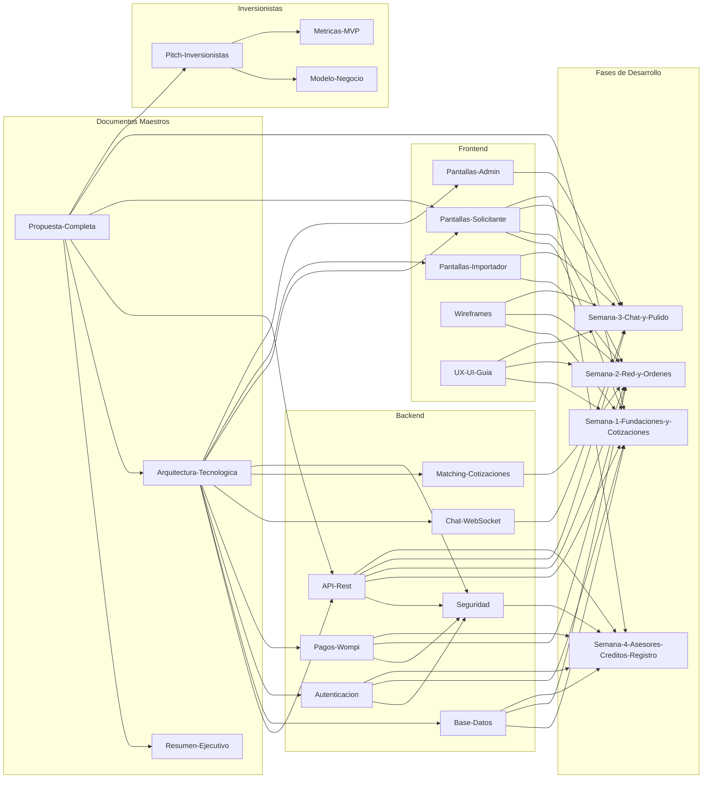
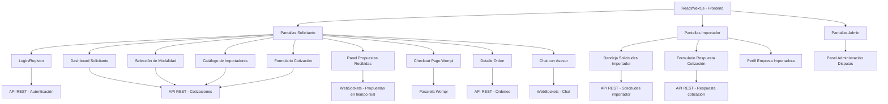
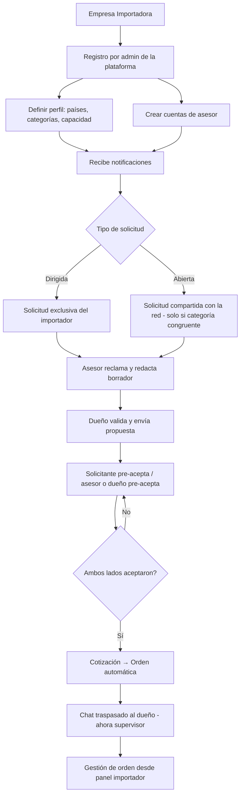
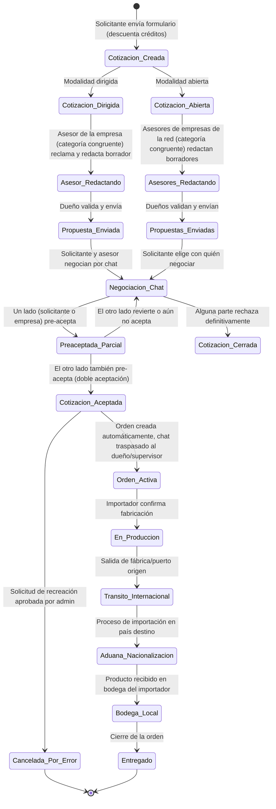
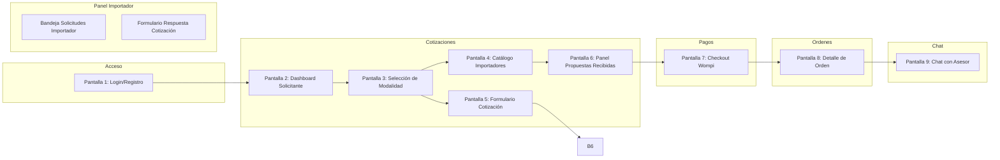
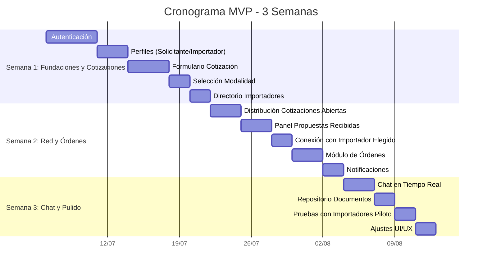

# Mapa de Conexiones del Proyecto ImportacionesQ8

## Diagrama principal de relaciones entre notas



---

## Mapa de dependencias técnicas (Backend)

```mermaid
graph TD
    A[FastAPI - Backend] --> B[MySQL - Base de datos principal]
    A --> C[Redis - Chat/Cache]
    A --> D[JWT - Autenticación]
    A --> E[Wompi - Pagos]
    A --> F[WebSockets - Chat en tiempo real]

    B --> G[Usuarios]
    B --> H[Importadores]
    B --> I[Cotizaciones]
    B --> J[Ordenes]
    B --> K[Pagos]

    C --> L[Pub/Sub - Mensajería chat]
    C --> M[Caché de sesiones]
    C --> N[Estado cotizaciones abiertas]

    D --> O[Tokens JWT solicitante]
    D --> P[Tokens JWT importador]
    D --> Q[Tokens JWT admin]

    E --> R[Checkout Wompi - compra de créditos]
    E --> S[Webhooks de confirmación - acredita créditos]

    F --> T[Chat 1 a 1 por orden]

    B --> U[Movimientos de crédito]
    B --> V[Solicitudes de recreación]
    B --> W[Tokens de recuperación de contraseña]
```



---

## Mapa de dependencias técnicas (Frontend)



---

## Mapa de flujo de datos del negocio (actualizado — Semana 4: créditos y doble aceptación)

```mermaid
graph LR
    Z[Solicitante compra créditos vía Wompi] --> A[Solicitante]
    A --> B[Nueva Cotización - descuenta créditos según modalidad]
    B --> C{Modalidad}
    C -->|Dirigida| D[Importador específico]
    C -->|Abierta| E[Todos los importadores de la red]
    D --> F1[Asesor redacta borrador]
    E --> F1
    F1 --> F2[Dueño valida categoría y envía propuesta]
    F2 --> H[Solicitante puede chatear y aceptar]
    H --> DA{Doble aceptación<br/>solicitante + empresa}
    DA -->|Falta un lado| H
    DA -->|Ambos aceptan| L[Orden creada automáticamente<br/>sin pago de por medio]
    L --> M[Chat traspasado al dueño/supervisor]
    M --> N[Seguimiento de orden a discreción de las partes]
```



> La plataforma **no cobra por la orden**: el único costo para el solicitante es el crédito consumido al crear la cotización. La plataforma solo conecta; el cumplimiento de la orden es responsabilidad de las partes.

---

## Mapa de flujo de datos del negocio (Importador, actualizado — Semana 4)



---

## Mapa de estados de una cotización/orden (actualizado — Semana 4)



---

## Mapa de roles y permisos (actualizado — Semana 4)

```mermaid
graph TD
    A[Roles del Sistema] --> B[Solicitante]
    A --> C[Importador - dueño]
    A --> C2[Asesor - renombrado de trabajador]
    A --> D[Admin Plataforma]

    B --> B1[Crear cotizaciones - consume créditos]
    B --> B2[Ver órdenes propias]
    B --> B3[Chat con asesor/dueño asignado]
    B --> B4[Comprar créditos vía Wompi]
    B --> B5[Ver panel de propuestas - modalidad abierta]
    B --> B6[Pre-aceptar propuesta - doble aceptación]
    B --> B7[Solicitar recreación por error]

    C --> C1[Recibir solicitudes dirigidas]
    C --> C3[Enviar propuesta tras validar categoría]
    C --> C4[Gestionar órdenes propias - vía chat traspasado]
    C --> C5[Pre-aceptar propuesta como dueño]
    C --> C6[Editar perfil de empresa]
    C --> C7[Crear/gestionar cuentas de asesor]

    C2 --> C2a[Reclamar cotizaciones del pool de su empresa]
    C2 --> C2b[Redactar/editar borradores de propuesta]
    C2 --> C2c[Chat con el solicitante hasta el traspaso]
    C2 --> C2d[Pre-aceptar en nombre de la empresa]

    D --> D1[Ver todas las cotizaciones abiertas]
    D --> D2[Mediar en disputas]
    D --> D3[Gestionar importadores vinculados - crear, verificar]
    D --> D4[Monitorear métricas del sistema]
    D --> D5[Resolver solicitudes de recreación de cotización]
```



---

## Mapa de wireframes por módulo



---

## Mapa de tareas por semana (Gantt simplificado)



---

## Mapa de métricas y KPIs

```mermaid
graph TD
    subgraph Metricas["Metricas de exito del MVP"]
        M1[Número de cotizaciones por modalidad]
        M2[Tasa de respuesta de importadores]
        M3[Tiempo promedio primera oferta]
        M4[Tasa conversión cotización → orden]
        M5[Importadores activos en la red]
    end

    subgraph Fuentes["Fuentes de datos"]
        F1[Backend: API logs]
        F2[MySQL: Tablas cotizaciones]
        F3[MySQL: Tabla importadores]
        F4[Wompi: Webhooks de pago]
    end

    M1 --> F2
    M2 --> F2
    M3 --> F2
    M4 --> F2
    M5 --> F3
    F4 --> M4