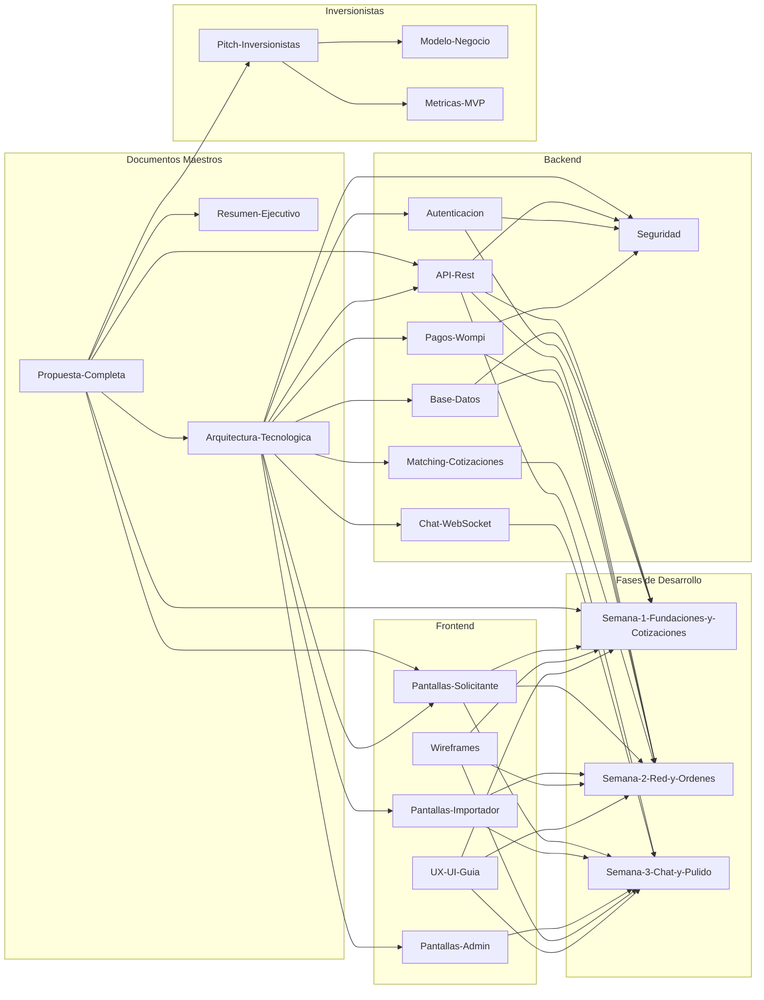
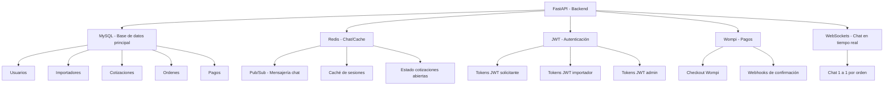
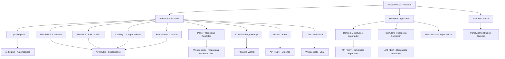
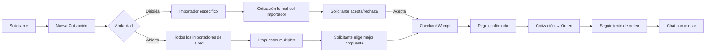
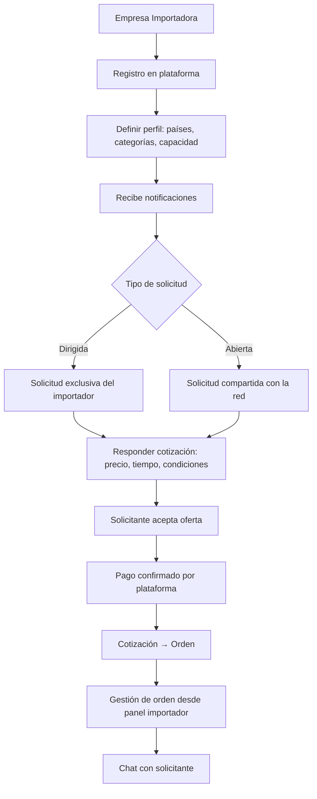
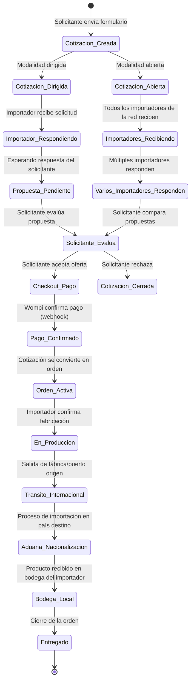
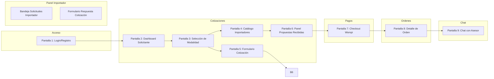
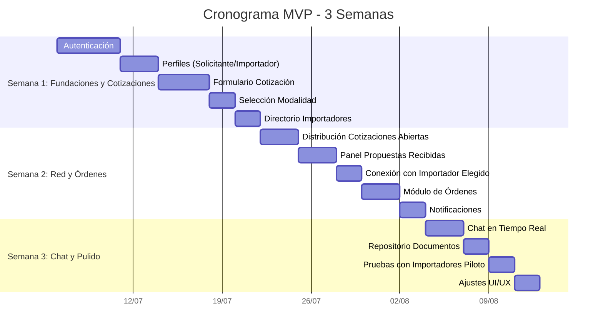

# Mapa de Conexiones del Proyecto ImportacionesQ8

## Diagrama principal de relaciones entre notas



---

## Mapa de dependencias técnicas (Backend)



---

## Mapa de dependencias técnicas (Frontend)



---

## Mapa de flujo de datos del negocio



---

## Mapa de flujo de datos del negocio (Importador)



---

## Mapa de estados de una cotización/orden



---

## Mapa de roles y permisos

```mermaid
graph TD
    A[Roles del Sistema] --> B[Solicitante]
    A --> C[Importador]
    A --> D[Admin Plataforma]

    B --> B1[Crear cotizaciones]
    B --> B2[Ver órdenes propias]
    B --> B3[Chat con asesores]
    B --> B4[Pagar ofertas aceptadas]
    B --> B5[Ver panel de propuestas (modalidad abierta)]

    C --> C1[Recibir solicitudes dirigidas]
    C --> C2[Recibir solicitudes abiertas (según perfil)]
    C --> C3[Responder cotizaciones con propuesta]
    C --> C4[Gestionar órdenes propias]
    C --> C5[Chat con solicitantes asignados]
    C --> C6[Editar perfil de empresa]

    D --> D1[Ver todas las cotizaciones abiertas]
    D --> D2[Mediar en disputas]
    D --> D3[Gestionar importadores vinculados]
    D --> D4[Monitorear métricas del sistema]
```

---

## Mapa de wireframes por módulo



---

## Mapa de tareas por semana (Gantt simplificado)



---

## Mapa de métricas y KPIs

```mermaid
graph TD
    subgraph Metricas["Metricas de exito del MVP"]
        M1[Número de cotizaciones por modalidad]
        M2[Tasa de respuesta de importadores]
        M3[Tiempo promedio primera oferta]
        M4[Tasa conversión cotización → orden]
        M5[Importadores activos en la red]
    end

    subgraph Fuentes["Fuentes de datos"]
        F1[Backend: API logs]
        F2[MySQL: Tablas cotizaciones]
        F3[MySQL: Tabla importadores]
        F4[Wompi: Webhooks de pago]
    end

    M1 --> F2
    M2 --> F2
    M3 --> F2
    M4 --> F2
    M5 --> F3
    F4 --> M4