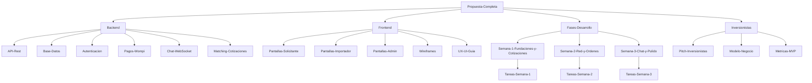

# 📦 ImportacionesQ8 — Plataforma de Conexión y Cotización de Importación

## Fuente única de verdad del proyecto

Este vault de Obsidian contiene toda la documentación del proyecto **ImportacionesQ8**, una plataforma web de networking que conecta a clientes finales con empresas importadoras para gestionar el proceso completo de cotización, compra y logística internacional desde China.

---

## 🗂️ Estructura del Vault

| Carpeta | Descripción |
|---------|-------------|
| [00-Index-y-Navegacion](./) | Índice principal, mapa de conexiones y documentos maestros |
| [Backend](../Backend/) | Documentación técnica del backend (API, base de datos, autenticación, pagos, chat) |
| [Frontend](../Frontend/) | Documentación técnica del frontend (pantallas, componentes, wireframes, UX/UI) |
| [Fases-Desarrollo](../Fases-Desarrollo/) | Tareas y entregables organizados por semana de desarrollo |
| [Inversionistas](../Inversionistas/) | Material para presentación a inversionistas y stakeholders |

---

## 📋 Documentos Maestros

- [[Propuesta-Completa]] — Documento completo del proyecto (fuente original)
- [[Resumen-Ejecutivo]] — Resumen ejecutivo del proyecto
- [[Arquitectura-Tecnologica]] — Stack tecnológico y decisiones de arquitectura

---

## 🔗 Mapa de conexiones del proyecto

---

## 🚀 Inicio rápido para nuevos miembros del equipo

### Si eres desarrollador Backend:
1. Lee [[Propuesta-Completa]] para entender el contexto del proyecto
2. Revisa [[Arquitectura-Tecnologica]] para conocer las decisiones técnicas
3. Explora la carpeta [Backend](../Backend/) para documentación detallada de cada módulo
4. Consulta las tareas en [Fases-Desarrollo](../Fases-Desarrollo/) según tu semana asignada

### Si eres desarrollador Frontend:
1. Lee [[Propuesta-Completa]] para entender el contexto del proyecto
2. Revisa los wireframes en [Frontend/Wireframes](../Frontend/Wireframes/)
3. Explora la documentación de pantallas en [Frontend/Pantallas](../Frontend/Pantallas/)
4. Consulta las tareas en [Fases-Desarrollo](../Fases-Desarrollo/) según tu semana asignada

### Si eres stakeholder/inversionista:
1. Comienza con [[Pitch-Inversionistas]] para una visión general del proyecto
2. Revisa [[Modelo-Negocio]] para entender cómo genera valor la plataforma
3. Consulta [[Metricas-MVP]] para ver los indicadores de éxito

---

## 📊 Estado actual del proyecto

| Fase | Estado | Descripción |
|------|--------|-------------|
| **Semana 1** | Pendiente | Fundaciones y módulo de cotizaciones |
| **Semana 2** | Pendiente | Red de importadores y órdenes |
| **Semana 3** | Pendiente | Chat, documentos y pulido |

---

## 📝 Convenciones del vault

- Los archivos están organizados por dominio funcional (Backend/Frontend) y fase de desarrollo
- Las notas internas se enlazan con `[[nombre-del-archivo]]`
- Los diagramas usan sintaxis Mermaid para visualización nativa en Obsidian
- Las tareas se marcan con `- [ ]` (pendiente) o `- [x]` (completada)