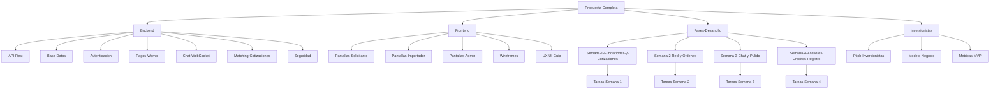

# ImportacionesQ8 — Plataforma de Conexión y Cotización de Importación

## Fuente única de verdad del proyecto

Este vault de Obsidian contiene toda la documentación del proyecto **ImportacionesQ8**, una plataforma web de networking que conecta a clientes finales con empresas importadoras para gestionar el proceso completo de cotización, compra y logística internacional desde China.

---

## Estructura del Vault

| Carpeta | Descripción |
|---------|-------------|
| [00-Index-y-Navegacion](./) | Índice principal, mapa de conexiones y documentos maestros |
| [Backend](../Backend/) | Documentación técnica del backend (API, base de datos, autenticación, pagos, chat) |
| [Frontend](../Frontend/) | Documentación técnica del frontend (pantallas, componentes, wireframes, UX/UI) |
| [Fases-Desarrollo](../Fases-Desarrollo/) | Tareas y entregables organizados por semana de desarrollo |
| [Inversionistas](../Inversionistas/) | Material para presentación a inversionistas y stakeholders |

---

## Documentos Maestros

- [[Propuesta-Completa]] — Documento completo del proyecto (fuente original)
- [[Resumen-Ejecutivo]] — Resumen ejecutivo del proyecto
- [[Arquitectura-Tecnologica]] — Stack tecnológico y decisiones de arquitectura

---

## Mapa de conexiones del proyecto

---

## Inicio rápido para nuevos miembros del equipo

### Si eres desarrollador Backend:
1. Lee [[Propuesta-Completa]] para entender el contexto del proyecto
2. Revisa [[Arquitectura-Tecnologica]] para conocer las decisiones técnicas
3. Explora la carpeta [Backend](../Backend/) para documentación detallada de cada módulo, y revisa [[Seguridad]] para el blindaje ya implementado antes de tocar autenticación, IDOR o pagos
4. Consulta las tareas en [Fases-Desarrollo](../Fases-Desarrollo/) según tu semana asignada

### Si eres desarrollador Frontend:
1. Lee [[Propuesta-Completa]] para entender el contexto del proyecto
2. Revisa los wireframes en [Frontend/Wireframes](../Frontend/Wireframes/)
3. Explora la documentación de pantallas en [Frontend/Pantallas](../Frontend/Pantallas/)
4. Consulta las tareas en [Fases-Desarrollo](../Fases-Desarrollo/) según tu semana asignada

### Si eres stakeholder/inversionista:
1. Comienza con [[Pitch-Inversionistas]] para una visión general del proyecto
2. Revisa [[Modelo-Negocio]] para entender cómo genera valor la plataforma
3. Consulta [[Metricas-MVP]] para ver los indicadores de éxito

---

## Estado actual del proyecto

| Fase | Backend | Frontend | Descripción |
|------|---------|----------|-------------|
| **Semana 1** | ✅ Completo | ⬜ Pendiente | Fundaciones y módulo de cotizaciones — ver [[Tareas-Semana-1]] |
| **Semana 2** | ✅ Completo (revisado 2026-07-06) | ⬜ Pendiente | Red de importadores y órdenes — ver [[Tareas-Semana-2]] |
| **Semana 3** | ✅ Completo (2026-07-07) | ⬜ Pendiente | Chat, documentos, panel admin + ampliación (trabajadores, perfiles, formulario dinámico) — ver [[Tareas-Semana-3]] |
| **Semana 4** | ✅ Completo (2026-07-08) | ⬜ Pendiente | Asesores (renombrado de trabajador), créditos, registro extendido y blindaje adicional — ver [[Tareas-Semana-4]] |

*Backend Semana 2 revisado el 2026-07-06: 101/101 tests pasando en local y Docker; se corrigieron IDOR, verificación de firma de webhooks, condiciones de carrera e idempotencia. El mismo día se verificó la congruencia del backend contra `docs/Propuesta_Plataforma_Importacion.pdf` y los wireframes del vault, corrigiendo 2 gaps (campo `incoterm` faltante en Propuesta, endpoint de estado de matching faltante). Ver el detalle en [[Tareas-Semana-2]].*

*Backend Semana 3 completado el 2026-07-07: 159/159 tests pasando en local y Docker. Incluye las 4 tareas backend originales de la Semana 3 (chat WebSocket + Redis Pub/Sub, endpoints REST de chat, repositorio de documentos ya verificado, panel admin con disputas) y una ampliación de alcance pedida explícitamente: desacople de identidad `Usuario`/`Importador` (soporte multi-usuario por empresa vía `importador_id`), panel de empresa con cuentas de trabajador y reclamo atómico de cotizaciones, personalización de perfiles (empresa y usuario), formulario de cotización personalizable para empresas `solo_cotizaciones_directas`, y endpoints de administración para el alta de empresas importadoras. Se cerró además el auto-registro público de cuentas `admin`/`importador` como refuerzo de seguridad. Ver el detalle en [[Tareas-Semana-3]] y [[Base-Datos]].*

*Backend Semana 4 completado el 2026-07-08: **221/221 tests pasando en local y Docker**. Registro diferenciado natural/jurídica con páginas legales placeholder, recuperación de contraseña con OTP + SMTP real, sistema de créditos que reemplaza la comisión por orden (con recreación de cotizaciones mediada por admin), renombrado de "trabajador" a "asesor" con redacción/envío de propuestas separados y validación de congruencia de categoría, doble aceptación mutua que crea la orden automáticamente y traspasa el chat al dueño de la empresa (supervisor), catálogo enriquecido de importadores (destacados, por categoría, certificados), y navegación cruzada entre cotización/propuesta/orden/chat. Ver el detalle en [[Tareas-Semana-4]], y el resumen consolidado de todo el blindaje de seguridad de la app (SQL injection, IDOR, rate limiting, ACID, webhooks, OTP, créditos) en [[Seguridad]].*

---

## Convenciones del vault

- Los archivos están organizados por dominio funcional (Backend/Frontend) y fase de desarrollo
- Las notas internas se enlazan con `[[nombre-del-archivo]]`
- Los diagramas usan sintaxis Mermaid para visualización nativa en Obsidian
- Las tareas se marcan con `- [ ]` (pendiente) o `- [x]` (completada)