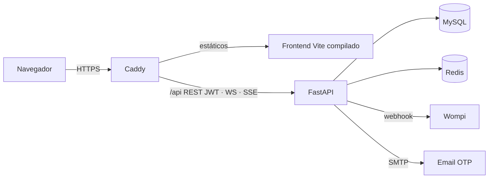

# Arquitectura tecnológica

> **Última actualización:** 2026-10-01

Resumen del stack de Zarpi y dónde está documentada cada pieza.

## Stack

| Capa | Tecnología |
|------|------------|
| API | FastAPI (Python 3.11), Uvicorn |
| Datos | MySQL 8 + SQLAlchemy 2 + Alembic |
| Cache / realtime | Redis 7 (matching y cupo de abiertas, pub/sub de chat y notificaciones, rate limits, modo mantenimiento) |
| Auth | JWT (PyJWT) + OTP email + blacklist `jti` |
| Pagos | Wompi (simulado mientras no haya llaves reales; el solicitante no paga por cotizar) |
| Correo | SMTP de Resend con plantilla HTML de Zarpi; WhatsApp opcional (open-wa) |
| Tiempo real | WebSocket para el chat (ticket de un solo uso) y SSE para notificaciones (ticket) |
| Frontend | Vite + React + Tailwind (`proyecto/frontend/`), marca Zarpi, modo claro/oscuro |
| Producción | Docker Compose + **Caddy** (HTTPS automático con Let's Encrypt, `/api` hacia el backend) en un droplet de DigitalOcean |
| Operación | `/health` y `/health/ready`, scripts de diagnóstico, backups (ZIP portable, `mysqldump`, Redis) y restauración desde el panel |

## Dónde profundizar

| Tema | Nota |
|------|------|
| Modelo de datos | [[Base-Datos]] |
| Auth y roles | [[Autenticacion]] · [[Seguridad]] |
| Pagos y créditos | [[Pagos-Wompi]] |
| Chat | [[Chat-WebSocket]] |
| Matching | [[Matching-Cotizaciones]] |
| Contrato HTTP para clientes | [[Indice-Integracion-API]] |
| Arranque local | [[00-Env-y-Arranque]] |
| Capacidad y auditorías | [[Indice-Calidad]] |
| Producción y operación | [[Despliegue-y-Operacion]] |
| Copias de seguridad | [[Backups-y-Restauracion]] |

## Diagrama lógico

← [[Inicio]] · [[Indice-Backend]]
