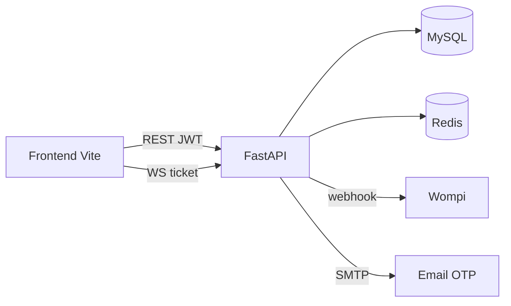

# Arquitectura tecnológica

Resumen del stack y dónde está documentado cada pieza.  
(Antes se enlazaba como nota maestra sin archivo propio; este es el índice.)

## Stack

| Capa | Tecnología |
|------|------------|
| API | FastAPI (Python 3.11), Uvicorn |
| Datos | MySQL 8 + SQLAlchemy 2 + Alembic |
| Cache / realtime | Redis 7 (matching, pub/sub chat, rate limits) |
| Auth | JWT (PyJWT) + OTP email + blacklist `jti` |
| Pagos | Wompi (compra de créditos; simulación en dev) |
| Frontend | Vite + React (`proyecto/frontend/`) |
| Ops | Docker Compose, `/health` + `/health/ready` |

## Dónde profundizar

| Tema | Nota |
|------|------|
| Modelo de datos | [[Base-Datos]] |
| Auth y roles | [[Autenticacion]] · [[Seguridad]] |
| Pagos y créditos | [[Pagos-Wompi]] |
| Chat | [[Chat-WebSocket]] |
| Matching | [[Matching-Cotizaciones]] |
| Contrato HTTP para clientes | [[Indice-Integracion-API]] |
| Arranque local | [[00-Env-y-Arranque]] |
| Capacidad y auditorías | [[Indice-Calidad]] |

## Diagrama lógico

← [[Inicio]] · [[Indice-Backend]]
