# Mapa del vault

> **Última actualización:** 2026-10-01

## Diagrama de carpetas

```mermaid
flowchart TB
  INICIO[00-Inicio]
  NEG[01-Negocio]
  API[02-Integracion-API]
  BE[03-Backend]
  FE[04-Frontend-UI]
  CAL[05-Calidad-y-Seguridad]
  HIS[06-Historial]

  INICIO --> NEG
  INICIO --> API
  INICIO --> BE
  INICIO --> FE
  INICIO --> CAL
  INICIO --> HIS
  INICIO --> ESTADO[Estado-del-proyecto]
  INICIO --> RUTA[Hoja-de-Ruta]
  INICIO --> RESUMEN[Resumen-Ejecutivo]

  NEG --> PROP[Propuesta]
  NEG --> MOD[Modelo-Negocio]
  NEG --> PITCH[Pitch]

  API --> ENV[Env-y-Arranque]
  API --> CAT[Catalogo-Completo]
  API --> AUTH[02-Auth]
  API --> PM[Postman]
  API --> GUIAS[Guías 15–22: cursos, notificaciones, documentos, tiers, cupo diario, calculadora, ayuda, landing]

  BE --> REST[API-Rest]
  BE --> DB[Base-Datos]
  BE --> SEG[Seguridad]
  BE --> PAY[Pagos-Wompi]
  BE --> CHAT[Chat-WebSocket]
  BE --> MATCH[Matching-Cotizaciones]
  BE --> DEP[Despliegue-y-Operacion]
  BE --> BAK[Backups-y-Restauracion]

  FE --> SOL[Pantallas-Solicitante]
  FE --> IMP[Pantallas-Importador]
  FE --> ADM[Pantallas-Admin]

  CAL --> AUD[Auditoria-Backend]
  CAL --> OWASP[OWASP-Top10]
  CAL --> LOAD[Pruebas-Carga]

  HIS --> S1[Semana-1]
  HIS --> S2[Semana-2]
  HIS --> S3[Semana-3]
  HIS --> S4[Semana-4]
  HIS --> CRONO[Cronologia-del-Proyecto]
  HIS --> F5[Fase-5]
  HIS --> F6[Fase-6]
  HIS --> F7[Fase-7]
  HIS --> F8[Fase-8]

  API -.->|contratos HTTP| BE
  FE -.->|consume| API
  CAL -.->|valida| BE
  HIS -.->|explica evolución| BE
```

## Relaciones útiles (no es un grafo exhaustivo)

| Desde | Hacia | Por qué |
|-------|-------|---------|
| Integración API | Backend | Misma API; la carpeta 02 es la guía de consumo, la 03 es el diseño |
| Frontend UI | Integración API | Pantallas necesitan endpoints y env |
| Calidad | Seguridad + Backend | Informes apuntan a implementación |
| Historial | Backend / API | Tareas de cada semana |
| Negocio | Todo | Define el *qué* y el *por qué* |

## Índice de índices

- [[Inicio]]
- [[Indice-Negocio]]
- [[Indice-Integracion-API]]
- [[Indice-Backend]]
- [[Indice-Frontend]]
- [[Indice-Calidad]]
- [[Indice-Historial]]
