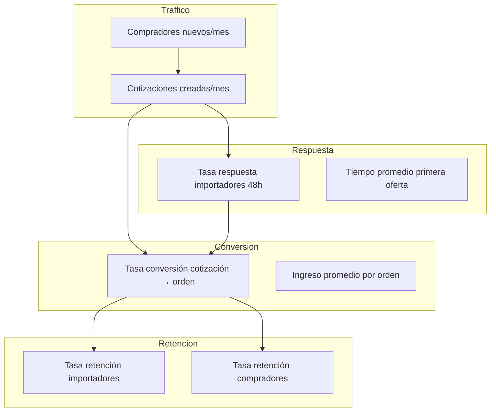

# Metricas MVP — ImportacionesQ8

## Descripción general

Métricas de éxito para el MVP del proyecto ImportacionesQ8, diseñado para validar el diferenciador (flujo dual de cotización) sin comprometer módulos regulatoriamente complejos.

---

## Metricas Clave de Exito del MVP

### 1. Número de Cotizaciones Creadas por Modalidad

**Objetivo:** Validar cuál flujo prefiere el mercado — dirigida o abierta.

| Métrica | Objetivo MVP |
|---------|-------------|
| Total cotizaciones/mes | 50-100 |
| % Dirigida | 40-60% |
| % Abierta | 40-60% |

**Por qué importa:** Si la mayoría prefiere una modalidad sobre la otra, indica dónde enfocar los esfuerzos de producto y marketing.

---

### 2. Tasa de Respuesta de Importadores a Cotizaciones Abiertas

**Objetivo:** Validar que los importadores responden dentro de la ventana de tiempo definida (48-72 horas).

| Métrica | Objetivo MVP |
|---------|-------------|
| Tasa de respuesta en 48h | >60% |
| Tasa de respuesta en 72h | >80% |
| Tiempo promedio de primera respuesta | <24 horas |

**Por qué importa:** Si los importadores no responden, la plataforma pierde valor para el comprador. La velocidad de respuesta es crítica para la experiencia del usuario.

---

### 3. Tiempo Promedio entre Solicitud y Primera Oferta Recibida

**Objetivo:** Medir la eficiencia del matching automático.

| Métrica | Objetivo MVP |
|---------|-------------|
| Tiempo promedio primera oferta (dirigida) | <12 horas |
| Tiempo promedio primera oferta (abierta) | <24 horas |

**Por qué importa:** Los compradores esperan respuestas rápidas. Si el tiempo es demasiado largo, la experiencia se degrada y pueden abandonar la plataforma.

---

### 4. Tasa de Conversión de Cotización a Orden Aceptada

**Objetivo:** Validar que las cotizaciones generan resultados reales para ambas partes.

| Métrica | Objetivo MVP |
|---------|-------------|
| Tasa conversión cotización → orden (dirigida) | >25% |
| Tasa conversión cotización → orden (abierta) | >30% |

**Por qué importa:** Esta es la métrica más importante del negocio. Si las cotizaciones no se convierten en órdenes, el modelo de ingresos no funciona.

---

### 5. Número de Empresas Importadoras Activas Vinculadas a la Red

**Objetivo:** Validar que los importadores quieren un canal adicional de captación de demanda.

| Métrica | Objetivo MVP |
|---------|-------------|
| Importadores activos al final del MVP | 5-10 |
| Tasa de retención importadores (mes 2) | >70% |
| Tasa de uso semanal por importador | >60% |

**Por qué importa:** Sin suficientes importadores, la plataforma no tiene valor para los compradores. El efecto red es fundamental.

---

## Metricas Secundarias del MVP

### Métricas de Adquisición

| Métrica | Objetivo MVP |
|---------|-------------|
| Compradores nuevos/mes | 20-50 |
| Tasa de registro → primera cotización | >40% |
| Costo de adquisición por comprador (CAC) | < $10 USD |

### Métricas de Retención

| Métrica | Objetivo MVP |
|---------|-------------|
| Compradores que regresan (mes 2) | >30% |
| Importadores que regresan (mes 2) | >70% |
| Tasa de abandono semanal | <15% |

### Métricas de Engagement

| Métrica | Objetivo MVP |
|---------|-------------|
| Tiempo promedio en plataforma por sesión | >5 minutos |
| Chats iniciados por orden | >80% |
| Documentos descargados por orden | >60% |

---

## Dashboard de Metricas — Vista para el Equipo

---

## Metricas por Fase de Desarrollo

### Semana 1 — Fundaciones y Cotizaciones

| Métrica | Objetivo | Cómo se mide |
|---------|----------|-------------|
| Usuarios registrados (solicitantes) | 10-20 | MySQL: tabla usuarios WHERE rol='solicitante' |
| Usuarios registrados (importadores) | 3-5 | MySQL: tabla importadores WHERE estado='activo' |
| Cotizaciones creadas | 10-20 | MySQL: tabla cotizaciones |

### Semana 2 — Red y Órdenes

| Métrica | Objetivo | Cómo se mide |
|---------|----------|-------------|
| Propuestas enviadas por importadores | 5-10 | MySQL: tabla propuestas WHERE estado='pendiente' |
| Cotizaciones convertidas en órdenes | 3-5 | MySQL: tabla cotizaciones WHERE estado='orden_activa' |
| Pagos confirmados con Wompi | 2-4 | MySQL: tabla pagos WHERE estado='confirmado' |

### Semana 3 — Chat y Pulido

| Métrica | Objetivo | Cómo se mide |
|---------|----------|-------------|
| Chats iniciados por orden | >80% | MySQL: tabla conversaciones_chat JOIN ordenes |
| Mensajes enviados por chat | 5-10 por orden | MySQL: tabla mensajes_chat |
| Órdenes completadas (entregado) | 1-2 | MySQL: tabla ordenes WHERE estado='entregado' |

---

## Criterios de Exito del MVP — Go/No-Go Decision

### Go (Continuar con inversión Serie A):

- [ ] Tasa de conversión cotización → orden > 25%
- [ ] Al menos 3 importadores activos y respondiendo regularmente
- [ ] Tiempo promedio de respuesta < 48 horas
- [ ] Al menos 10 órdenes completadas (entregado) en el primer mes

### No-Go (Reevaluar modelo):

- [ ] Tasa de conversión cotización → orden < 15%
- [ ] Menos de 2 importadores activos después del MVP
- [ ] Tiempo promedio de respuesta > 7 días
- [ ] Más del 80% de las cotizaciones no reciben ninguna propuesta

---

## Metricas para Presentacion a Inversionistas

### Metrica de Traccion (MVP)

| Métrica | Valor Actual | Objetivo | Estado |
|---------|-------------|----------|--------|
| Importadores activos | 0 | 5-10 | ⬜ Pendiente |
| Cotizaciones/mes | 0 | 50-100 | ⬜ Pendiente |
| Órdenes/mes | 0 | 15-30 | ⬜ Pendiente |
| Ingresos/mes | $0 | $1,125-$2,250 | ⬜ Pendiente |

### Metrica de Validacion (MVP)

| Hipótesis | Criterio de Validación | Estado |
|-----------|----------------------|--------|
| Los compradores prefieren la modalidad abierta | >50% de cotizaciones son abiertas | ⬜ Pendiente |
| Los importadores responden dentro de 48h | >60% de respuestas en 48h | ⬜ Pendiente |
| Las cotizaciones se convierten en órdenes | >25% tasa de conversión | ⬜ Pendiente |
| Los importadores regresan a la plataforma | >70% retención mes 2 | ⬜ Pendiente |

---

## Notas sobre las Metricas

- **Las métricas del MVP son intencionalmente conservadoras:** El objetivo es validar el diferenciador (flujo dual de cotización), no escalar a gran escala.
- **Se recomienda usar Google Analytics para tracking web y logs de la API para tracking backend.**
- **Las métricas se revisan semanalmente durante el MVP y mensualmente después del lanzamiento.**
- **Los datos de las métricas deben estar disponibles en un dashboard simple (ej: Metabase o Grafana) para que todo el equipo pueda verlos en tiempo real.**