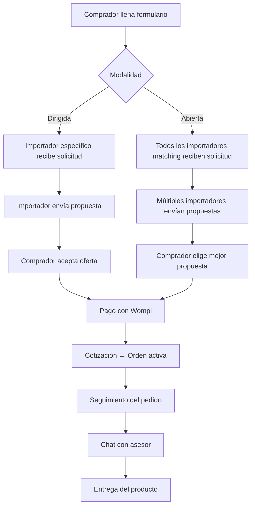

# Modelo de Negocio — ImportacionesQ8

## Descripción general

Modelo de negocio de la plataforma ImportacionesQ8: cómo generamos valor para ambas partes (compradores e importadores) y cómo capturamos ese valor a través de ingresos sostenibles.

---

## Propuesta de Valor

### Para los Compradores (Solicitantes):

| Beneficio | Descripción |
|-----------|-------------|
| **Transparencia de precios** | En modalidad abierta, el comprador recibe múltiples propuestas y puede comparar para elegir la mejor opción |
| **Ahorro de tiempo** | Llenar un solo formulario en lugar de contactar a varios importadores individualmente |
| **Trazabilidad del pedido** | Seguimiento visual del estado del pedido desde la cotización hasta la entrega |
| **Asesor dedicado** | Cada orden tiene un asesor asignado para resolver dudas y problemas |

### Para los Importadores:

| Beneficio | Descripción |
|-----------|-------------|
| **Canal adicional de demanda** | Acceso a compradores que hoy no los conocen por falta de visibilidad |
| **Sin inversión en tecnología propia** | No necesitan construir su propio sistema de captación y gestión de cotizaciones |
| **Demanda calificada** | Los compradores que llegan a la plataforma ya tienen un formulario completo con toda la información necesaria |
| **Visibilidad en la red** | Posicionamiento preferencial como "importador insignia" o partner fundador |

---

## Fuentes de Ingreso

### 1. Comisión por Intermediación (Principal)

Cobramos un porcentaje del valor de cada cotización aceptada — el servicio de conexión entre comprador e importador.

| Detalle | Valor |
|---------|-------|
| **Porcentaje** | 5-10% del valor de la transacción |
| **Base de cálculo** | Precio acordado en la cotización aceptada |
| **Ejemplo** | Si el comprador acepta una oferta de $1,000 USD → comisión = $50-$100 USD |

### 2. Suscripción Premium para Importadores

Importadores pagan una suscripción mensual por visibilidad adicional en la plataforma.

| Plan | Precio Mensual | Beneficios |
|------|---------------|------------|
| **Básico** | Gratis | Visibilidad estándar, hasta 10 solicitudes/mes |
| **Premium** | $50 USD/mes | Posicionamiento preferencial, solicitudes ilimitadas, badge de "socio verificado" |
| **Enterprise** | $200 USD/mes | API para sincronización con sistema interno, soporte prioritario, analytics avanzados |

### 3. Servicios Adicionales (Fase 2)

Servicios complementarios que generan ingresos adicionales:

| Servicio | Descripción | Precio Estimado |
|----------|-------------|-----------------|
| **Facturación electrónica** | Emisión de facturación con validez fiscal propia | Por factura emitida |
| **Logística integrada** | Gestión de transporte y logística desde origen hasta destino | Variable según ruta |
| **Seguros de importación** | Protección contra daños, pérdidas o retrasos en el envío | 1-3% del valor del producto |

---

## Proyeccion Financiera (5 anos)

### Año 1 — Lanzamiento y Validación

| Métrica | Valor |
|---------|-------|
| Importadores activos | 20 |
| Cotizaciones/mes | 500 |
| Tasa de conversión cotización → orden | 30% |
| Órdenes/mes | 150 |
| Ingreso promedio por orden (comisión) | $75 USD |
| **Ingresos mensuales** | $11,250 USD |
| **Ingresos anuales** | $135,000 USD |

### Año 2 — Crecimiento

| Métrica | Valor |
|---------|-------|
| Importadores activos | 50 |
| Cotizaciones/mes | 2,000 |
| Tasa de conversión cotización → orden | 35% |
| Órdenes/mes | 700 |
| Ingreso promedio por orden (comisión) | $85 USD |
| Suscripciones premium mensuales | 15 importadores × $50 = $750 USD |
| **Ingresos mensuales** | $66,250 USD |
| **Ingresos anuales** | $795,000 USD |

### Año 3 — Escalamiento

| Métrica | Valor |
|---------|-------|
| Importadores activos | 100 |
| Cotizaciones/mes | 5,000 |
| Tasa de conversión cotización → orden | 40% |
| Órdenes/mes | 2,000 |
| Ingreso promedio por orden (comisión) | $95 USD |
| Suscripciones premium mensuales | 30 importadores × $100 = $3,000 USD |
| Servicios adicionales | $5,000 USD/mes |
| **Ingresos mensuales** | $223,000 USD |
| **Ingresos anuales** | $2,676,000 USD |

---

## Flujo de Valor — Como funciona la plataforma

---

## Estructura de Costos

### Costos Fijos (Mensuales)

| Concepto | Costo Mensual |
|----------|--------------|
| Equipo de desarrollo (2 personas) | $4,000 USD |
| Infraestructura (servidor, base de datos, Redis) | $500 USD |
| Herramientas y software | $300 USD |
| **Total costos fijos** | **$4,800 USD/mes** |

### Costos Variables (Por Transacción)

| Concepto | Costo por Transacción |
|----------|----------------------|
| Comisión Wompi (pasarela de pagos) | 2.9% + $30 COP |
| Notificaciones (email, SMS) | $0.10 USD |
| Soporte al cliente | $5 USD |

---

## Metricas Clave del Negocio

### Métricas de Adquisición

| Métrica | Objetivo Año 1 | Objetivo Año 2 | Objetivo Año 3 |
|---------|---------------|---------------|---------------|
| Importadores nuevos/mes | 2 | 5 | 10 |
| Compradores nuevos/mes | 100 | 400 | 1,000 |

### Métricas de Retención

| Métrica | Objetivo Año 1 | Objetivo Año 2 | Objetivo Año 3 |
|---------|---------------|---------------|---------------|
| Tasa de retención importadores | 70% | 80% | 90% |
| Tasa de retención compradores | 40% | 50% | 60% |

### Métricas de Monetización

| Métrica | Objetivo Año 1 | Objetivo Año 2 | Objetivo Año 3 |
|---------|---------------|---------------|---------------|
| Ingreso promedio por orden | $75 USD | $85 USD | $95 USD |
| Tasa de conversión cotización → orden | 30% | 35% | 40% |

---

## Estrategia de Crecimiento

### Fase 1 — Lanzamiento (Meses 1-6)

- Validar el modelo con 2-3 importadores piloto
- Enfocarse en una categoría de producto específica (ej: Textiles)
- Construir la reputación y confianza en la plataforma

### Fase 2 — Crecimiento (Meses 7-18)

- Expandir a más categorías de producto
- Agregar más importadores a la red
- Lanzar suscripción premium para importadores

### Fase 3 — Escalamiento (Meses 19-36)

- Expandir a nuevos países (Colombia → Ecuador, Perú, etc.)
- Lanzar servicios adicionales (facturación electrónica, logística, seguros)
- Evaluar ronda de inversión Serie A para acelerar el crecimiento

---

## Ventaja Competitiva Sostenible

1. **Efecto red:** Cuantos más importadores se unen, más atractivo es para compradores y viceversa.
2. **Datos acumulados:** Cada cotización y orden genera datos que mejoran el matching y la experiencia del usuario.
3. **Barrera de entrada:** La plataforma necesita un número mínimo de importadores y compradores para funcionar — una vez alcanzado ese punto, es difícil competir.
4. **Relaciones a largo plazo:** El chat con asesor y el seguimiento del pedido crean relaciones duraderas entre compradores e importadores.