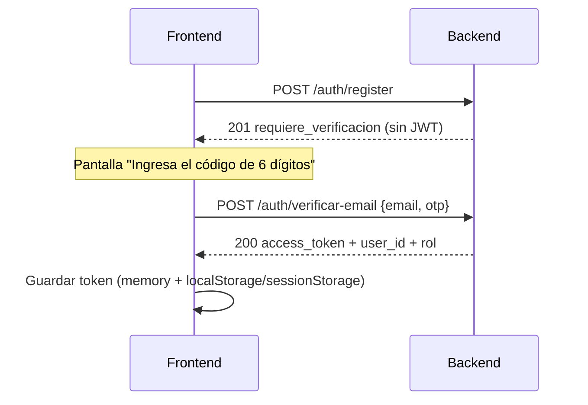

# Integración API — guía para frontend / fullstack

Documentación **orientada al desarrollador frontend/fullstack** para conectar el cliente (Vite/React u otro) con el backend FastAPI.

> Carpeta del vault: `02-Integracion-API/`  
> Fuente de verdad en runtime: Swagger (`http://localhost:8000/docs`) y OpenAPI (`/openapi.json`) en development.  
> Aquí están **todas las rutas**, convenciones, plantillas `.env` y Postman. **No** es código del frontend: solo documentación de integración.

← [[Inicio]] · Pantallas UI → [[Indice-Frontend]] · Diseño backend → [[Indice-Backend]]

---

## Contenido de esta carpeta

| Nota | Para qué sirve |
|------|----------------|
| [[00-Env-y-Arranque]] | Cómo levantar backend + frontend y **plantillas `.env`** |
| [[01-Convenciones-Auth-y-Cliente]] | Base URL, headers JWT, roles, errores, fetch/axios, CORS |
| [[Catalogo-Completo]] | Tabla de **todas** las operaciones REST |
| [[02-Auth]] | Registro, OTP, login, refresh, logout, password |
| [[03-Usuarios-Asesores-y-Perfil]] | `/usuarios/me`, asesores |
| [[04-Importadores]] | Catálogo, perfil empresa, campos, evidencias, asesores |
| [[05-Cotizaciones-y-Propuestas]] | Crear cotizaciones, pool, propuestas, pre-aceptar, reclamar |
| [[06-Ordenes]] | Órdenes, estados, documentos, problemas |
| [[07-Creditos-y-Pagos]] | Comprar créditos, saldo, Wompi |
| [[08-Chat-y-WebSocket]] | REST chat + ticket WS + WebSocket |
| [[09-Organizaciones]] | Org multi-usuario del solicitante |
| [[10-Disputas]] | Dispute room y evidencias |
| [[11-Referidos]] | Código y estadísticas de referidos |
| [[12-Admin]] | Endpoints solo `rol=admin` |
| [[13-Legal-y-Salud]] | Legal, `/health`, `/health/ready` |
| [[14-Postman-Insomnia]] | Cómo importar y usar la colección HTTP |
| [[15-Cursos-LMS]] | Catálogo, compra, progreso (reemplaza localStorage FE) |
| [[16-Notificaciones]] | Bandeja real en BD + marcar leídas |
| [[17-Documentos-y-Multimedia]] | Drive documental, adjuntos chat, reglas LMS y PDFs automáticos |
| [[18-Tiers-y-Perfil-Cotizante]] | Tier mínimo de empresa, desbloqueo con puntos, recálculo de tiers y perfil público |
| [[19-Limite-Diario-Cotizaciones]] | Límite diario de cotizaciones que recibe cada empresa importadora |
| [[20-Calculadora-Precios-Chat]] | Calculadora de precios estimados que la empresa envía al cliente por el chat |
| [[21-Ayuda-y-Soporte]] | Centro de ayuda: artículos, categorías, votos (generado desde OpenAPI) |
| [[22-Landing-CMS]] | Landing pública por bloques, aliados, noticias y contacto (generado desde OpenAPI) |
| [[23-Asignacion-de-Solicitudes]] | Asignación de abiertas a máx. 3 empresas por encaje, propuestas selladas y comparador |
| [[24-Eventos-y-Panel-Empresa]] | Bitácora de eventos con montos en COP (TRM) y panel comercial de la empresa |
| [[25-Tendencias-y-Catalogos]] | Tendencias semanales por suscripción, panel del curador y catálogos selectos de empresas |
| [[26-Tipografia-y-Videos-Landing]] | Tipografía de toda la plataforma (Fontsource, alojada en el servidor) y carrusel de videos de «Quiénes somos» |
| [[27-Tendencias-Virales-y-Reto]] | Tendencias v2: productos virales (comunidad, importadoras, equipo), aprobación con portada, solicitudes atribuidas y reto con recompensa |
| `Zarpi.postman_collection.json` | Importar en Postman o Insomnia |

---

## Base URL

| Entorno | REST | WebSocket |
|---------|------|-----------|
| Local (Docker Compose) | `http://localhost:8000` | `ws://localhost:8000` |
| Producción (ejemplo) | `https://api.tudominio.com` | `wss://api.tudominio.com` |

En el frontend usa una variable de entorno (ver [[00-Env-y-Arranque]]):

```ts
const API_URL = import.meta.env.VITE_API_URL; // http://localhost:8000
```

---

## Roles del producto (JWT `rol`)

| Rol | Quién es | Notas de integración |
|-----|----------|----------------------|
| `solicitante` | Persona natural/jurídica que cotiza | Auto-registro público. Gasta **créditos**. Puede tener organización multi-usuario. |
| `importador` | Dueño/representante de la empresa importadora | **No** se auto-registra: lo crea **admin**. Gestiona asesores, responde cotizaciones. |
| `asesor` | Operador de una importadora | Acceso a pool/cotizaciones de su empresa. |
| `admin` | Equipo ImportacionesQ8 | Alta de empresas, métricas, disputas, moderación. |

Header en rutas protegidas:

```http
Authorization: Bearer <access_token>
Content-Type: application/json
```

---

## Flujos que debes implementar sí o sí

### 1) Registro + OTP (solicitante)



- Sin verificar email, `POST /auth/login` responde **403**.
- Sin SMTP real en local, el OTP **no llega por correo** (se omite envío si `SMTP_HOST` vacío). En dev pide al backend el OTP en logs o usa reenvío + DB; en tests se mockea.

### 2) Login normal vs login tardío (>72 h)

- Login OK → `{ access_token, user_id, rol, ... }`
- Login tardío → `{ requiere_otp: true, challenge_token, mensaje }` → `POST /auth/login/verificar-otp`

### 3) Cotización (sin cobro al solicitante)

1. `POST /cotizaciones` (`modalidad`: `abierta` | `dirigida`) — **gratis** para natural/jurídica
2. **No** pedir compra de créditos ni mostrar saldo como requisito
3. `POST /creditos/comprar` está **deshabilitado** (410); el cobro de la plataforma es a importadoras por contrato
4. Flag backend: `COBRO_A_SOLICITANTES=false` (ver [[07-Creditos-y-Pagos]])

### 4) Chat en tiempo real

1. `POST /chat/ws-ticket` con JWT → `{ ticket, expira_en }`
2. Conectar `ws://localhost:8000/ws/chat/{conversacion_id}?ticket={ticket}`
3. Enviar: `{"contenido":"Hola","tipo":"texto"}`
4. Fallback REST: `POST /chat/conversaciones/{id}/mensajes`

Detalle en [[08-Chat-y-WebSocket]].

---

## Mapa rápido por pantalla

| Pantalla / feature | Endpoints principales |
|--------------------|------------------------|
| Login / Registro / OTP | [[02-Auth]] |
| Perfil usuario | `GET/PUT /usuarios/me` |
| Catálogo importadores | `GET /importadores`, destacados, certificados |
| Crear cotización | `POST /cotizaciones`, `GET /creditos/saldo` |
| Inbox importadora | `GET /cotizaciones/pool-empresa`, `POST .../reclamar` |
| Propuestas | `POST /propuestas`, borrador, enviar, pre-aceptar |
| Órdenes | `GET /ordenes`, actualizar estado, documentos |
| Chat | `GET /chat/conversaciones`, `POST /chat/iniciar`, WS ticket |
| Cursos / LMS | [[15-Cursos-LMS]] — `GET/POST /cursos`, `/mis-cursos`, progreso |
| Notificaciones | [[16-Notificaciones]] — `GET /notificaciones`, marcar leídas, stream SSE |
| Métricas importadora | `GET /importadores/metricas` |
| Dashboard asesor | `GET /asesores/dashboard/stats` |
| Admin panel | [[12-Admin]] |
| Referidos | `GET /referidos/mi-codigo` |

---

## Qué NO es responsabilidad del frontend

- Webhook Wompi (`POST /pagos/webhook/wompi`) — solo backend/Wompi.
- Secretos (`SECRET_KEY`, `WOMPI_EVENTS_SECRET`, SMTP password, Redis password) — **nunca** en el repo del frontend ni en `VITE_*`.
- Crear importadoras: única vía `POST /admin/importadores` (empresa + cuenta dueño en un paso). `/importadores` no expone POST.

---

## Colección HTTP

Archivo: `ImportacionesQ8V/02-Integracion-API/Zarpi.postman_collection.json`  
Guía: [[14-Postman-Insomnia]].

La integración del frontend (fetch/axios, stores, etc.) la implementa el equipo de UI; esta carpeta es **solo documentación + `.env` + Postman**.

---

## Ver también

- [[Inicio]] · [[Indice-Frontend]] · [[Indice-Backend]]
- Backend técnico: [[API-Rest]], [[Autenticacion]], [[Pagos-Wompi]], [[Chat-WebSocket]], [[Seguridad]]
- Pantallas: [[Pantallas-Solicitante]], [[Pantallas-Importador]], [[Pantallas-Admin]]
- Calidad: [[OWASP-Top10-Backend-2026-07-14]] · [[Indice-Calidad]]
