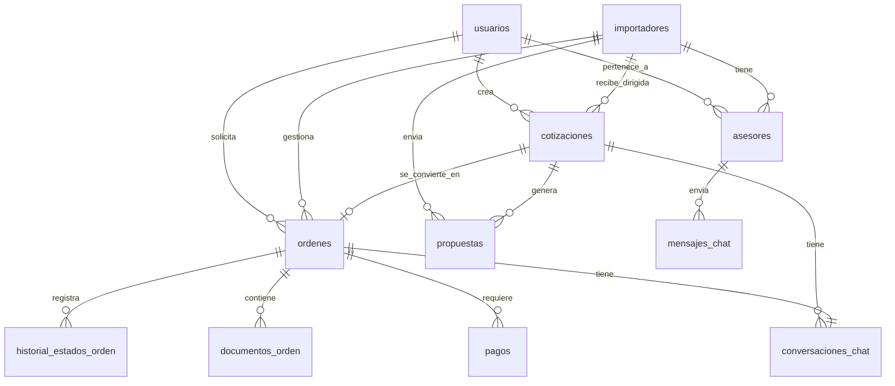

# Base de Datos — Zarpi (ImportacionesQ8)

> **Última actualización:** 2026-10-01 · 24 migraciones, 52 tablas. Las secciones por tabla describen el núcleo de julio de 2026; lo añadido después está en [[#Migraciones y esquema inicial]].

## Descripción general

**MySQL** como base de datos principal para almacenar usuarios, empresas importadoras, cotizaciones, órdenes y pagos. Volumen y complejidad moderados adecuados para esta etapa del negocio.

> **Estado de implementación (Semana 3 — Fases 0 a 4, verificado con 159/159 tests):** el esquema real diverge del documentado más abajo en varios puntos importantes, resumidos aquí. El detalle columna por columna de cada tabla se actualiza en las secciones correspondientes.
>
> - **`usuarios`**: se agregó `importador_id` (FK nullable → `importadores.id`) para desacoplar la cuenta de la empresa (antes se asumía `Usuario.id == Importador.id`), además de `nombre`, `telefono`, `foto_url`, `whatsapp` y `activo`. El rol `asesor` se sumó a la lista de roles válidos.
> - **La tabla `asesores` fue retirada** y su función la absorbe `Usuario(rol="asesor")`, ya que un asesor ahora es una cuenta con login propio (con permisos de reclamar cotizaciones, redactar borradores de propuestas y chatear), no solo un dato de contacto.
> - **`importadores`**: se agregó `solo_cotizaciones_directas` (Boolean), que determina si la empresa participa en el matching de la red abierta (`False`, formulario estándar) o define su propio formulario de cotización (`True`, queda fuera del matching abierto).
> - **`cotizaciones`**: se agregaron `asesor_asignado_id` (FK → `usuarios.id`, quién reclamó la cotización del pool de la empresa) y `campos_personalizados_valores` (JSON, valores de los campos del formulario personalizado cuando aplica).
> - **`ordenes`**: `asesor_asignado_id` se renombró a `asesor_asignado_id` (FK → `usuarios.id`, heredado de la cotización). Se agregaron `en_disputa` (Boolean) y `motivo_disputa` (Text) para el flujo de disputas del panel admin.
> - **Nueva tabla `campos_personalizados`**: define los campos del formulario de cotización personalizado de una empresa `solo_cotizaciones_directas=True`.
> - **`conversaciones_chat`**: la columna `importador_id` se renombró conceptualmente a `importador_usuario_id` (FK → `usuarios.id`, no a `importadores.id`), ya que la conversación se vincula a la cuenta específica (dueño o asesor asignado) que negocia con el solicitante, no a la empresa en abstracto. Además, la conversación se crea al **aceptar/rechazar la propuesta** (no solo al pagar), por lo que `orden_id` queda `NULL` hasta que se genera la orden.
> - **`mensajes_chat`**: el campo `archivo_url` no se implementó en esta iteración (el tipo `"archivo"` existe en el enum pero sin campo dedicado; se puede enviar la URL dentro de `contenido` como solución temporal).
>
> Ver el plan de implementación y `Fases-Desarrollo/Semana-3-Chat-y-Pulido/Tareas-Semana-3.md` para el detalle de las tareas que motivaron estos cambios.

> **Estado de implementación (Semana 4 — Asesores, créditos, registro y blindaje adicional):**
>
> - **Rol `asesor`:** el rol `trabajador` se **renombró a `asesor`** en `usuarios.rol`, y la columna `cotizaciones.trabajador_asignado_id`/`ordenes.trabajador_asignado_id` se renombró a **`asesor_asignado_id`**.
> - **`usuarios`**: se agregaron los campos de registro diferenciado (`tipo_persona`, `tipo_documento`, `numero_documento`, `nit`, `razon_social`, `apellido`, `indicativo_pais_telefono`, `acepto_politica_datos`, `fecha_aceptacion_politica`) y **`creditos_balance`** (saldo de créditos consumibles al crear cotizaciones).
> - **`importadores`**: se agregó **`verificado`** (Boolean), badge real de "socio verificado" del catálogo, independiente de `estado`.
> - **`cotizaciones`**: se agregaron `costo_creditos`, `cotizacion_origen_id` (FK a sí misma, trazabilidad de recreaciones), `cancelada_por_error` y `motivo_cancelacion`; el enum `estado` ganó el valor `cancelada`.
> - **`propuestas`**: se agregaron `creado_por_usuario_id` (quién redactó/editó por última vez: asesor o dueño), `preaceptada_por_solicitante` y `preaceptada_por_empresa` (doble aceptación mutua); el enum `estado` ganó el valor `borrador`.
> - **`pagos`**: ya no se vincula a `orden_id`/`cotizacion_id`; ahora se vincula a `usuario_id` y agrega `creditos_comprados` — el pago compra créditos, no paga una orden directamente (ver `Backend/Pagos-Wompi.md`).
> - **`mensajes_chat`**: el enum `tipo` ganó el valor `sistema` (mensajes automáticos, ej. el aviso de traspaso de chat al dueño tras la doble aceptación).
> - **Nuevas tablas:** `password_reset_tokens`, `movimientos_credito`, `solicitudes_recreacion` (detalladas más abajo).
> - **`POST /ordenes/crear-orden` fue eliminado.** La orden ahora se crea automáticamente cuando ambas partes pre-aceptan la misma propuesta (`POST /propuestas/{id}/pre-aceptar`), sin pago de por medio.
>
> Ver `Fases-Desarrollo/Semana-4-Asesores-Creditos-Registro/Tareas-Semana-4.md` para el detalle completo.

---

## Esquema de la base de datos

### Tabla: `usuarios`

| Columna | Tipo | Descripción |
|---------|------|-------------|
| id | UUID PK | Identificador único del usuario |
| email | VARCHAR(255) UNIQUE | Email del usuario (login) |
| password_hash | VARCHAR(255) | Hash de la contraseña (bcrypt) |
| rol | ENUM('solicitante', 'importador', 'asesor', 'admin') | Rol del usuario en el sistema |
| importador_id | UUID FK → importadores.id, NULLABLE | Empresa a la que pertenece la cuenta (dueño o asesor). NULL para solicitantes y admins |
| nombre | VARCHAR(255) NULL | Nombre personal (cliente, dueño o asesor) |
| telefono | VARCHAR(30) NULL | Teléfono de contacto |
| foto_url | VARCHAR(500) NULL | URL de foto de perfil (dueño/asesor) |
| whatsapp | VARCHAR(20) NULL | Número de WhatsApp (dueño/asesor) |
| activo | BOOLEAN DEFAULT TRUE | Si la cuenta puede iniciar sesión (se desactiva desde el panel admin) |
| perfil_completo | BOOLEAN DEFAULT FALSE | Si el usuario completó su perfil |
| tipo_persona | ENUM('natural', 'juridica') NULL | (Semana 4) Solo `solicitante`; distingue el formulario de registro usado |
| tipo_documento | VARCHAR(30) NULL | (Semana 4) Cédula, pasaporte, cédula de extranjería... (persona natural) |
| numero_documento | VARCHAR(50) NULL | (Semana 4) Persona natural |
| nit | VARCHAR(50) NULL | (Semana 4) Persona jurídica |
| razon_social | VARCHAR(255) NULL | (Semana 4) Nombre de la empresa (persona jurídica) |
| indicativo_pais_telefono | VARCHAR(6) NULL | (Semana 4) Ej. "+57" |
| acepto_politica_datos | BOOLEAN DEFAULT FALSE | (Semana 4) Debe ser `TRUE` para completar el registro |
| fecha_aceptacion_politica | TIMESTAMP NULL | (Semana 4) Trazabilidad legal de la aceptación |
| creditos_balance | DECIMAL(10,2) DEFAULT 0.00 | (Semana 4) Saldo de créditos consumibles al crear cotizaciones; solo aplica a `solicitante` |
| fecha_creacion | TIMESTAMP | Fecha de registro |

> **Nota (Semana 3):** `importador_id` desacopla la cuenta de usuario de la empresa importadora, para soportar varias cuentas (dueño + asesores) por empresa. Antes se asumía `Usuario.id == Importador.id` para el rol "importador".

### Tabla: `importadores`

| Columna | Tipo | Descripción |
|---------|------|-------------|
| id | UUID PK | Identificador único del importador |
| nombre_empresa | VARCHAR(255) | Nombre de la empresa importadora |
| logo_url | VARCHAR(500) NULL | URL del logo de la empresa |
| especialidad_producto | JSON | Array de categorías (ej: ["Textiles", "Electrónica"]) |
| paises_origen | JSON | Array de países de origen (ej: ["China", "Vietnam"]) |
| calificacion_promedio | DECIMAL(3,2) DEFAULT 0.00 | Calificación promedio de la empresa |
| tiempo_respuesta_promedio | VARCHAR(10) | Tiempo promedio de respuesta (ej: "24h") |
| capacidad_volumen | INT NULL | Capacidad máxima de volumen por pedido |
| estado | ENUM('activo', 'inactivo') DEFAULT 'activo' | Estado del importador en la red |
| solo_cotizaciones_directas | BOOLEAN DEFAULT FALSE | Si `TRUE`, la empresa define su propio formulario de cotización (tabla `campos_personalizados`) y queda fuera del motor de matching de la red abierta. Si `FALSE`, usa el formulario estándar del PDF y participa en el matching |
| verificado | BOOLEAN DEFAULT FALSE | (Semana 4) Badge de "socio verificado", independiente de `estado`. Solo el admin lo fija (`POST /admin/importadores/{id}/verificar`) |
| fecha_registro | TIMESTAMP | Fecha de registro en la plataforma |

### Tabla: `asesores` (retirada — ver `usuarios.rol='asesor'`)

> **Nota (Semana 3):** esta tabla se retiró. Un "asesor" ahora es una cuenta con login propio: `Usuario(rol="asesor", importador_id=<empresa>)`. Ver la sección de tareas de asesores en `Fases-Desarrollo/Semana-3-Chat-y-Pulido/Tareas-Semana-3.md`.

### Tabla: `campos_personalizados` (nueva — Semana 3)

| Columna | Tipo | Descripción |
|---------|------|-------------|
| id | UUID PK | Identificador único del campo |
| importador_id | UUID FK → importadores.id | Empresa dueña del campo (solo si `solo_cotizaciones_directas=TRUE`) |
| etiqueta | VARCHAR(255) | Texto visible del campo en el formulario |
| tipo | ENUM('texto', 'numero', 'select', 'booleano') | Tipo de campo a renderizar |
| opciones | JSON NULL | Opciones disponibles si `tipo='select'` |
| obligatorio | BOOLEAN DEFAULT FALSE | Si el campo es obligatorio al crear la cotización |
| orden | INT DEFAULT 0 | Orden de aparición en el formulario |

### Tabla: `cotizaciones`

| Columna | Tipo | Descripción |
|---------|------|-------------|
| id | UUID PK | Identificador único de la cotización |
| solicitante_id | UUID FK → usuarios.id | Solicitante que creó la cotización |
| importador_id | UUID NULL | Importador específico (solo modalidad dirigida) |
| modalidad | ENUM('dirigida', 'abierta') | Tipo de cotización |
| foto_producto | VARCHAR(500) NULL | URL de la imagen del producto |
| pais_importacion | VARCHAR(100) | País desde donde se importa |
| nivel_personalizacion | ENUM('estandar', 'personalizacion_marca', 'personalizacion_diseno_completo') | Nivel de personalización deseado |
| nombre_producto | VARCHAR(255) | Nombre del producto a importar |
| descripcion_cliente | TEXT | Descripción detallada del producto |
| link_referencia | VARCHAR(500) NULL | URL de referencia (Alibaba, 1688) |
| linea_producto | VARCHAR(100) | Categoría/línea del producto |
| tipo_calidad | ENUM('economica', 'estandar', 'premium') | Tipo de calidad deseada |
| modalidad_importacion | ENUM('ecommerce', 'corporativo') | Modalidad de importación |
| cantidad_minima | INT | Cantidad mínima a importar |
| precio_objetivo_usd | DECIMAL(10,2) | Precio objetivo en USD |
| incoterm | VARCHAR(50) | Incoterm acordado (FOB, CIF, etc.) |
| notas_adicionales | TEXT NULL | Notas adicionales del solicitante |
| campos_personalizados_valores | JSON NULL | Valores del formulario personalizado (`{campo_id: valor}`) cuando la empresa dirigida es `solo_cotizaciones_directas=TRUE` |
| asesor_asignado_id | UUID FK → usuarios.id, NULLABLE | Dueño o asesor que reclamó la cotización del pool (`POST /cotizaciones/{id}/reclamar`) |
| costo_creditos | DECIMAL(10,2) NULL | (Semana 4) Créditos descontados al crear esta cotización (trazabilidad) |
| cotizacion_origen_id | UUID FK → cotizaciones.id, NULLABLE | (Semana 4) Si esta cotización nace como reemplazo de una cancelada por error, referencia a la original |
| cancelada_por_error | VARCHAR(20) NULL | (Semana 4) `NULL`, o quién fue responsable: `"solicitante"`/`"importador"` |
| motivo_cancelacion | TEXT NULL | (Semana 4) Motivo de la cancelación por error |
| estado | ENUM('creada', 'dirigida', 'abierta', 'propuestas_recibidas', 'cotizacion_aceptada', 'orden_activa', 'cancelada') | Estado actual de la cotización (Semana 4: se agregó `cancelada`) |
| fecha_creacion | TIMESTAMP | Fecha de creación |
| fecha_actualizacion | TIMESTAMP | Última actualización |

### Tabla: `propuestas`

| Columna | Tipo | Descripción |
|---------|------|-------------|
| id | UUID PK | Identificador único de la propuesta |
| cotizacion_id | UUID FK → cotizaciones.id | Cotización a la que responde |
| importador_id | UUID FK → importadores.id | Importador que envía la propuesta |
| precio_ofrecido_usd | DECIMAL(10,2) | Precio ofrecido por el importador |
| tiempo_estimado_entrega | VARCHAR(50) | Tiempo estimado de entrega |
| incoterm | VARCHAR(50) | Incoterm propuesto por el importador (FOB, CIF, EXW, DDP...) |
| condiciones_adicionales | TEXT NULL | Condiciones adicionales (garantías, forma de pago, etc.) |
| creado_por_usuario_id | UUID FK → usuarios.id, NULLABLE | (Semana 4) Cuenta (asesor o dueño) que redactó/editó por última vez esta propuesta |
| preaceptada_por_solicitante | BOOLEAN DEFAULT FALSE | (Semana 4) El solicitante marcó su lado de la doble aceptación mutua |
| preaceptada_por_empresa | BOOLEAN DEFAULT FALSE | (Semana 4) El asesor asignado o el dueño marcó el lado empresa |
| estado | ENUM('borrador', 'pendiente', 'aceptada', 'rechazada') | Estado de la propuesta (Semana 4: se agregó `borrador`, redactado por un asesor y aún no visible para el solicitante) |
| fecha_envio | TIMESTAMP | Fecha y hora de envío de la propuesta |

> **Nota (revisión de congruencia con wireframes, 06/07):** se agregó la columna `incoterm`, ausente en la implementación original. Los wireframes "Panel de Propuestas Recibidas" (Pantalla 6) y "Formulario de Respuesta a Cotización" (Pantalla 11) muestran el incoterm como dato obligatorio de cada propuesta, y el PDF de referencia (`docs/Propuesta_Plataforma_Importacion.pdf`) lo confirma en el flujo de respuesta del importador (paso 15: "responde con propuesta de precio, tiempo estimado, condiciones **e incoterm**").

### Tabla: `ordenes`

| Columna | Tipo | Descripción |
|---------|------|-------------|
| id | UUID PK | Identificador único de la orden |
| cotizacion_id | UUID FK → cotizaciones.id | Cotización origen de la orden |
| importador_id | UUID FK → importadores.id | Importador asignado a la orden |
| solicitante_id | UUID FK → usuarios.id | Solicitante de la orden |
| asesor_asignado_id | UUID FK → usuarios.id, NULLABLE | asesor de la empresa que reclamó la cotización de origen (heredado al crear la orden); NULL si nadie la reclamó. Reemplaza a `asesor_asignado_id` |
| estado | ENUM('cotizacion_aceptada', 'en_produccion', 'transito_internacional', 'aduana_nacionalizacion', 'bodega_local', 'entregado') | Estado actual de la orden |
| precio_acordado_usd | DECIMAL(10,2) | Precio acordado en la cotización aceptada |
| tiempo_estimado_entrega | VARCHAR(50) NULL | Tiempo estimado de entrega acordado |
| condiciones_adicionales | TEXT NULL | Condiciones adicionales acordadas |
| en_disputa | BOOLEAN DEFAULT FALSE | Si el solicitante reportó un problema pendiente de revisión por el equipo admin |
| motivo_disputa | TEXT NULL | Motivo reportado por el solicitante / notas de resolución del admin |
| fecha_creacion | TIMESTAMP | Fecha de creación de la orden |
| fecha_actualizacion | TIMESTAMP | Última actualización del estado |

### Tabla: `historial_estados_orden`

| Columna | Tipo | Descripción |
|---------|------|-------------|
| id | UUID PK | Identificador único del registro |
| orden_id | UUID FK → ordenes.id | Orden a la que pertenece el cambio de estado |
| estado_anterior | VARCHAR(50) NULL | Estado anterior (NULL si es el primer estado) |
| estado_nuevo | VARCHAR(50) | Nuevo estado |
| fecha_cambio | TIMESTAMP | Fecha y hora del cambio |

### Tabla: `documentos_orden`

| Columna | Tipo | Descripción |
|---------|------|-------------|
| id | UUID PK | Identificador único del documento |
| orden_id | UUID FK → ordenes.id | Orden a la que pertenece el documento |
| nombre | VARCHAR(255) | Nombre descriptivo del documento (ej: "Factura Proforma") |
| url | VARCHAR(500) | URL del archivo almacenado |
| tipo | ENUM('factura_proforma', 'factura_comercial', 'packing_list', 'comprobante_pago') | Tipo de documento |

### Tabla: `pagos`

> **Cambio de modelo (Semana 4):** el pago ya no está ligado a una orden ni a una cotización específica — ahora es una **compra de créditos** del usuario, consumibles luego al crear cotizaciones. Ver [[Pagos-Wompi]].

| Columna | Tipo | Descripción |
|---------|------|-------------|
| id | UUID PK | Identificador único del pago |
| usuario_id | UUID FK → usuarios.id, NOT NULL | (Semana 4) Usuario que compra los créditos |
| wompi_payment_id | VARCHAR(100) UNIQUE, NOT NULL | ID del pago en Wompi — la restricción UNIQUE es la garantía real (a nivel de base de datos) de que un mismo pago no se procesa dos veces |
| monto_usd | DECIMAL(10,2) | Monto pagado en USD |
| creditos_comprados | DECIMAL(10,2) | (Semana 4) Créditos a acreditar cuando el pago se confirme |
| estado | ENUM('pendiente', 'confirmado', 'fallido', 'reembolsado') | Estado del pago según Wompi |
| fecha_creacion | TIMESTAMP | Fecha de creación del pago |
| fecha_confirmacion | TIMESTAMP NULL | Fecha de confirmación del pago (NULL si no confirmado) |

### Tabla: `movimientos_credito` (nueva — Semana 4)

| Columna | Tipo | Descripción |
|---------|------|-------------|
| id | UUID PK | Identificador único del movimiento |
| usuario_id | UUID FK → usuarios.id | Usuario dueño del movimiento |
| tipo | ENUM('compra', 'consumo', 'reembolso') | Tipo de movimiento |
| monto | DECIMAL(10,2) | Créditos sumados (positivo) o restados (negativo) |
| cotizacion_id | UUID FK → cotizaciones.id, NULLABLE | Cotización asociada, si aplica (consumo/reembolso) |
| pago_id | UUID FK → pagos.id, NULLABLE | Pago asociado, si aplica (compra) |
| descripcion | VARCHAR(255) NULL | Detalle legible del movimiento |
| fecha | TIMESTAMP | Fecha del movimiento |

### Tabla: `solicitudes_recreacion` (nueva — Semana 4)

Gestiona el flujo de "cotización one-time": si hubo un error de alguna de las partes durante la negociación, se solicita anular la cotización aceptada y crear una nueva, con el admin mediando quién asume el costo.

| Columna | Tipo | Descripción |
|---------|------|-------------|
| id | UUID PK | Identificador único de la solicitud |
| cotizacion_origen_id | UUID FK → cotizaciones.id | Cotización que se solicita cancelar/recrear |
| solicitado_por_usuario_id | UUID FK → usuarios.id | Quién solicitó la recreación (solicitante o asesor/dueño asignado) |
| motivo | TEXT | Motivo reportado |
| parte_atribuida | ENUM('solicitante', 'importador') | Parte que el solicitante cree responsable (sugerencia, no definitiva) |
| estado | ENUM('pendiente', 'aprobada', 'rechazada') | Estado de la solicitud |
| resuelto_por_admin_id | UUID FK → usuarios.id, NULLABLE | Admin que resolvió la solicitud |
| fecha | TIMESTAMP | Fecha de la solicitud |

### Tabla: `password_reset_tokens` (nueva — Semana 4)

| Columna | Tipo | Descripción |
|---------|------|-------------|
| id | UUID PK | Identificador único del token |
| usuario_id | UUID FK → usuarios.id | Usuario que solicitó la recuperación |
| token_hash | VARCHAR(255) | Hash del token enviado por enlace (nunca en texto plano) |
| otp_hash | VARCHAR(255) | Hash del OTP de 6 dígitos enviado por correo |
| expira_en | TIMESTAMP | Expiración corta (default 15 minutos, `PASSWORD_RESET_EXPIRE_MINUTES`) |
| usado | BOOLEAN DEFAULT FALSE | Un token/OTP es de un solo uso |
| fecha_creacion | TIMESTAMP | Fecha de creación del token |

### Tabla: `conversaciones_chat`

| Columna | Tipo | Descripción |
|---------|------|-------------|
| id | UUID PK | Identificador único de la conversación |
| cotizacion_id | UUID FK → cotizaciones.id, UNIQUE | Cotización que originó la conversación (se crea al aceptar/rechazar la propuesta) |
| orden_id | UUID FK → ordenes.id, NULLABLE, UNIQUE | Orden asociada a la conversación; NULL hasta que se crea la orden (el pago es posterior a la negociación) |
| solicitante_id | UUID FK → usuarios.id | Solicitante en la conversación |
| importador_usuario_id | UUID FK → usuarios.id | Cuenta de la empresa en la conversación: el asesor que reclamó la cotización, o la cuenta dueña si nadie la reclamó. **No** es `importadores.id` |
| fecha_creacion | TIMESTAMP | Fecha de creación de la conversación |

### Tabla: `mensajes_chat`

| Columna | Tipo | Descripción |
|---------|------|-------------|
| id | UUID PK | Identificador único del mensaje |
| conversacion_id | UUID FK → conversaciones_chat.id | Conversación a la que pertenece el mensaje |
| remitente_id | UUID FK → usuarios.id | Usuario que envió el mensaje |
| contenido | TEXT | Contenido del mensaje |
| tipo | ENUM('texto', 'archivo', 'sistema') DEFAULT 'texto' | Tipo de mensaje. (Semana 4) `sistema`: mensajes automáticos, ej. el aviso de traspaso de chat al dueño tras la doble aceptación |
| fecha_envio | TIMESTAMP | Fecha y hora de envío |

> **Nota (Semana 3):** el campo `archivo_url` planeado originalmente no se implementó en esta iteración; para mensajes tipo `"archivo"` la URL puede enviarse dentro de `contenido` como solución temporal.

---

## Relaciones entre tablas



---

## Índices recomendados

| Tabla | Columna(s) | Tipo de índice | Razón |
|-------|-----------|---------------|-------|
| cotizaciones | solicitante_id, estado | Compuesto | Búsqueda rápida de cotizaciones del solicitante por estado |
| cotizaciones | importador_id, modalidad | Compuesto | Filtrado de cotizaciones dirigidas/abiertas por importador |
| cotizaciones | estado, fecha_creacion | Compuesto | Listado de cotizaciones activas ordenadas por fecha |
| cotizaciones | modalida | Índice simple | Filtro principal para matching de cotizaciones abiertas |
| propuestas | cotizacion_id, importador_id | Compuesto | Búsqueda rápida de propuestas de una cotización específica |
| propuestas | estado, fecha_envio | Compuesto | Listado de propuestas pendientes ordenadas por tiempo |
| ordenes | solicitante_id, estado | Compuesto | Búsqueda de órdenes del solicitante por estado |
| ordenes | importador_id, estado | Compuesto | Búsqueda de órdenes asignadas al importador por estado |
| pagos | wompi_payment_id | Único | Verificación rápida de pagos por ID de Wompi |
| pagos | orden_id | Simple | Búsqueda del pago asociado a una orden |
| conversaciones_chat | orden_id | Simple | Búsqueda de conversación por orden |
| conversaciones_chat | solicitante_id, importador_id | Compuesto | Búsqueda de conversación entre dos usuarios específicos |

---

## Migraciones y esquema inicial

### Alembic (estado actual — 2026-10-01)

El esquema se gestiona con **Alembic** en `proyecto/backend/alembic/`. Hay **24 revisiones** y 52 tablas.

| Pieza | Rol |
|-------|-----|
| `alembic.ini` + `alembic/env.py` | Configuración; la URL sale de `DATABASE_URL` |
| `entrypoint.sh` (contenedor del backend) | Base vacía: `create_all` de los modelos + `alembic stamp head` (`database.bootstrap_si_vacia`). Base existente: `alembic upgrade head`. Si la migración falla, el contenedor no arranca |
| `scripts/restaurar_backup.py --crear-esquema` | Mismo bootstrap para restaurar una copia sobre una base vacía |

> La cadena de migraciones **no sirve para partir de cero**: la `0001` hace `create_all` con los modelos actuales. Para una base nueva se usa el bootstrap de arriba. Alembic sirve para llevar hacia adelante una base existente.

#### Revisiones

| Revisión | Fecha | Qué añade |
|----------|-------|-----------|
| `0001` | 2026-07-13 | Esquema inicial (`create_all`) |
| `0002` | 2026-07-13 | Evidencias de importador, organizaciones, disputas, referidos, caché de traducciones; `mensajes_chat.metadata` |
| `0003` | 2026-07-13 | Códigos OTP, verificación de email, `usuarios.ultimo_login_at` |
| `0004` | 2026-07-14 | Endurecimiento OWASP: `jwt_blacklist`, compra única por pago |
| `0005` | 2026-07-28 | Cursos (LMS) y notificaciones |
| `0006` | 2026-08-04 | Gestión documental: carpetas, archivos, etiquetas, favoritos, `orden_documentos`, `mensajes_adjuntos`, `curso_recursos`, borrado lógico (`deleted_at`) |
| `0007` | 2026-08-05 | `importadores.perfil_publico` |
| `0008` | 2026-08-06 | `certificados_curso` |
| `0009` | 2026-08-06 | `certificaciones` y `certificaciones_importador` |
| `0010` | 2026-08-07 | Shipping mark (importadores, cotizaciones, órdenes) |
| `0011` | 2026-08-08 | `resenas_importador` |
| `0012` | 2026-08-09 | Chat interno empresa–asesor (`conversaciones_chat.tipo`, `importador_id`) |
| `0013` | 2026-08-09 | Tickets de soporte (asunto, urgencia) y `lecturas_conversacion` |
| `0014` | 2026-08-09 | Fechas del chat con microsegundos |
| `0015` | 2026-08-09 | Cierre de tickets (resolución, quién y cuándo) |
| `0016` | 2026-08-09 | Mesa de soporte por niveles (`usuarios.nivel_soporte`; nivel, agente, calificación del ticket) |
| `0017` | 2026-08-10 | `articulos_ayuda` |
| `0018` | 2026-08-31 | `cotizaciones.moneda_precio_objetivo` e incoterm DDP por defecto |
| `0019` | 2026-09-08 | `landing_blocks`, `landing_allies`, `landing_news` |
| `0020` | 2026-09-08 | `landing_blocks.fuente` |
| `0021` | 2026-09-21 | `usuarios.tier`, `puntos_cotizacion`; `cotizaciones.tier_minimo_requerido`, `desbloqueada_por_puntos` |
| `0022` | 2026-09-21 | `usuarios.tier_manual`, `umbrales_tier_cotizante`, `movimientos_puntos_cotizacion` |
| `0023` | 2026-09-29 | `importadores.tier_minimo_requerido`; `notificaciones.cotizacion_id` y `conversacion_id`; `usuarios.importaciones_fuera_plataforma`; `cotizaciones.tier_solicitante_creacion` |
| `0024` | 2026-09-30 | `importadores.limite_cotizaciones_diarias` y `recepciones_cotizacion` (cupo diario) |

#### Tablas añadidas después del esquema documentado arriba

Las secciones de tabla de esta nota describen el núcleo (julio de 2026). Estas otras tablas se añadieron después. El detalle de columnas está en `proyecto/backend/models/`.

| Dominio | Tablas | Guía |
|---------|--------|------|
| Seguridad y acceso | `codigos_otp`, `jwt_blacklist` | [[Autenticacion]] |
| Organizaciones, referidos, traducción | `organizaciones_solicitantes`, `miembros_organizacion`, `codigos_referido`, `referidos_uso`, `traducciones_cache` | [[Features-Valor-Jul-2026]] |
| Reputación | `evidencias_importador`, `certificaciones`, `certificaciones_importador`, `resenas_importador` | [[04-Importadores]] |
| Disputas | `disputas`, `evidencias_disputa`, `mensajes_disputa` | [[10-Disputas]] |
| Documentos | `carpetas`, `archivos`, `etiquetas`, `archivo_etiquetas`, `favoritos`, `orden_documentos`, `mensajes_adjuntos`, `curso_recursos` | [[17-Documentos-y-Multimedia]] |
| Cursos | `cursos`, `modulos_curso`, `lecciones_curso`, `recursos_leccion`, `compras_curso`, `progreso_lecciones`, `certificados_curso` | [[15-Cursos-LMS]] |
| Chat y soporte | `lecturas_conversacion` (+ columnas de soporte en `conversaciones_chat`) | [[Chat-WebSocket]] |
| Ayuda y landing | `articulos_ayuda`, `landing_blocks`, `landing_allies`, `landing_news` | [[21-Ayuda-y-Soporte]] · [[22-Landing-CMS]] |
| Tiers | `umbrales_tier_cotizante`, `movimientos_puntos_cotizacion` | [[18-Tiers-y-Perfil-Cotizante]] |
| Cupo diario | `recepciones_cotizacion` | [[19-Limite-Diario-Cotizaciones]] |

Comandos típicos:

```bash
cd proyecto/backend
alembic upgrade head
alembic revision --autogenerate -m "descripcion"   # revisar el resultado: las migraciones del repo son idempotentes (comprueban columnas antes de añadirlas)
```

> **Importante:** no usar solo `create_all` al importar módulos: la metadata debe estar cargada (modelos importados) antes de crear tablas. Detalle en [[Remediaciones-Backend-Jul-2026]] y [[Auditoria-Backend-2026-07-13]].

### Script de creación del esquema (pseudocódigo SQL de referencia)

```sql
-- Crear base de datos
CREATE DATABASE importacionesq8;

-- Tabla de usuarios
CREATE TABLE usuarios (
    id UUID PRIMARY KEY DEFAULT (UUID()),
    email VARCHAR(255) UNIQUE NOT NULL,
    password_hash VARCHAR(255) NOT NULL,
    rol ENUM('solicitante', 'importador', 'admin') NOT NULL,
    perfil_completo BOOLEAN DEFAULT FALSE,
    fecha_creacion TIMESTAMP DEFAULT CURRENT_TIMESTAMP
);

-- Tabla de importadores
CREATE TABLE importadores (
    id UUID PRIMARY KEY DEFAULT (UUID()),
    nombre_empresa VARCHAR(255) NOT NULL,
    logo_url VARCHAR(500),
    especialidad_producto JSON,
    paises_origen JSON,
    calificacion_promedio DECIMAL(3,2) DEFAULT 0.00,
    tiempo_respuesta_promedio VARCHAR(10),
    capacidad_volumen INT,
    estado ENUM('activo', 'inactivo') DEFAULT 'activo',
    fecha_registro TIMESTAMP DEFAULT CURRENT_TIMESTAMP
);

-- Tabla de asesores
CREATE TABLE asesores (
    id UUID PRIMARY KEY DEFAULT (UUID()),
    importador_id UUID NOT NULL,
    nombre VARCHAR(255) NOT NULL,
    foto_url VARCHAR(500),
    whatsapp VARCHAR(20),
    FOREIGN KEY (importador_id) REFERENCES importadores(id) ON DELETE CASCADE
);

-- Tabla de cotizaciones
CREATE TABLE cotizaciones (
    id UUID PRIMARY KEY DEFAULT (UUID()),
    solicitante_id UUID NOT NULL,
    importador_id UUID,
    modalidad ENUM('dirigida', 'abierta') NOT NULL,
    foto_producto VARCHAR(500),
    pais_importacion VARCHAR(100) NOT NULL,
    nivel_personalizacion ENUM('estandar', 'personalizacion_marca', 'personalizacion_diseno_completo'),
    nombre_producto VARCHAR(255) NOT NULL,
    descripcion_cliente TEXT NOT NULL,
    link_referencia VARCHAR(500),
    linea_producto VARCHAR(100) NOT NULL,
    tipo_calidad ENUM('economica', 'estandar', 'premium') NOT NULL,
    modalidad_importacion ENUM('ecommerce', 'corporativo'),
    cantidad_minima INT NOT NULL,
    precio_objetivo_usd DECIMAL(10,2),
    incoterm VARCHAR(50) NOT NULL,
    notas_adicionales TEXT,
    estado ENUM('creada', 'dirigida', 'abierta', 'propuestas_recibidas', 'cotizacion_aceptada', 'orden_activa') DEFAULT 'creada',
    fecha_creacion TIMESTAMP DEFAULT CURRENT_TIMESTAMP,
    fecha_actualizacion TIMESTAMP DEFAULT CURRENT_TIMESTAMP ON UPDATE CURRENT_TIMESTAMP,
    FOREIGN KEY (solicitante_id) REFERENCES usuarios(id),
    FOREIGN KEY (importador_id) REFERENCES importadores(id)
);

-- Tabla de propuestas
CREATE TABLE propuestas (
    id UUID PRIMARY KEY DEFAULT (UUID()),
    cotizacion_id UUID NOT NULL,
    importador_id UUID NOT NULL,
    precio_ofrecido_usd DECIMAL(10,2),
    tiempo_estimado_entrega VARCHAR(50),
    incoterm VARCHAR(50) NOT NULL,
    condiciones_adicionales TEXT,
    estado ENUM('pendiente', 'aceptada', 'rechazada') DEFAULT 'pendiente',
    fecha_envio TIMESTAMP DEFAULT CURRENT_TIMESTAMP,
    FOREIGN KEY (cotizacion_id) REFERENCES cotizaciones(id) ON DELETE CASCADE,
    FOREIGN KEY (importador_id) REFERENCES importadores(id),
    UNIQUE KEY unique_propuesta_cotizacion_importador (cotizacion_id, importador_id)
);

-- Tabla de órdenes
CREATE TABLE ordenes (
    id UUID PRIMARY KEY DEFAULT (UUID()),
    cotizacion_id UUID NOT NULL,
    importador_id UUID NOT NULL,
    solicitante_id UUID NOT NULL,
    asesor_asignado_id UUID,
    estado ENUM('cotizacion_aceptada', 'en_produccion', 'transito_internacional', 'aduana_nacionalizacion', 'bodega_local', 'entregado') DEFAULT 'cotizacion_aceptada',
    precio_acordado_usd DECIMAL(10,2),
    tiempo_estimado_entrega VARCHAR(50),
    condiciones_adicionales TEXT,
    fecha_creacion TIMESTAMP DEFAULT CURRENT_TIMESTAMP,
    fecha_actualizacion TIMESTAMP DEFAULT CURRENT_TIMESTAMP ON UPDATE CURRENT_TIMESTAMP,
    FOREIGN KEY (cotizacion_id) REFERENCES cotizaciones(id),
    FOREIGN KEY (importador_id) REFERENCES importadores(id),
    FOREIGN KEY (solicitante_id) REFERENCES usuarios(id),
    FOREIGN KEY (asesor_asignado_id) REFERENCES asesores(id)
);

-- Tabla de historial de estados de orden
CREATE TABLE historial_estados_orden (
    id UUID PRIMARY KEY DEFAULT (UUID()),
    orden_id UUID NOT NULL,
    estado_anterior VARCHAR(50),
    estado_nuevo VARCHAR(50) NOT NULL,
    fecha_cambio TIMESTAMP DEFAULT CURRENT_TIMESTAMP,
    FOREIGN KEY (orden_id) REFERENCES ordenes(id) ON DELETE CASCADE
);

-- Tabla de documentos de orden
CREATE TABLE documentos_orden (
    id UUID PRIMARY KEY DEFAULT (UUID()),
    orden_id UUID NOT NULL,
    nombre VARCHAR(255) NOT NULL,
    url VARCHAR(500) NOT NULL,
    tipo ENUM('factura_proforma', 'factura_comercial', 'packing_list', 'comprobante_pago') NOT NULL,
    FOREIGN KEY (orden_id) REFERENCES ordenes(id) ON DELETE CASCADE
);

-- Tabla de pagos
CREATE TABLE pagos (
    id UUID PRIMARY KEY DEFAULT (UUID()),
    orden_id UUID NOT NULL,
    wompi_payment_id VARCHAR(100) UNIQUE,
    monto_usd DECIMAL(10,2),
    estado ENUM('pendiente', 'confirmado', 'fallido', 'reembolsado') DEFAULT 'pendiente',
    webhook_url VARCHAR(500),
    fecha_creacion TIMESTAMP DEFAULT CURRENT_TIMESTAMP,
    fecha_confirmacion TIMESTAMP NULL,
    FOREIGN KEY (orden_id) REFERENCES ordenes(id)
);

-- Tabla de conversaciones de chat
CREATE TABLE conversaciones_chat (
    id UUID PRIMARY KEY DEFAULT (UUID()),
    orden_id UUID,
    solicitante_id UUID NOT NULL,
    importador_id UUID NOT NULL,
    FOREIGN KEY (orden_id) REFERENCES ordenes(id),
    FOREIGN KEY (solicitante_id) REFERENCES usuarios(id),
    FOREIGN KEY (importador_id) REFERENCES importadores(id),
    UNIQUE KEY unique_conversacion_orden (orden_id),
    UNIQUE KEY unique_conversacion_solicitante_importador (solicitante_id, importador_id)
);

-- Tabla de mensajes de chat
CREATE TABLE mensajes_chat (
    id UUID PRIMARY KEY DEFAULT (UUID()),
    conversacion_id UUID NOT NULL,
    remitente_id UUID NOT NULL,
    contenido TEXT NOT NULL,
    tipo ENUM('texto', 'archivo') DEFAULT 'texto',
    archivo_url VARCHAR(500),
    fecha_envio TIMESTAMP DEFAULT CURRENT_TIMESTAMP,
    FOREIGN KEY (conversacion_id) REFERENCES conversaciones_chat(id) ON DELETE CASCADE,
    FOREIGN KEY (remitente_id) REFERENCES usuarios(id)
);

-- Índices recomendados
CREATE INDEX idx_cotizaciones_solicitante_estado ON cotizaciones(solicitante_id, estado);
CREATE INDEX idx_cotizaciones_importador_modalidad ON cotizaciones(importador_id, modalidad);
CREATE INDEX idx_cotizaciones_estado_fecha ON cotizaciones(estado, fecha_creacion DESC);
CREATE INDEX idx_propuestas_cotizacion_importador ON propuestas(cotizacion_id, importador_id);
CREATE INDEX idx_ordenes_solicitante_estado ON ordenes(solicitante_id, estado);
```

---

### Tablas LMS y notificaciones (2026-07-28, migración `20260728_0005`)

| Tabla | Descripción |
|-------|-------------|
| `cursos` | Curso publicado por empresa (`importador_id`, `slug`, precio, nivel, categoría, rating, estudiantes) |
| `modulos_curso` | Módulos del temario (`orden`) |
| `lecciones_curso` | Lecciones con `video_url`, `duracion`, `es_preview` |
| `recursos_leccion` | Adjuntos de lección (nombre, url, tipo) |
| `compras_curso` | Inscripción usuario↔curso (unique) |
| `progreso_lecciones` | Lección completada por usuario (unique usuario+lección) |
| `notificaciones` | Bandeja in-app (`usuario_id`, tipo, título, mensaje, data JSON, leída) |

---

## Notas de arquitectura de base de datos

- **Arquitectura multi-tenant desde el inicio:** cada importador vinculado es una entidad independiente con su propio equipo de asesores
- **JSON para arrays de categorías:** `especialidad_producto` y `paises_origen` usan tipo JSON en lugar de tablas separadas para simplificar las consultas iniciales
- **UUIDs como primary keys:** mejor seguridad (no exponer IDs secuenciales) y facilidad para generar IDs distribuidos sin conflictos
- **Timestamps automáticos:** uso de `DEFAULT CURRENT_TIMESTAMP` y `ON UPDATE CURRENT_TIMESTAMP` para mantener trazabilidad sin lógica adicional en el backend
- **Migraciones versionadas:** cambios de esquema vía Alembic (no depender de `create_all` en producción)
- **Pool de conexiones:** `DB_POOL_SIZE` / `DB_MAX_OVERFLOW` + `pool_pre_ping`; MySQL Compose con `--max-connections=500` para carga alta (ver [[Pruebas-Carga-1000-Concurrentes]])