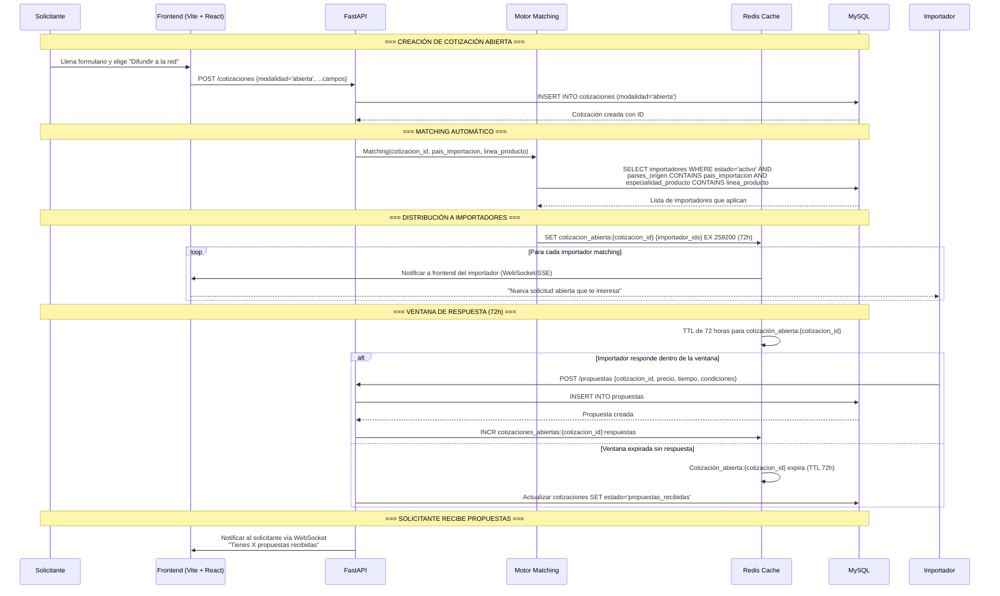
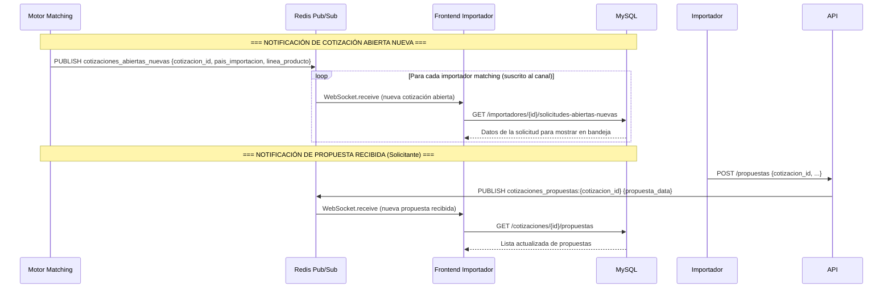

# Motor de Matching — ImportacionesQ8


> **Actualización 2026-10-01** (detalle en [[#Cupo diario y reconstrucción del reparto (2026-09-30 → 10-01)|Cupo diario y reconstrucción del reparto]]):
> - el matching salta a las empresas que agotaron su **límite diario de cotizaciones**;
> - cada entrega queda registrada en la tabla `recepciones_cotizacion`;
> - el reparto en Redis se puede **reconstruir desde la base** tras restaurar una copia.

## Descripción general

Motor de **"matching" simple** para cotizaciones abiertas: reglas por país de importación y categoría de producto son suficientes para el MVP. Un modelo de recomendación más sofisticado puede quedar para fases posteriores. Redis también permite implementar de forma económica la ventana de tiempo de las cotizaciones abiertas (ej. expirar automáticamente una cotización abierta tras 48-72 horas).

> **Estado de implementación (Semana 3):** `services/matching_service.py::matching_cotizacion_abierta` excluye del pool de matching a los importadores con `solo_cotizaciones_directas=True` — estas empresas eligieron no adaptarse al formulario estandarizado (usan un formulario propio vía `CampoPersonalizado`), por lo que solo pueden recibir cotizaciones **dirigidas** directamente a ellas, nunca abiertas. Además, el endpoint real de estado de matching es `GET /cotizaciones/{id}/matching-status` (agregado en la revisión de congruencia de Semana 2), que reemplaza al `GET /cotizaciones/{id}/estado-abierta` descrito más abajo como diseño original.

---

## Flujo de matching de cotizaciones abiertas



---

## Lógica de matching (MVP)

### Reglas de matching por importador

Un importador recibe una cotización abierta si cumple **AMBAS** condiciones:

| Condición | Campo en DB | Descripción |
|-----------|-------------|-------------|
| **País de origen** | `importadores.paises_origen` CONTAINS `cotizaciones.pais_importacion` | El importador debe operar desde el país de origen del producto |
| **Categoría de producto** | `importadores.especialidad_producto` CONTAINS `cotizaciones.linea_producto` | El importador debe tener la categoría de producto como especialidad |

### Ejemplo de matching

```python
# Datos de ejemplo
cotizacion = {
    "pais_importacion": "China",
    "linea_producto": "Textiles"
}

importadores_matching = db.query("""
    SELECT * FROM importadores
    WHERE estado = 'activo'
      AND paises_origen LIKE '%"China"%'
      AND especialidad_producto LIKE '%"Textiles"%'
""")

# Resultado: Solo los importadores que operan desde China Y manejan Textiles
```

### Matching con JSON en MySQL

Los campos `paises_origen` y `especialidad_producto` son de tipo JSON. Para buscar dentro de ellos se usa la función `JSON_CONTAINS`:

```sql
SELECT * FROM importadores
WHERE estado = 'activo'
  AND JSON_CONTAINS(paises_origen, '"China"')
  AND JSON_CONTAINS(especialidad_producto, '"Textiles"');
```

---

## Redis para gestión de cotizaciones abiertas

> **Actualización 2026-07-13:** el pool/inbox **ya no usa** `KEYS cotizacion_abierta:*` (O(N) bloqueante). Se mantiene un índice SET por importador. Ver [[Remediaciones-Backend-Jul-2026]].

### Estructura de datos en Redis

| Clave | Tipo | Valor | TTL | Descripción |
|-------|------|-------|-----|-------------|
| `cotizacion_abierta:{id}` | Hash | `{importador_id_1: "pendiente", importador_id_2: "respondido"}` | 72h | Estado de respuestas por importador |
| `cotizacion_abierta:{id}:respuestas` | Counter | Número entero | 72h | Contador de propuestas recibidas |
| `cotizacion_abierta:{id}:expiracion` | String | Timestamp de expiración | 72h | Fecha límite para respuestas |
| `indice:importador:{id}:abiertas` | Set | IDs de cotizaciones abiertas del importador | — | Índice para pool/inbox (`SMEMBERS`, no `KEYS`) |
| `indice:abiertas:global` | Set | IDs de cotizaciones abiertas | — | Índice global auxiliar |

### Operaciones Redis

```python
# Al crear cotización abierta (matching_cotizacion_abierta)
redis.hset(f"cotizacion_abierta:{cotizacion_id}", mapping={
    importador_id: "pendiente" for importador_id in matching_importadores
})
redis.setex(
    f"cotizacion_abierta:{cotizacion_id}:expiracion",
    259200,  # 72 horas en segundos
    datetime.now() + timedelta(hours=72)
)
# Indexar por importador (evita KEYS)
for importador_id in matching_importadores:
    redis.sadd(f"indice:importador:{importador_id}:abiertas", cotizacion_id)
redis.sadd("indice:abiertas:global", cotizacion_id)

# Al recibir una propuesta
redis.hset(f"cotizacion_abierta:{cotizacion_id}", importador_id, "respondido")
redis.incr(f"cotizacion_abierta:{cotizacion_id}:respuestas")

# Pool / inbox de la empresa: SMEMBERS del índice, no KEYS
ids = redis.smembers(f"indice:importador:{importador_id}:abiertas")

# Al expirar: desindexar (expirar_cotizacion_abierta)
# Verificar si cotización abierta está expirada
if redis.ttl(f"cotizacion_abierta:{cotizacion_id}") <= 0:
    # Cotización expirada - actualizar estado en MySQL y quitar del índice
```

---

## Notificaciones a importadores

### Flujo de notificación



---

## Endpoints para matching

### Obtener importadores que aplican a una cotización abierta

| Método | Endpoint | Descripción |
|--------|----------|-------------|
| GET | `/cotizaciones/{id}/importadores-matching` | Lista de importadores que reciben esta cotización (solo admin) |

**Response:**
```json
{
    "success": true,
    "data": {
        "cotizacion_id": "550e8400-e29b-41d4-a716-446655440000",
        "pais_importacion": "China",
        "linea_producto": "Textiles",
        "importadores_matching": [
            {
                "id": "660f9500-f39c-52e5-b827-557766551111",
                "nombre_empresa": "Importadora ABC",
                "especialidad_producto": ["Textiles", "Ropa"],
                "paises_origen": ["China", "Vietnam"],
                "tiempo_respuesta_promedio": "24h"
            }
        ],
        "estado_respuestas": {
            "total_matching": 3,
            "respondidos": 1,
            "pendientes": 2
        }
    }
}
```

### Verificar si una cotización abierta está activa (no expirada)

| Método | Endpoint | Descripción |
|--------|----------|-------------|
| GET | `/cotizaciones/{id}/matching-status` | Estado del reparto de la cotización abierta (el diseño original lo llamaba `/estado-abierta`) |

**Response:**
```json
{
    "success": true,
    "data": {
        "cotizacion_id": "550e8400-e29b-41d4-a716-446655440000",
        "esta_activa": true,
        "tiempo_restante_segundos": 129600,
        "propuestas_recibidas": 3,
        "importadores_matching_total": 5
    }
}
```

---

## Notas de implementación

- **Matching simple en MVP:** Solo dos criterios (país + categoría). Un modelo más sofisticado podría incluir: calificación del importador, tiempo de respuesta promedio, capacidad de volumen, historial de éxito.
- **TTL de 72 horas en Redis:** La ventana de tiempo para respuestas se implementa con `SET key value EX 259200` (72h). Cuando la clave expira, el estado de la cotización cambia automáticamente a "propuestas_recibidas".
- **Índice SET por importador (2026-07-13):** pool e inbox usan `SMEMBERS` sobre `indice:importador:{id}:abiertas`. **Prohibido** `KEYS` en hot path.
- **Notificaciones push:** Para MVP, las notificaciones se envían vía WebSocket/SSE cuando el importador tiene la aplicación abierta. WhatsApp Business API puede evaluarse en fase 2.
- **Escalabilidad futura:** Si el número de importadores crece significativamente, el matching puede migrar a un motor basado en Elasticsearch para búsquedas más eficientes sobre campos JSON.

---

## Cupo diario y reconstrucción del reparto (2026-09-30 → 10-01)

**Cupo diario por empresa** (`services/cupo_cotizaciones.py`, migración `0024`, guía [[19-Limite-Diario-Cotizaciones]]):

- `matching_cotizacion_abierta` calcula los candidatos por país y categoría y descarta los que ya tienen el cupo del día agotado (`Importador.limite_cotizaciones_diarias`).
- Cada empresa a la que se reparte la cotización queda en `recepciones_cotizacion` con `entregada=True`, y eso cuenta para su cupo. Las que se saltaron por cupo quedan con `entregada=False`: no les aparece en la bandeja y no pueden reclamarla ni responderla.
- Las cotizaciones dirigidas registran la recepción al crearse. Si el cupo está agotado, `POST /cotizaciones` responde 409.
- El día se cuenta desde la medianoche de Colombia (`CUPO_COTIZACIONES_UTC_OFFSET_HORAS=-5`).

**Reconstrucción del reparto** (`reconstruir_matching_abiertas`):

- Tras restaurar una copia desde el panel, Redis guarda el reparto de los datos anteriores.
- La función borra ese estado (`SCAN`, sin `KEYS`) y lo rehace para las abiertas de las últimas 72 h:
  - destinatarios según `recepciones_cotizacion` o, en copias anteriores a esa tabla, según el criterio de país y categoría;
  - "respondido" para quien ya envió propuesta;
  - el TTL restante de cada cotización.
- Ver [[Backups-y-Restauracion]].

