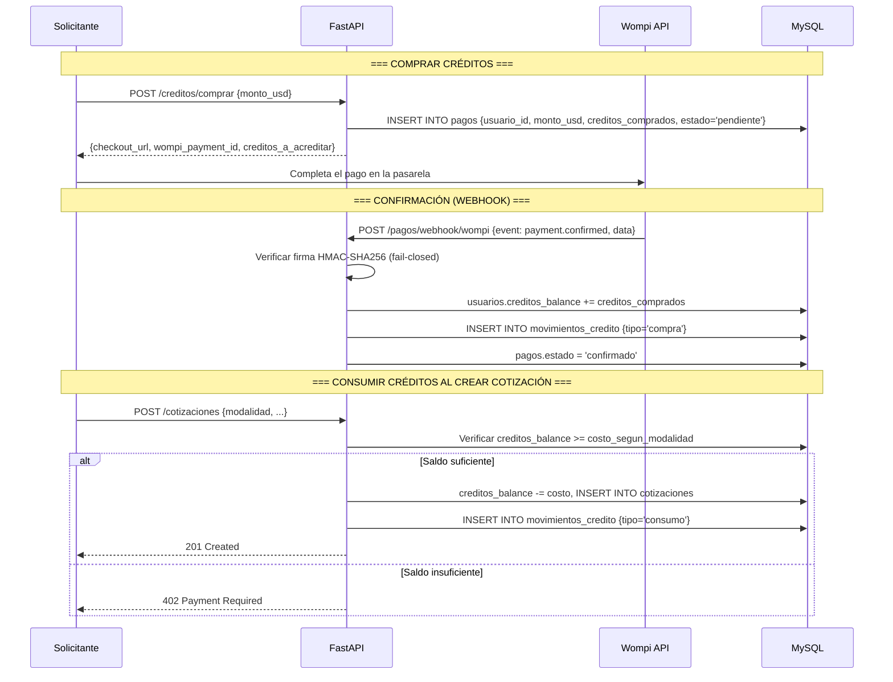
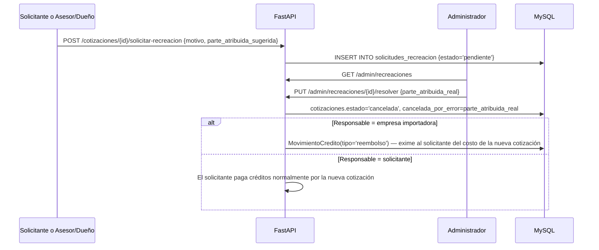

# Pagos con Wompi y sistema de créditos — ImportacionesQ8

## Descripción general

Integración de **Wompi** como pasarela de pagos para el mercado colombiano. Delega el cumplimiento de seguridad de pagos (PCI) al proveedor.

> **Cambio de modelo (Semana 4):** el pago vía Wompi **ya NO es una comisión sobre la orden aceptada**. Ahora el solicitante **compra créditos** dentro de la plataforma, y esos créditos se consumen al **crear una cotización** (una cantidad fija por cotización abierta, otra por cotización dirigida, configurable). La **orden se crea automáticamente** cuando ambas partes se aceptan mutuamente (ver [[API-Rest]] y [[Tareas-Semana-4]]), **sin ningún pago de por medio**: la plataforma solo conecta solicitantes con empresas importadoras, no se responsabiliza por el cumplimiento del negocio concretado entre las partes.

---

## Flujo de compra y consumo de créditos



---

## Endpoints de créditos (`/creditos`)

### Comprar créditos

| Método | Endpoint | Rol | Descripción |
|--------|----------|-----|-------------|
| POST | `/creditos/comprar` | `solicitante` | Genera un checkout de Wompi para recargar créditos |

**Request body:**
```json
{ "monto_usd": 50.0 }
```

**Response (200 OK):**
```json
{
    "checkout_url": "https://pay.wompi.co/pay/wpm_abc123",
    "wompi_payment_id": "wpm_abc123",
    "monto_usd": 50.0,
    "creditos_a_acreditar": 500.0
}
```

Los créditos **no se acreditan en este endpoint**: solo se acreditan cuando Wompi confirma el pago vía webhook.

### Saldo y movimientos

| Método | Endpoint | Rol | Descripción |
|--------|----------|-----|-------------|
| GET | `/creditos/saldo` | `solicitante` | Saldo actual de créditos del usuario autenticado |
| GET | `/creditos/movimientos` | `solicitante` | Historial de movimientos (compra/consumo/reembolso) |

### Consultar un pago

| Método | Endpoint | Rol | Descripción |
|--------|----------|-----|-------------|
| GET | `/pagos/{id}` | Dueño del pago | Estado de un pago de créditos. Verifica propiedad (evita IDOR) |

### Webhook de confirmación (Wompi)

| Método | Endpoint | Descripción |
|--------|----------|-------------|
| POST | `/pagos/webhook/wompi` | Recibe notificaciones de Wompi sobre pagos de créditos |

**Eventos manejados:**

| Evento Wompi | Acción | Estado del pago |
|--------------|--------|------------------|
| `payment.confirmed` | Acredita `creditos_comprados` a `Usuario.creditos_balance`, registra `MovimientoCredito(tipo="compra")` | `confirmado` |
| `payment.failed` | No se acreditan créditos | `fallido` |
| `payment.refunded` | Revierte los créditos acreditados (`MovimientoCredito(tipo="consumo")`, monto negativo) | `reembolsado` |

**Seguridad del webhook (sin cambios respecto a Semana 2):** firma HMAC-SHA256 verificada con `WOMPI_EVENTS_SECRET`, **fail-closed** (sin firma válida, `403` y no se procesa). Idempotente: reintentos del mismo evento no duplican la acreditación de créditos (se revisa `Pago.estado` antes de aplicar efectos, más `IntegrityError`/rollback como defensa adicional ante condiciones de carrera).

---

## Costos de créditos por cotización

Configurables en `.env` / `config.py`, con un valor por defecto documentado (decisión de negocio ajustable sin tocar código):

| Variable | Descripción | Default sugerido |
|----------|-------------|-------------------|
| `CREDITO_COSTO_COTIZACION_ABIERTA` | Créditos que cuesta crear una cotización **abierta** (difusión a toda la red) | `10.0` |
| `CREDITO_COSTO_COTIZACION_DIRIGIDA` | Créditos que cuesta crear una cotización **dirigida** a una sola empresa | `5.0` |
| `CREDITO_USD_POR_UNIDAD` | Tasa de conversión USD → créditos usada en `POST /creditos/comprar` | `0.1` (1 USD = 10 créditos) |
| `CREDITO_BONO_REGISTRO` | Créditos de bienvenida al registrarse (`services/auth_service.py::register_user`) | `20.0` |

El cobro ocurre en `routers/cotizaciones.py::crear_cotizacion`, en la **misma transacción atómica** que la creación de la cotización: si el saldo no alcanza, se responde `402 Payment Required` y no se crea nada; si alcanza, se descuenta el saldo y se registra el `MovimientoCredito` antes del `commit()`.

---

## Recreación de una cotización por error (mediada por admin)

Una cotización es "one-time": una vez enviada y aceptada por ambas partes, si hubo un error en la negociación (por chat) se debe **crear una cotización completamente nueva**, no editar la original. La pregunta de quién asume el costo de esa nueva cotización la resuelve el equipo de administración:



| Método | Endpoint | Rol | Descripción |
|--------|----------|-----|-------------|
| POST | `/cotizaciones/{id}/solicitar-recreacion` | `solicitante` o `asesor`/`importador` asignado | Solicita anular una cotización aceptada por error, sugiriendo quién fue responsable |
| GET | `/admin/recreaciones` | `admin` | Lista solicitudes de recreación pendientes/resueltas |
| PUT | `/admin/recreaciones/{id}/resolver` | `admin` | Decide la parte realmente responsable; si es la empresa importadora, reembolsa créditos al solicitante |

---

## Configuración de Wompi

| Variable | Descripción |
|----------|-------------|
| `WOMPI_PUBLIC_KEY` | Clave pública de Wompi para generar el checkout |
| `WOMPI_SECRET_KEY` | Clave secreta de Wompi |
| `WOMPI_EVENTS_SECRET` | Secreto usado para verificar la firma HMAC-SHA256 de los webhooks (sin esta variable, el webhook rechaza **todos** los eventos por diseño) |

---

## Estado de implementación (Semana 4, 2026-07-08)

| Elemento documentado | Estado | Detalle |
|---|---|---|
| Modelo `Pago` (compra de créditos, ya no ligado a orden/cotización) | ✅ Implementado | `models/pago.py` — `usuario_id` + `creditos_comprados`, `wompi_payment_id` **UNIQUE** |
| Modelo `MovimientoCredito` | ✅ Implementado | `models/credito.py` — tipos `compra`/`consumo`/`reembolso` |
| `POST /creditos/comprar` | ✅ Implementado | `routers/pagos.py::comprar_creditos` |
| `GET /creditos/saldo`, `GET /creditos/movimientos` | ✅ Implementado | `routers/pagos.py` |
| `POST /pagos/webhook/wompi` acredita créditos (ya no crea `Orden`) | ✅ Implementado | La creación de la orden se movió a la doble aceptación de propuestas (Fase 5, ver `API-Rest.md`) |
| Cobro de créditos al crear cotización (`402` si no alcanza) | ✅ Implementado | `routers/cotizaciones.py::crear_cotizacion`, atómico |
| Recreación mediada por admin + reembolso condicional | ✅ Implementado | `models/solicitud_recreacion.py`, `routers/admin.py` |
| `POST /ordenes/crear-orden` (manual, Semana 2) | 🗑️ Eliminado | Reemplazado por creación automática vía doble aceptación (`POST /propuestas/{id}/pre-aceptar`) |
| Integración real con la API de Wompi (checkout/API keys reales) | ⬜ Pendiente | El MVP simula la generación del checkout (`wpm_...` + URL simulada); la integración real queda para antes de producción |

**Tests:** `tests/test_creditos.py`, `tests/test_pagos.py`, `tests/test_recreacion_cotizacion.py`.
