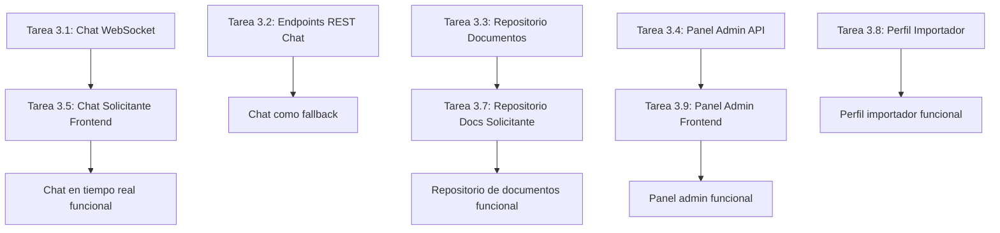

# Semana 3: Chat, Documentos y Pulido — ImportacionesQ8

## Descripción general

Semana 3 del MVP a 3 semanas. Entregables: Chat 1 a 1 en tiempo real ligado a orden, repositorio de documentos básico (sin facturación electrónica), pruebas con importadores piloto, ajustes de UI/UX.

> **Estado de implementación (backend, verificado con 159/159 tests pasando local y en Docker):** todas las tareas de backend de esta semana (3.1, 3.2, 3.3, 3.4) están **implementadas y probadas**, junto con un alcance ampliado solicitado durante el desarrollo: panel de empresa (trabajadores), personalización de perfiles, formulario de cotización personalizable y endpoints de administración para el alta de empresas importadoras. Ver la nueva sección **"Tareas Backend adicionales — Panel de empresa, perfiles y formulario dinámico"** más abajo. El alcance de esta ampliación fue exclusivamente backend (modelos, endpoints, tests); `proyecto/frontend` sigue sin existir, por lo que las tareas de Frontend (3.5–3.10) permanecen pendientes. El refuerzo de seguridad transversal (cierre de auto-registro, IDOR, rate limiting, etc.) está consolidado en [[Seguridad]].

---

## Resumen de entregables

| Entregable | Módulo | Prioridad |
|------------|--------|-----------|
| Chat 1 a 1 en tiempo real ligado a orden | Backend/Chat-WebSocket, Frontend/Pantallas-Solicitante | P0 |
| Repositorio de documentos básico | Backend/API-Rest, Frontend/Pantallas-Solicitante | P1 |
| Pruebas con importadores piloto | General | P0 |
| Ajustes de UI/UX | Frontend | P0 |

---

## Tareas Backend — Semana 3

### Tarea 3.1: Implementar chat en tiempo real con WebSocket + Redis Pub/Sub

**Módulo:** Backend/Chat-WebSocket  
**Duración estimada:** 2 días  
**Responsable:** Desarrollador Backend Senior

#### Descripción
Implementar el sistema de chat en tiempo real usando WebSocket para la comunicación bidireccional y Redis Pub/Sub para la distribución de mensajes entre instancias del servidor. Este es el entregable más crítico de esta semana.

#### Pasos de implementación

1. **Instalar dependencias** — Agregar a `requirements.txt`:
   - `websockets==12.0`
   - `redis==5.0.1` (si no está ya instalado)

2. **Configurar WebSocket en FastAPI** (`main.py`)
   ```python
   from fastapi import FastAPI, WebSocket, WebSocketDisconnect
   
   app = FastAPI()
   
   # Almacén de conexiones WebSocket activas: {conversacion_id: [websocket1, websocket2]}
   active_connections: dict[str, list[WebSocket]] = {}
   
   @app.websocket("/ws/chat/{conversation_id}")
   async def websocket_chat(websocket: WebSocket, conversation_id: str):
       """
       Endpoint WebSocket para chat en tiempo real.
       
       - Valida el JWT token del cliente
       - Verifica que el usuario está autorizado en la conversación
       - Suscribe al canal Redis Pub/Sub correspondiente
       - Reenvía mensajes entre clientes y Redis
       """
       # 1. Aceptar conexión WebSocket
       await websocket.accept()
       
       # 2. Validar JWT token del cliente (extraído de query params)
       token = websocket.query_params.get("token")
       if not token:
           await websocket.close(code=4001, reason="Token no proporcionado")
           return
       
       try:
           payload = jwt.decode(token, SECRET_KEY, algorithms=[ALGORITHM])
           user_id = payload["sub"]
           rol = payload["rol"]
       except jwt.InvalidTokenError:
           await websocket.close(code=4001, reason="Token inválido")
           return
       
       # 3. Verificar que el usuario está autorizado en la conversación
       db = SessionLocal()
       try:
         conversacion = db.query(ConversacionChat).filter(
             ConversacionChat.id == conversation_id
         ).first()
         
         if not conversacion or (
             conversacion.solicitante_id != user_id and 
             conversacion.importador_id != user_id
         ):
             await websocket.close(code=4003, reason="No autorizado")
             return
       finally:
           db.close()
       
       # 4. Agregar conexión al almacén de conexiones activas
       if conversation_id not in active_connections:
           active_connections[conversation_id] = []
       active_connections[conversation_id].append(websocket)
       
       try:
           while True:
               # 5. Recibir mensaje del cliente
               data = await websocket.receive_json()
               
               # 6. Validar y guardar el mensaje en MySQL
               db = SessionLocal()
               try:
                   nuevo_mensaje = MensajeChat(
                       conversacion_id=conversation_id,
                       remitente_id=user_id,
                       contenido=data["contenido"],
                       tipo="texto"
                   )
                   db.add(nuevo_mensaje)
                   db.commit()
                   
                   # 7. Publicar mensaje en Redis Pub/Sub para reenviar a otros clientes
                   redis_client.publish(
                       f"chat:{conversation_id}",
                       json.dumps({
                           "tipo": "mensaje",
                           "conversacion_id": conversation_id,
                           "remitente_id": user_id,
                           "contenido": data["contenido"],
                           "tipo_mensaje": "texto",
                           "fecha_envio": datetime.now().isoformat()
                       })
                   )
               finally:
                   db.close()
       
       except WebSocketDisconnect:
           # 8. Remover conexión cuando el cliente se desconecta
           if conversation_id in active_connections:
               active_connections[conversation_id].remove(websocket)
               if not active_connections[conversation_id]:
                   del active_connections[conversation_id]
   ```

3. **Implementar servicio de reenvío de mensajes desde Redis** (`services/chat_service.py`)
   - Función `listen_redis_channel(conversation_id)` que escucha el canal Redis Pub/Sub y reenvía los mensajes a las conexiones WebSocket activas
   
4. **Crear modelo ORM para ConversacionChat** (`models/chat.py`)
   - Campos: id (UUID), orden_id FK → ordenes.id, solicitante_id FK, importador_id FK, fecha_creacion

5. **Crear modelo ORM para MensajeChat** (`models/chat.py`)
   - Campos: id (UUID), conversacion_id FK → conversaciones_chat.id, remitente_id FK, contenido, tipo (ENUM: "texto", "archivo"), fecha_envio

6. **Integrar con endpoint POST /pagos/webhook/wompi** — Crear conversación de chat automáticamente al confirmar pago (ya implementado en Tarea 2.3)

#### Criterios de aceptación

- [x] El WebSocket se conecta correctamente y valida el JWT token del cliente (`decode_access_token`, cierre con `WS_1008_POLICY_VIOLATION` si falta o es inválido)
- [x] Los mensajes enviados por un cliente se guardan en MySQL/SQLite y se reenvían a otros clientes vía Redis Pub/Sub (con degradación a eco directo si Redis no está disponible)
- [x] Cuando un cliente se desconecta (`WebSocketDisconnect`), se cancela la tarea de escucha de Redis y se cierra el `pubsub` correctamente
- [x] El chat funciona entre el solicitante y la cuenta de la empresa (trabajador asignado o, si nadie reclamó la cotización, la cuenta dueña)

> **Nota de implementación:** la conversación **no** se crea solo al confirmar el pago (como decía el plan original), sino al **aceptar o rechazar la propuesta** — antes de que exista una orden — para permitir la negociación previa al pago. `ConversacionChat.orden_id` queda `NULL` hasta que se crea la orden. Ver `Backend/Chat-WebSocket.md` para el detalle actualizado.

#### Entregables

1. ✅ Endpoint WebSocket `/ws/chat/{conversacion_id}` funcional con validación JWT (`routers/chat.py`)
2. ✅ Reenvío de mensajes vía Redis Pub/Sub con fallback a eco directo sin Redis
3. ✅ Modelos ORM `ConversacionChat` y `MensajeChat` (`models/chat.py`)
4. ✅ Creación automática de la conversación al aceptar/rechazar la propuesta (`routers/cotizaciones.py::aceptar_propuesta`)
5. ✅ 10 tests automatizados (`tests/test_chat.py`): creación de conversación, mensajes REST, IDOR entre conversaciones/empresas, WebSocket autorizado/no autorizado

---

### Tarea 3.2: Implementar endpoints REST de chat como fallback

**Módulo:** Backend/API-Rest  
**Duración estimada:** 0.5 día  
**Responsable:** Desarrollador Backend

#### Descripción
Implementar los endpoints REST para cargar el historial de mensajes y enviar mensajes como fallback cuando la conexión WebSocket falla.

#### Pasos de implementación

1. **Implementar endpoint GET /chat/conversaciones** (`routers/chat.py`) — Listar conversaciones del usuario autenticado
   ```python
   @app.get("/chat/conversaciones")
   async def listar_conversaciones(
       current_user: dict = Depends(require_rol("solicitante")),
       db: Session = Depends(get_db)
   ):
       # Solicitante ve sus conversaciones como solicitante
       conversaciones = db.query(ConversacionChat).filter(
           ConversacionChat.solicitante_id == current_user["user_id"]
       ).order_by(ConversacionChat.fecha_creacion.desc()).all()
       
       return [{
           "id": str(c.id),
           "orden_id": str(c.orden_id),
           "importador_id": str(c.importador_id),
           "fecha_creacion": c.fecha_creacion.isoformat(),
           "ultimo_mensaje": None  # Se puede optimizar con subquery
       } for c in conversaciones]
   ```

2. **Implementar endpoint GET /chat/conversaciones/{id}/mensajes** (`routers/chat.py`) — Obtener mensajes de una conversación (paginados, últimos 50)
   ```python
   @app.get("/chat/conversaciones/{conversation_id}/mensajes")
   async def obtener_mensajes(
       conversation_id: str,
       limite: int = 50,
       offset: int = 0,
       current_user: dict = Depends(require_rol("solicitante")),
       db: Session = Depends(get_db)
   ):
       # Verificar que el usuario está autorizado en la conversación
       conversacion = db.query(ConversacionChat).filter(
           ConversacionChat.id == conversation_id,
           (ConversacionChat.solicitante_id == current_user["user_id"]) |
           (ConversacionChat.importador_id == current_user["user_id"])
       ).first()
       
       if not conversacion:
           raise HTTPException(status_code=403, detail="No autorizado")
       
       # Obtener mensajes paginados
       mensajes = db.query(MensajeChat).filter(
           MensajeChat.conversacion_id == conversation_id
       ).order_by(MensajeChat.fecha_envio.desc()).offset(offset).limit(limite).all()
       
       return [{
           "id": str(m.id),
           "remitente_id": str(m.remitente_id),
           "contenido": m.contenido,
           "tipo_mensaje": m.tipo,
           "fecha_envio": m.fecha_envio.isoformat()
       } for m in mensajes]
   ```

3. **Implementar endpoint POST /chat/conversaciones/{id}/mensajes** (`routers/chat.py`) — Enviar mensaje vía REST como fallback
   ```python
   @app.post("/chat/conversaciones/{conversation_id}/mensajes")
   async def enviar_mensaje_rest(
       conversation_id: str,
       mensaje: dict,  # {"contenido": "Hola"}
       current_user: dict = Depends(require_rol("solicitante")),
       db: Session = Depends(get_db)
   ):
       # Verificar que el usuario está autorizado en la conversación
       conversacion = db.query(ConversacionChat).filter(
           ConversacionChat.id == conversation_id,
           (ConversacionChat.solicitante_id == current_user["user_id"]) |
           (ConversacionChat.importador_id == current_user["user_id"])
       ).first()
       
       if not conversacion:
           raise HTTPException(status_code=403, detail="No autorizado")
       
       # Guardar mensaje en MySQL
       nuevo_mensaje = MensajeChat(
           conversacion_id=conversation_id,
           remitente_id=current_user["user_id"],
           contenido=mensaje["contenido"],
           tipo="texto"
       )
       db.add(nuevo_mensaje)
       db.commit()
       
       # Publicar en Redis Pub/Sub para reenviar a otros clientes
       redis_client.publish(
           f"chat:{conversation_id}",
           json.dumps({
               "tipo": "mensaje",
               "conversacion_id": conversation_id,
               "remitente_id": current_user["user_id"],
               "contenido": mensaje["contenido"],
               "tipo_mensaje": "texto",
               "fecha_envio": datetime.now().isoformat()
           })
       )
       
       return {"success": True}
   ```

#### Criterios de aceptación

- [x] GET /chat/conversaciones retorna conversaciones del usuario autenticado (200 OK), filtradas por rol (solicitante, importador/trabajador o todas para admin)
- [x] GET /chat/conversaciones/{id}/mensajes retorna el historial completo o 403 si no está autorizado (paginación no implementada, dado el volumen bajo esperado en el MVP)
- [x] POST /chat/conversaciones/{id}/mensajes envía mensaje vía REST como fallback, publicándolo también en Redis para quien esté conectado por WebSocket

#### Entregables

1. ✅ Endpoint GET /chat/conversaciones funcional
2. ✅ Endpoint GET /chat/conversaciones/{id}/mensajes funcional (sin paginación en esta iteración)
3. ✅ Endpoint POST /chat/conversaciones/{id}/mensajes funcional como fallback

---

### Tarea 3.3: Implementar repositorio de documentos por orden

**Módulo:** Backend/API-Rest  
**Duración estimada:** 1 día  
**Responsable:** Desarrollador Backend

#### Descripción
Implementar el modelo y endpoints REST para que las órdenes tengan documentos adjuntos accesibles desde el detalle de la orden.

#### Pasos de implementación

1. **Crear esquema Pydantic para DocumentoOrden** (`schemas/orden.py`)
   ```python
   from pydantic import BaseModel
   
   class DocumentoOrdenCreate(BaseModel):
       nombre: str
       tipo: str  # "factura_proforma", "factura_comercial", "packing_list", "comprobante_pago"
   
   class DocumentoOrdenResponse(BaseModel):
       id: str
       orden_id: str
       nombre: str
       url: str
       tipo: str
   ```

2. **Crear modelo ORM para DocumentoOrden** (`models/orden.py`) — Ya creado en Tarea 2.2, verificar que existe

3. **Implementar endpoint GET /ordenes/{id}/documentos** (`routers/ordenes.py`) — Listar documentos de una orden
   ```python
   @app.get("/ordenes/{orden_id}/documentos")
   async def listar_documentos(
       orden_id: str,
       current_user: dict = Depends(require_rol("solicitante")),
       db: Session = Depends(get_db)
   ):
       # Verificar que el usuario está autorizado en la orden
       orden = db.query(Orden).filter(
           Orden.id == orden_id,
           (Orden.solicitante_id == current_user["user_id"]) |
           (Orden.importador_id == current_user["user_id"])
       ).first()
       
       if not orden:
           raise HTTPException(status_code=403, detail="No autorizado")
       
       # Obtener documentos de la orden
       documentos = db.query(DocumentoOrden).filter(
           DocumentoOrden.orden_id == orden_id
       ).all()
       
       return [{
           "id": str(d.id),
           "nombre": d.nombre,
           "url": d.url,
           "tipo": d.tipo
       } for d in documentos]
   ```

4. **Implementar endpoint POST /ordenes/{id}/documentos** (`routers/ordenes.py`) — Subir documento a una orden (solo importador/admin)
   ```python
   @app.post("/ordenes/{orden_id}/documentos")
   async def subir_documento(
       orden_id: str,
       documento: DocumentoOrdenCreate,
       current_user: dict = Depends(require_rol("importador")),
       db: Session = Depends(get_db)
   ):
       # Verificar que el importador está autorizado en la orden
       orden = db.query(Orden).filter(
           Orden.id == orden_id,
           Orden.importador_id == current_user["user_id"]
       ).first()
       
       if not orden:
           raise HTTPException(status_code=403, detail="No autorizado")
       
       # Subir documento al servicio de almacenamiento (S3/Cloudinary)
       url_documento = await subir_documento_almacenamiento(documento.nombre, documento.tipo)
       
       # Crear registro en la base de datos
       nuevo_documento = DocumentoOrden(
           orden_id=orden_id,
           nombre=documento.nombre,
           url=url_documento,
           tipo=documento.tipo
       )
       db.add(nuevo_documento)
       db.commit()
       
       return {"success": True, "url": url_documento}
   ```

#### Criterios de aceptación

- [x] GET /ordenes/{id}/documentos retorna documentos de una orden (200 OK) o 403 si no está autorizado
- [x] POST /ordenes/{id}/documentos sube un documento a la orden (solo importador/admin)

> **Nota:** esta tarea ya se implementó y probó durante la Semana 2 (`routers/ordenes.py`), por lo que no requirió trabajo adicional en la Semana 3 — solo se deja constancia aquí.

#### Entregables

1. ✅ Endpoint GET /ordenes/{id}/documentos funcional con verificación de autorización
2. ✅ Endpoint POST /ordenes/{id}/documentos funcional para subir documentos

---

### Tarea 3.4: Implementar panel de administración interno (disputas)

**Módulo:** Backend/API-Rest  
**Duración estimada:** 1 día  
**Responsable:** Desarrollador Backend Senior

#### Descripción
Implementar los endpoints REST para el panel de administración interno donde el equipo puede ver cotizaciones abiertas activas, disputas e importadores vinculados.

#### Pasos de implementación

1. **Implementar endpoint GET /admin/cotizaciones-abiertas** (`routers/admin.py`) — Listar todas las cotizaciones abiertas activas (solo admin)
   ```python
   @app.get("/admin/cotizaciones-abiertas")
   async def listar_cotizaciones_abiertas(
       current_user: dict = Depends(require_rol("admin")),
       db: Session = Depends(get_db)
   ):
       cotizaciones = db.query(Cotizacion).filter(
           Cotizacion.estado == "abierta"
       ).order_by(Cotizacion.fecha_creacion.desc()).all()
       
       return [{
           "id": str(c.id),
           "solicitante_id": str(c.solicitante_id),
           "pais_importacion": c.pais_importacion,
           "linea_producto": c.linea_producto,
           "fecha_creacion": c.fecha_creacion.isoformat(),
           "importadores_matching": redis_client.hgetall(f"cotizacion_abierta:{c.id}"),
           "respuestas_recibidas": redis_client.get(f"cotizacion_abierta:{c.id}:respuestas") or 0,
           "ventana_restante": redis_client.ttl(f"cotizacion_abierta:{c.id}")
       } for c in cotizaciones]
   ```

2. **Implementar endpoint GET /admin/disputas** (`routers/admin.py`) — Listar órdenes en disputa (solo admin)
3. **Implementar endpoint POST /admin/importadores/{id}/verificar** (`routers/admin.py`) — Verificar empresa importadora (solo admin)
4. **Implementar endpoint PUT /admin/importadores/{id}/estado** (`routers/admin.py`) — Activar/desactivar importador de la red (solo admin)

#### Criterios de aceptación

- [x] GET /admin/cotizaciones-abiertas retorna cotizaciones abiertas activas (versión simplificada: sin el detalle en vivo de Redis del ejemplo original, que se puede añadir después con `GET /cotizaciones/{id}/matching-status`)
- [x] GET /admin/disputas retorna órdenes en disputa
- [x] POST /admin/importadores/{id}/verificar verifica empresa importadora (solo admin)
- [x] PUT /admin/importadores/{id}/estado activa/desactiva importador de la red (solo admin)
- [x] PUT /ordenes/{id}/reportar-problema permite al solicitante abrir una disputa (`en_disputa`, `motivo_disputa`)
- [x] PUT /admin/disputas/{orden_id}/resolver permite al admin cerrar la disputa

> **Ampliación de seguridad y monitoreo** (a pedido explícito, ver sección siguiente): se cerró el auto-registro público de `admin`/`importador`, y se agregaron `GET /admin/usuarios`, `PUT /admin/usuarios/{id}/estado` y `GET /admin/metricas` (métricas de éxito del PDF).

#### Entregables

1. ✅ Endpoint GET /admin/cotizaciones-abiertas funcional
2. ✅ Endpoint GET /admin/disputas funcional
3. ✅ Endpoint POST /admin/importadores/{id}/verificar funcional
4. ✅ Endpoint PUT /admin/importadores/{id}/estado funcional
5. ✅ Endpoints de disputa: `PUT /ordenes/{id}/reportar-problema` y `PUT /admin/disputas/{id}/resolver`

---

## Tareas Backend adicionales — Panel de empresa, perfiles y formulario dinámico

Ampliación de alcance solicitada durante el desarrollo de la Semana 3: las empresas importadoras del MVP dejan de modelarse como una sola cuenta (`Usuario.rol="importador"` == `Importador`) y pasan a ser una **empresa con varios usuarios** (una cuenta dueña + trabajadores), con perfiles personalizables y la posibilidad de definir su propio formulario de cotización. Todo el trabajo fue exclusivamente backend, con 159/159 tests pasando en local y Docker.

### Tarea 3.13: Desacoplar identidad Usuario/Importador y cerrar auto-registro de admin/importador

**Módulo:** Backend/Autenticacion, todos los routers  
**Estado:** ✅ Completado

#### Descripción
El backend original asumía `Usuario.id == Importador.id` para el rol "importador", lo que hacía imposible tener varios trabajadores logueados bajo la misma empresa y abría un hueco de seguridad (cualquiera podía auto-registrarse como `admin` o `importador` vía `POST /auth/register`).

#### Cambios implementados
- `Usuario.importador_id` (FK nullable a `importadores.id`) desacopla la cuenta de la empresa. Nuevos campos de perfil: `nombre`, `telefono`, `foto_url`, `whatsapp`, `activo`.
- Rol nuevo `trabajador`, además de `solicitante`, `importador` (cuenta dueña) y `admin`.
- El JWT incluye el claim `importador_id`; todas las comprobaciones de propiedad (IDOR) en `routers/importadores.py`, `routers/cotizaciones.py`, `routers/ordenes.py` y `routers/pagos.py` se refactorizaron para usar `current_user["importador_id"]` en vez de `current_user["user_id"]`.
- `POST /auth/register` **solo** acepta `rol="solicitante"`; crear cuentas `admin` o `importador` ahora requiere que un admin ya autenticado use `POST /admin/importadores` (importador) — no existe un camino de auto-registro para `admin`.
- `Usuario.activo`: el login y el refresh de token rechazan cuentas desactivadas (`401 Unauthorized`).

#### Criterios de aceptación
- [x] El auto-registro público rechaza `rol="admin"` y `rol="importador"` con `400 Bad Request`
- [x] El JWT incluye `importador_id` y se usa consistentemente para las comprobaciones de propiedad entre empresas (IDOR)
- [x] Una cuenta con `activo=False` no puede iniciar sesión ni renovar su token
- [x] Toda la suite de tests existente se migró al nuevo modelo desacoplado (helpers `crear_empresa_importadora` y `auth_headers_for` en `conftest.py`)

> Ver [[Seguridad]] para el resumen consolidado de este y todo el resto del blindaje de seguridad de la app (SQL injection, IDOR, rate limiting, ACID, webhooks).

---

### Tarea 3.14: Panel de empresa — trabajadores y reclamo de cotizaciones

**Módulo:** Backend/API-Rest (`routers/importadores.py`, `routers/cotizaciones.py`, `routers/usuarios.py`)  
**Estado:** ✅ Completado

#### Descripción
Las empresas importadoras pueden crear cuentas de trabajador con permisos limitados: solo pueden reclamar cotizaciones de un pool compartido ("el primero que hace clic se la queda"), ver cuántas tienen asignadas y negociar por chat. La cuenta dueña sigue siendo la única que envía la propuesta formal (`POST /propuestas`).

#### Endpoints implementados
| Método | Endpoint | Rol |
|--------|----------|-----|
| POST | `/importadores/trabajadores` | Dueño |
| GET | `/importadores/trabajadores` | Dueño |
| PUT | `/importadores/trabajadores/{id}/estado` | Dueño |
| GET | `/cotizaciones/pool-empresa` | Dueño + trabajador |
| POST | `/cotizaciones/{id}/reclamar` | Trabajador |
| GET | `/trabajadores/me/cotizaciones` | Trabajador |

#### Criterios de aceptación
- [x] Solo la cuenta dueña puede crear/listar/activar-desactivar trabajadores de su propia empresa (403 si es de otra empresa)
- [x] El reclamo de cotizaciones es atómico (`UPDATE ... WHERE trabajador_asignado_id IS NULL`): dos trabajadores reclamando a la vez no pueden quedarse ambos con la misma cotización (`409 Conflict` para el segundo)
- [x] Un trabajador no puede reclamar cotizaciones de otra empresa
- [x] Al aceptar/rechazar la propuesta, se notifica (best-effort, Redis) al trabajador asignado
- [x] 14 tests automatizados en `tests/test_trabajadores.py`, incluyendo la condición de carrera del reclamo

---

### Tarea 3.15: Personalización de perfiles (empresa y usuario)

**Módulo:** Backend/API-Rest (`routers/importadores.py`, `routers/usuarios.py`)  
**Estado:** ✅ Completado

#### Endpoints implementados
| Método | Endpoint | Descripción |
|--------|----------|-------------|
| PUT | `/importadores/{id}` | Autoservicio del perfil de la empresa (nombre, logo, países, especialidades, capacidad, tiempo de respuesta, `solo_cotizaciones_directas`) — solo el dueño de esa empresa |
| GET | `/usuarios/me` | Perfil personal de la cuenta autenticada (cualquier rol) |
| PUT | `/usuarios/me` | Actualiza nombre, teléfono, foto y WhatsApp (aplica a solicitante, dueño y trabajador) |

#### Criterios de aceptación
- [x] Un dueño no puede editar el perfil de otra empresa (403)
- [x] Un trabajador no puede editar el perfil de la empresa (solo la cuenta dueña)
- [x] 8 tests automatizados en `tests/test_perfiles.py`

---

### Tarea 3.16: Formulario de cotización personalizable

**Módulo:** Backend/API-Rest (`routers/importadores.py`, `routers/cotizaciones.py`, `services/matching_service.py`)  
**Estado:** ✅ Completado

#### Descripción
Las empresas eligen: si quieren aparecer en la red de matching abierto, usan el formulario estándar del PDF sin personalización; si prefieren definir su propio formulario (agregar/modificar campos), se marcan como `solo_cotizaciones_directas=True` y quedan fuera del motor de matching de cotizaciones abiertas.

#### Endpoints implementados
| Método | Endpoint | Rol |
|--------|----------|-----|
| POST/GET/PUT/DELETE | `/importadores/campos-personalizados[/{id}]` | Dueño, solo si `solo_cotizaciones_directas=True` |
| GET | `/importadores/{id}/formulario` | Público (indica al frontend qué formulario renderizar) |

#### Criterios de aceptación
- [x] Solo empresas `solo_cotizaciones_directas=True` pueden crear campos personalizados (400 para las demás)
- [x] `POST /cotizaciones` valida los campos obligatorios personalizados cuando la modalidad es dirigida a una empresa personalizada
- [x] Las empresas `solo_cotizaciones_directas=True` se excluyen del motor de matching de cotizaciones abiertas (`services/matching_service.py`)
- [x] 11 tests automatizados en `tests/test_formulario_personalizado.py`

---

### Tarea 3.17: Endpoints de administración para el alta de empresas importadoras

**Módulo:** Backend/API-Rest (`routers/admin.py`)  
**Estado:** ✅ Completado

#### Descripción
Dado que se cerró el auto-registro público de cuentas `importador`, la plataforma (como administrador) crea la empresa y su cuenta dueña en un solo paso transaccional.

#### Endpoints implementados
| Método | Endpoint | Descripción |
|--------|----------|-------------|
| POST | `/admin/importadores` | Crea el `Importador` + su cuenta dueña (`rol="importador"`) atómicamente |
| GET | `/admin/usuarios` | Monitoreo de cuentas de la plataforma, filtrable por rol/estado |
| PUT | `/admin/usuarios/{id}/estado` | Activa/desactiva cualquier cuenta (control crítico de seguridad) |
| GET | `/admin/metricas` | Métricas de éxito del PDF: volumen de cotizaciones, tasa de respuesta, tiempo a primera propuesta, tasa de conversión, salud de la red |

#### Criterios de aceptación
- [x] Solo un admin puede crear empresas importadoras; la cuenta dueña puede iniciar sesión inmediatamente después
- [x] Email duplicado para la cuenta dueña es rechazado (400)
- [x] Desactivar una cuenta desde `/admin/usuarios/{id}/estado` le bloquea el login de inmediato
- [x] 14 tests automatizados en `tests/test_admin.py` (incluye disputas y métricas)

---

## Tareas Frontend — Semana 3

### Tarea 3.5: Implementar chat con asesor (solicitante)

**Módulo:** Frontend/Pantallas-Solicitante  
**Duración estimada:** 2 días  
**Responsable:** Desarrollador Frontend Senior

#### Descripción
Implementar la pantalla P9 — Chat con Asesor para el solicitante con panel lateral de conversaciones, área principal de chat y conexión WebSocket en tiempo real.

#### Pasos de implementación

1. **Crear página de chat** (`app/chat/page.tsx`)
   - Panel lateral izquierdo: lista de conversaciones (por orden/cotización) con último mensaje y hora
   - Área principal de chat: mensajes en tiempo real, burbujas de mensajes (izquierda = importador, derecha = solicitante)
   - Indicador "en línea" del importador cuando está conectado vía WebSocket
   - Campo de texto para escribir mensajes con botón de adjuntar archivos

2. **Crear componente de lista de conversaciones** (`components/ConversacionList.tsx`)
   ```typescript
   interface ConversacionItemProps {
     id: string;
     importadorNombre: string;
     ultimoMensaje: string;
     horaUltimoMensaje: string;
     onClick: (id: string) => void;
   }
   
   export function ConversacionItem({ importadorNombre, ultimoMensaje, horaUltimoMensaje, onClick }: ConversacionItemProps) {
     return (
       <div 
         className="p-4 border-b hover:bg-gray-50 cursor-pointer"
         onClick={() => onClick(id)}
       >
         <h3 className="font-semibold">{importadorNombre}</h3>
         <p className="text-sm text-gray-600 truncate">{ultimoMensaje}</p>
         <span className="text-xs text-gray-400">{horaUltimoMensaje}</span>
       </div>
     );
   }
   ```

3. **Crear componente de área de chat** (`components/ChatArea.tsx`)
   ```typescript
   interface ChatAreaProps {
     conversacionId: string;
     importadorNombre: string;
     importadorEnLinea: boolean;
   }
   
   export function ChatArea({ conversacionId, importadorNombre, importadorEnLinea }: ChatAreaProps) {
     const [mensajes, setMensajes] = useState<Array<{remitente_id: string; contenido: string; fecha_envio: string}>>([]);
     const [nuevoMensaje, setNuevoMensaje] = useState("");
     
     // Conectar WebSocket
     useEffect(() => {
       const token = localStorage.getItem('token');
       const ws = new WebSocket(`ws://localhost:8000/ws/chat/${conversacionId}?token=${token}`);
       
       ws.onmessage = (event) => {
         const data = JSON.parse(event.data);
         if (data.tipo === "mensaje") {
           setMensajes(prev => [...prev, data]);
         }
       };
       
       // Cargar historial de mensajes vía REST
       axios.get(`/chat/conversaciones/${conversacionId}/mensajes?limite=50`)
         .then(res => setMensajes(res.data.reverse()));
       
       return () => ws.close();
     }, [conversacionId]);
     
     const enviarMensaje = async () => {
       if (!nuevoMensaje.trim()) return;
       
       // Intentar enviar vía WebSocket primero
       try {
         ws.send(JSON.stringify({ contenido: nuevoMensaje }));
       } catch (error) {
         // Fallback REST si WebSocket falla
         await axios.post(`/chat/conversaciones/${conversacionId}/mensajes`, {
           contenido: nuevoMensaje
         });
       }
       
       setNuevoMensaje("");
     };
     
     return (
       <div className="flex flex-col h-full">
         {/* Header con nombre del importador y estado en línea */}
         <div className="p-4 border-b flex items-center justify-between">
           <h2 className="text-lg font-semibold">{importadorNombre}</h2>
           <span className={`w-3 h-3 rounded-full ${importadorEnLinea ? 'bg-green-500' : 'bg-gray-300'}`} />
         </div>
         
         {/* Área de mensajes */}
         <div className="flex-1 overflow-y-auto p-4 space-y-4">
           {mensajes.map((mensaje, index) => (
             <div key={index} className={`flex ${mensaje.remitente_id === currentUserId ? 'justify-end' : 'justify-start'}`}>
               <div className={`max-w-xs lg:max-w-md px-4 py-2 rounded-lg ${
                 mensaje.remitente_id === currentUserId 
                   ? 'bg-blue-600 text-white' 
                   : 'bg-gray-100 text-gray-900'
               }`}>
                 <p>{mensaje.contenido}</p>
                 <span className="text-xs opacity-75">
                   {new Date(mensaje.fecha_envio).toLocaleTimeString()}
                 </span>
               </div>
             </div>
           ))}
         </div>
         
         {/* Campo de texto y botón enviar */}
         <div className="p-4 border-t flex gap-2">
           <input
             type="text"
             value={nuevoMensaje}
             onChange={(e) => setNuevoMensaje(e.target.value)}
             onKeyDown={(e) => e.key === 'Enter' && enviarMensaje()}
             placeholder="Escribe un mensaje..."
             className="flex-1 px-4 py-2 border rounded-lg focus:outline-none focus:ring-2 focus:ring-blue-500"
           />
           <button 
             onClick={enviarMensaje}
             className="bg-blue-600 text-white px-6 py-2 rounded-lg hover:bg-blue-700 transition-colors"
           >
             Enviar
           </button>
         </div>
       </div>
     );
   }
   ```

4. **Implementar fetch de conversaciones** — Llamar a GET /chat/conversaciones al cargar la página

5. **Implementar indicador "en línea"** — Usar Redis Pub/Sub para detectar cuando el importador se conecta/desconecta del WebSocket

#### Criterios de aceptación

- [ ] El panel lateral muestra lista de conversaciones con último mensaje y hora
- [ ] Los mensajes en tiempo real se muestran como burbujas (izquierda = importador, derecha = solicitante)
- [ ] El indicador "en línea" muestra el estado del importador cuando está conectado vía WebSocket
- [ ] El campo de texto permite escribir mensajes con botón enviar
- [ ] Si la conexión WebSocket falla, los mensajes se envían vía REST como fallback

#### Entregables

1. Página de chat funcional con panel lateral y área principal
2. Componente de lista de conversaciones con último mensaje y hora
3. Componente de área de chat con burbujas de mensajes en tiempo real
4. Conexión WebSocket con fallback REST
5. Indicador "en línea" del importador

---

### Tarea 3.6: Implementar chat con asesor (importador)

**Módulo:** Frontend/Pantallas-Importador  
**Duración estimada:** 1 día  
**Responsable:** Desarrollador Frontend

#### Descripción
Implementar el chat integrado en la bandeja de solicitudes del importador, organizado por orden/cotización.

#### Pasos de implementación

1. **Crear componente de chat para importador** (`components/ChatImportador.tsx`)
   - Chat integrado en la bandeja de solicitudes del importador
   - Conversaciones organizadas por orden/cotización
   - Mensajes en tiempo real vía WebSocket
   - Indicador "en línea" del solicitante cuando está conectado

2. **Implementar fetch de conversaciones** — Llamar a GET /chat/conversaciones al cargar la página

3. **Conexión WebSocket** — Conectar al WebSocket para recibir mensajes en tiempo real

#### Criterios de aceptación

- [ ] El chat se integra en la bandeja de solicitudes del importador
- [ ] Las conversaciones están organizadas por orden/cotización
- [ ] Los mensajes se muestran en tiempo real vía WebSocket
- [ ] El indicador "en línea" muestra el estado del solicitante cuando está conectado

#### Entregables

1. Componente de chat para importador integrado en la bandeja de solicitudes
2. Conexión WebSocket con mensajes en tiempo real
3. Indicador "en línea" del solicitante

---

### Tarea 3.7: Implementar repositorio de documentos (solicitante)

**Módulo:** Frontend/Pantallas-Solicitante  
**Duración estimada:** 1 día  
**Responsable:** Desarrollador Frontend

#### Descripción
Implementar la pantalla P12 — Repositorio de Documentos donde el solicitante puede ver y descargar los documentos adjuntos a una orden.

#### Pasos de implementación

1. **Crear página de repositorio de documentos** (`app/ordenes/[id]/documentos/page.tsx`)
   - Sección de facturas: factura proforma, comprobante de pago
   - Sección de documentos del proveedor: packing list
   - Enlaces de descarga para cada documento

2. **Implementar fetch de documentos** — Llamar a GET /ordenes/{id}/documentos al cargar la página

3. **Crear componente de tarjeta de documento** (`components/DocumentoCard.tsx`)
   ```typescript
   interface DocumentoCardProps {
     nombre: string;
     url: string;
     tipo: string;
   }
   
   export function DocumentoCard({ nombre, url, tipo }: DocumentoCardProps) {
     return (
       <div className="bg-white rounded-xl shadow-sm p-6">
         <h3 className="font-semibold mb-2">{nombre}</h3>
         <p className="text-sm text-gray-600 mb-4 capitalize">{tipo.replace('_', ' ')}</p>
         <a 
           href={url}
           target="_blank"
           rel="noopener noreferrer"
           className="inline-block bg-blue-600 text-white px-4 py-2 rounded-lg hover:bg-blue-700 transition-colors"
         >
           Descargar
         </a>
       </div>
     );
   }
   ```

#### Criterios de aceptación

- [ ] El repositorio muestra secciones organizadas por tipo (facturas, documentos del proveedor)
- [ ] Cada documento tiene un enlace de descarga funcional
- [ ] Los documentos se listan correctamente desde el backend

#### Entregables

1. Página de repositorio de documentos funcional con secciones organizadas
2. Componente de tarjeta de documento con enlace de descarga
3. Fetch de documentos desde el backend

---

### Tarea 3.8: Implementar perfil y configuración de empresa importadora (P1)

**Módulo:** Frontend/Pantallas-Importador  
**Duración estimada:** 1 día  
**Responsable:** Desarrollador Frontend

#### Descripción
Implementar la pantalla P13 — Perfil y Configuración de Empresa Importadora con formulario de perfil, tags de países y categorías, y lista de asesores.

#### Pasos de implementación

1. **Crear página de perfil** (`app/importador/perfil/page.tsx`)
   - Formulario de perfil: nombre, logo, países, categorías, capacidad
   - Tags de países y categorías con botón "+" para agregar nuevos
   - Lista de asesores con foto, nombre, email, WhatsApp del asesor
   - Botón "Agregar Asesor": modal o formulario inline

2. **Implementar fetch de datos del perfil** — Llamar a GET /importadores/{id} al cargar la página

3. **Implementar envío del formulario** — Llamar a PUT /importadores/{id} para actualizar el perfil

#### Criterios de aceptación

- [ ] El formulario de perfil permite editar nombre, logo, países, categorías y capacidad
- [ ] Los tags de países y categorías se pueden agregar con botón "+"
- [ ] La lista de asesores muestra foto, nombre, email y WhatsApp del asesor
- [ ] El botón "Agregar Asesor" abre un modal o formulario inline

#### Entregables

1. Página de perfil funcional con formulario completo
2. Tags de países y categorías con botón "+" para agregar nuevos
3. Lista de asesores con información completa
4. Botón "Agregar Asesor" funcional

---

### Tarea 3.9: Implementar panel de administración interno (P1)

**Módulo:** Frontend/Pantallas-Admin  
**Duración estimada:** 1.5 días  
**Responsable:** Desarrollador Frontend Senior

#### Descripción
Implementar la pantalla P14 — Panel de Administración Interno con tabs para cotizaciones abiertas, disputas e importadores vinculados.

#### Pasos de implementación

1. **Crear página de panel admin** (`app/admin/page.tsx`)
   - Tabs: Cotizaciones Abiertas | Disputas | Importadores Vinculados
   - Tarjetas de cotización abierta activa con solicitante, importadores matching, propuestas recibidas, ventana restante
   - Tarjetas de disputa con orden, solicitante, importador, motivo, botón "Mediar"
   - Tarjetas de importador vinculado con estado, especialidad, calificación, verificado, botones de acción

2. **Implementar fetch de cotizaciones abiertas** — Llamar a GET /admin/cotizaciones-abiertas al cargar la página

3. **Implementar fetch de disputas** — Llamar a GET /admin/disputas al cargar la página

4. **Implementar fetch de importadores vinculados** — Llamar a GET /importadores (todos) al cargar la página

#### Criterios de aceptación

- [ ] El panel admin muestra tabs funcionales (Cotizaciones Abiertas | Disputas | Importadores Vinculados)
- [ ] Las tarjetas de cotización abierta muestran solicitante, importadores matching y ventana restante
- [ ] Las tarjetas de disputa muestran orden, solicitante, importador y botón "Mediar"
- [ ] Las tarjetas de importador vinculado muestran estado, especialidad, calificación y botones de acción

#### Entregables

1. Página de panel admin funcional con tabs
2. Tarjetas de cotización abierta activa con datos de Redis
3. Tarjetas de disputa con botón "Mediar"
4. Tarjetas de importador vinculado con botones de acción

---

### Tarea 3.10: Ajustes de UI/UX y pulido general

**Módulo:** Frontend  
**Duración estimada:** 2 días  
**Responsable:** Desarrollador Frontend Senior

#### Descripción
Revisar consistencia visual entre todas las pantallas, verificar que los botones de acción principal estén en posición fija y predecible, asegurar distinción visual clara entre "dirigida" y "abierta", optimizar mobile-first para formulario de cotización y chat.

#### Pasos de implementación

1. **Revisar consistencia visual** — Verificar que todas las pantallas usen los mismos componentes base (Button, Card, Badge) con los colores definidos en el sistema de diseño

2. **Verificar botones de acción principal** — Asegurar que el botón de acción principal (solicitar cotización, aceptar oferta, responder, pagar) esté siempre en una posición fija y predecible

3. **Asegurar distinción visual entre "dirigida" y "abierta"** — Verificar que las etiquetas de modalidad usen colores consistentes:
   - Dirigida: Verde (#10B981) con badge verde
   - Abierta: Amarillo (#F59E0B) con badge amarillo

4. **Optimizar mobile-first** — Verificar que el formulario de cotización y chat sean completamente funcionales en móvil:
   - Formulario: campos ocupan ancho completo, botón "Enviar Cotización" fijo en la parte inferior (sticky bottom)
   - Chat: panel lateral colapsable, área de mensajes ocupa todo el ancho

5. **Agregar indicadores de carga** — Implementar skeleton loading para listas y tarjetas, spinners para acciones asíncronas

6. **Revisar accesibilidad** — Verificar contraste de colores, navegación por teclado y atributos ARIA

#### Criterios de aceptación

- [ ] Todas las pantallas usan los mismos componentes base con los colores definidos en el sistema de diseño
- [ ] Los botones de acción principal están siempre en posición fija y predecible
- [ ] Las etiquetas de modalidad (Dirigida/Abierta) usan colores consistentes
- [ ] El formulario de cotización es completamente funcional en móvil
- [ ] El chat es completamente funcional en móvil con panel lateral colapsable
- [ ] Los indicadores de carga (skeleton loading, spinners) están implementados

#### Entregables

1. Consistencia visual verificada entre todas las pantallas
2. Botones de acción principal en posición fija y predecible
3. Distinción visual clara entre "dirigida" y "abierta" con etiquetas de color
4. Mobile-first optimizado para formulario de cotización y chat
5. Indicadores de carga implementados

---

## Tareas de Testing y QA

### Tarea 3.11: Pruebas con importadores piloto

**Módulo:** General  
**Duración estimada:** 2 días  
**Responsable:** Equipo completo

#### Descripción
Identificar y contactar a 2-3 empresas importadoras adicionales para pruebas, configurar cuentas de prueba en el entorno de staging, ejecutar flujo completo y recopilar feedback.

#### Pasos de implementación

1. **Identificar y contactar importadores piloto** — Contactar a 2-3 empresas importadoras adicionales que estén interesadas en probar la plataforma
2. **Configurar cuentas de prueba** — Crear cuentas de solicitante e importador en el entorno de staging
3. **Ejecutar flujo completo** — Solicitante crea cotización → Importadores responden → Solicitante acepta oferta → Pago con Wompi → Orden activa → Seguimiento del pedido
4. **Recopilar feedback** — Documentar bugs y problemas encontrados durante las pruebas
5. **Priorizar correcciones** — Clasificar los problemas por severidad (crítico, alto, medio, bajo)

#### Criterios de aceptación

- [ ] Al menos 2-3 importadores han probado el flujo completo sin bloqueos críticos
- [ ] Los bugs encontrados se documentan y priorizan para corrección
- [ ] El feedback de los importadores piloto se recopila y analiza

#### Entregables

1. Cuentas de prueba configuradas en staging
2. Flujo completo ejecutado con éxito por 2-3 importadores piloto
3. Documentación de bugs encontrados y priorizados
4. Feedback recopilado de los importadores piloto

---

### Tarea 3.12: Pruebas unitarias e integración

**Módulo:** General  
**Duración estimada:** 1.5 días  
**Responsable:** Desarrollador Backend + Frontend

#### Descripción
Implementar pruebas unitarias para endpoints de autenticación, CRUD de cotizaciones y órdenes, pruebas de integración para el flujo completo, pruebas de WebSocket para chat en tiempo real y pruebas de UI para componentes críticos.

#### Pasos de implementación

1. **Pruebas unitarias para endpoints de autenticación** — Usar pytest para probar POST /auth/register, POST /auth/login, POST /auth/refresh
2. **Pruebas unitarias para CRUD de cotizaciones y órdenes** — Probar POST /cotizaciones, GET /cotizaciones, GET /ordenes
3. **Pruebas de integración para flujo completo** — Probar el flujo: registro → login → crear cotización → enviar propuesta → checkout → orden
4. **Pruebas de WebSocket para chat en tiempo real** — Usar websockets library para probar la conexión y envío de mensajes
5. **Pruebas de UI para componentes críticos** — Usar React Testing Library para probar el formulario, chat y línea de estados

#### Criterios de aceptación

- [ ] Las pruebas unitarias para endpoints de autenticación pasan correctamente
- [ ] Las pruebas unitarias para CRUD de cotizaciones y órdenes pasan correctamente
- [ ] La prueba de integración del flujo completo pasa correctamente
- [ ] Las pruebas de WebSocket para chat en tiempo real pasan correctamente
- [ ] Las pruebas de UI para componentes críticos pasan correctamente

#### Entregables

1. Pruebas unitarias para endpoints de autenticación
2. Pruebas unitarias para CRUD de cotizaciones y órdenes
3. Prueba de integración del flujo completo
4. Pruebas de WebSocket para chat en tiempo real
5. Pruebas de UI para componentes críticos

---

## Criterios de aceptacion — Semana 3 (Resumen)

| Entregable | Criterio de aceptación | Estado real |
|------------|----------------------|--------------|
| Chat en tiempo real | Los usuarios pueden chatear en tiempo real con WebSocket. El historial se guarda en MySQL/SQLite (sin paginación en esta iteración). | ✅ Cumplido — `routers/chat.py`, 10 tests |
| Repositorio de documentos | Las órdenes tienen documentos adjuntos accesibles desde el detalle de la orden. | ✅ Cumplido (implementado en Semana 2) |
| Panel admin | El equipo de administración puede ver cotizaciones abiertas, disputas e importadores vinculados, además de crear empresas y monitorear cuentas. | ✅ Cumplido — `routers/admin.py`, 14 tests |
| Panel de empresa (trabajadores) | Las empresas pueden crear trabajadores con permisos limitados que reclaman cotizaciones y negocian por chat. | ✅ Cumplido — 14 tests |
| Perfiles personalizables | Empresa y usuario pueden personalizar su perfil vía autoservicio. | ✅ Cumplido — 8 tests |
| Formulario de cotización personalizable | Empresas `solo_cotizaciones_directas` definen sus propios campos. | ✅ Cumplido — 11 tests |
| Ajustes UI/UX | Todas las pantallas son consistentes visualmente y funcionales en móvil. | ⏳ Pendiente (no hay frontend en el repositorio) |
| Pruebas con importadores piloto | Al menos 2-3 importadores han probado el flujo completo sin bloqueos críticos. | ⏳ Pendiente (requiere staging + usuarios reales) |

> Suite de backend: **159/159 tests pasando** en local y en Docker (`docker compose run --rm --build tests`).

---

## Dependencias entre tareas



---

## Notas adicionales

- **Prioridad:** Las tareas P0 deben completarse antes de las P1. El chat en tiempo real es el entregable más crítico de esta semana.
- **Testing con importadores piloto:** Es fundamental validar que el flujo completo funcione sin bloqueos críticos antes del lanzamiento.
- **Documentación:** Actualizar la documentación del vault en Obsidian con cualquier cambio significativo en los endpoints o pantallas.