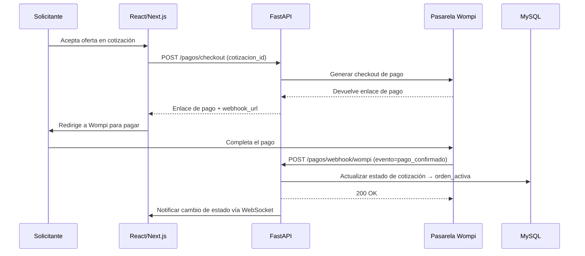

# API REST — ImportacionesQ8

## Descripción general

La API REST es el motor central de la plataforma, construida con **FastAPI** en Python 3. Gestiona toda la lógica del negocio: autenticación, cotizaciones, órdenes, pagos y chat.

---

## Endpoints principales

### Autenticación

| Método | Endpoint | Descripción |
|--------|----------|-------------|
| POST | `/auth/register` | Registro de nuevo usuario (solicitante o importador) |
| POST | `/auth/login` | Inicio de sesión y obtención de JWT token |
| POST | `/auth/refresh` | Renovación de token JWT expirado |
| POST | `/auth/logout` | Cierre de sesión y revocación de token |

### Cotizaciones

| Método | Endpoint | Descripción |
|--------|----------|-------------|
| GET | `/cotizaciones` | Listar cotizaciones del usuario autenticado |
| GET | `/cotizaciones/{id}` | Obtener detalles de una cotización específica |
| POST | `/cotizaciones` | Crear nueva cotización (solicitante) |
| PUT | `/cotizaciones/{id}/modalidad` | Actualizar modalidad de cotización |
| DELETE | `/cotizaciones/{id}` | Eliminar cotización (solo si no tiene orden asociada) |

### Importadores

| Método | Endpoint | Descripción |
|--------|----------|-------------|
| GET | `/importadores` | Listar importadores disponibles (con filtros) |
| GET | `/importadores/{id}` | Obtener detalles de un importador específico |
| POST | `/importadores` | Registrar nueva empresa importadora (admin) |

### Órdenes

| Método | Endpoint | Descripción |
|--------|----------|-------------|
| GET | `/ordenes` | Listar órdenes del usuario autenticado |
| GET | `/ordenes/{id}` | Obtener detalles de una orden específica |
| PUT | `/ordenes/{id}/estado` | Actualizar estado de una orden (importador/admin) |

### Pagos

| Método | Endpoint | Descripción |
|--------|----------|-------------|
| POST | `/pagos/checkout` | Generar enlace de pago con Wompi |
| GET | `/pagos/{id}` | Obtener estado del pago |
| POST | `/pagos/webhook/wompi` | Webhook de confirmación de pago (Wompi) |

### Chat

| Método | Endpoint | Descripción |
|--------|----------|-------------|
| GET | `/chat/conversaciones` | Listar conversaciones del usuario autenticado |
| GET | `/chat/conversaciones/{id}/mensajes` | Obtener mensajes de una conversación |
| POST | `/chat/conversaciones/{id}/mensajes` | Enviar mensaje a una conversación |

---

## Modelos de datos principales

### Cotización

```python
class Cotizacion(BaseModel):
    id: UUID
    solicitante_id: UUID
    importador_id: Optional[UUID]  # Solo para modalidad dirigida
    modalidad: Literal["dirigida", "abierta"]
    foto_producto: Optional[str]  # URL de la imagen
    pais_importacion: str
    nivel_personalizacion: Literal["estandar", "personalizacion_marca", "personalizacion_diseño_completo"]
    nombre_producto: str
    descripcion_cliente: str
    link_referencia: Optional[str]
    linea_producto: str
    tipo_calidad: Literal["economica", "estandar", "premium"]
    modalidad_importacion: Literal["ecommerce", "corporativo"]
    cantidad_minima: int
    precio_objetivo_usd: float
    incoterm: str
    notas_adicionales: Optional[str]
    estado: Literal[
        "creada",
        "dirigida",
        "abierta",
        "propuestas_recibidas",
        "cotizacion_aceptada",
        "orden_activa"
    ]
    fecha_creacion: datetime
    fecha_actualizacion: datetime
```

### Orden

```python
class Orden(BaseModel):
    id: UUID
    cotizacion_id: UUID
    importador_id: UUID
    solicitante_id: UUID
    asesor_asignado_id: UUID
    estado: Literal[
        "cotizacion_aceptada",
        "en_produccion",
        "transito_internacional",
        "aduana_nacionalizacion",
        "bodega_local",
        "entregado"
    ]
    precio_acordado_usd: float
    tiempo_estimado_entrega: Optional[str]
    condiciones_adicionales: Optional[str]
    documentos_adjuntos: List[Dict[str, str]]  # [{nombre, url}]
    historial_estados: List[Dict[str, Union[str, datetime]]]
    fecha_creacion: datetime
    fecha_actualizacion: datetime
```

### Importador

```python
class Importador(BaseModel):
    id: UUID
    nombre_empresa: str
    logo_url: Optional[str]
    especialidad_producto: List[str]  # ["Textiles", "Electrónica"]
    paises_origen: List[str]  # ["China", "Vietnam"]
    calificacion_promedio: float
    tiempo_respuesta_promedio: str  # "24h"
    capacidad_volumen: Optional[int]
    asesores: List[Dict[str, str]]  # [{id, nombre, foto_url, whatsapp}]
    estado: Literal["activo", "inactivo"]
    fecha_registro: datetime
```

### Usuario

```python
class Usuario(BaseModel):
    id: UUID
    email: str
    password_hash: str
    rol: Literal["solicitante", "importador", "admin"]
    perfil_completo: bool
    fecha_creacion: datetime
```

---

## Autenticación y autorización

### Flujo de autenticación JWT

1. El cliente envía credenciales (email + contraseña) al endpoint `/auth/login`
2. FastAPI valida las credenciales contra la base de datos MySQL
3. Se genera un token JWT con los claims: `user_id`, `rol`, `exp`
4. El token se devuelve al cliente en el body de la respuesta
5. El cliente incluye el token en el header `Authorization: Bearer <token>` para todas las peticiones posteriores
6. FastAPI valida el token en cada endpoint protegido usando dependencias

### Roles y permisos por endpoint

| Rol | Cotizaciones | Importadores | Órdenes | Pagos | Chat | Admin |
|-----|-------------|--------------|---------|-------|------|-------|
| Solicitante | ✅ Propias | 🔍 Solo lectura | ✅ Propias | ✅ Pagar | ✅ Propio | ❌ |
| Importador | ✅ Recibidas | ✅ Propia | ✅ Propias | ❌ | ✅ Asignado | ❌ |
| Admin | ✅ Todas | ✅ CRUD | ✅ Todas | ✅ Todos | ✅ Todos | ✅ |

---

## Webhooks de Wompi

### Flujo de webhook de pago



### Eventos de Wompi que se manejan

| Evento | Acción en la plataforma |
|--------|----------------------|
| `payment.confirmed` | Cotización → Orden activa, notificar al solicitante y importador |
| `payment.failed` | Mantener cotización en estado "pendiente de pago" |
| `payment.refunded` | Notificar disputa, cambiar estado de orden a "en disputa/reembolso" |

---

## Endpoints de administracion (solo admin)

| Método | Endpoint | Descripción |
|--------|----------|-------------|
| GET | `/admin/cotizaciones-abiertas` | Listar todas las cotizaciones abiertas activas |
| GET | `/admin/disputas` | Listar órdenes en disputa |
| POST | `/admin/importadores/{id}/verificar` | Verificar empresa importadora (badge de "socio verificado") |
| PUT | `/admin/importadores/{id}/estado` | Activar/desactivar importador de la red |

---

## Convenciones de la API

- **Formato de respuesta:** JSON con estructura uniforme: `{"success": true/false, "data": {...}, "error": null}`
- **Paginación:** Todos los endpoints que retornan listas soportan `?page=1&limit=20`
- **Filtros:** Los endpoints GET soportan filtros query params (ej. `/importadores?especialidad=textiles&pais=china`)
- **Errores HTTP:** 400 (Bad Request), 401 (Unauthorized), 403 (Forbidden), 404 (Not Found), 500 (Internal Server Error)
- **Documentación automática:** Swagger UI en `/docs` y OpenAPI spec en `/openapi.json`