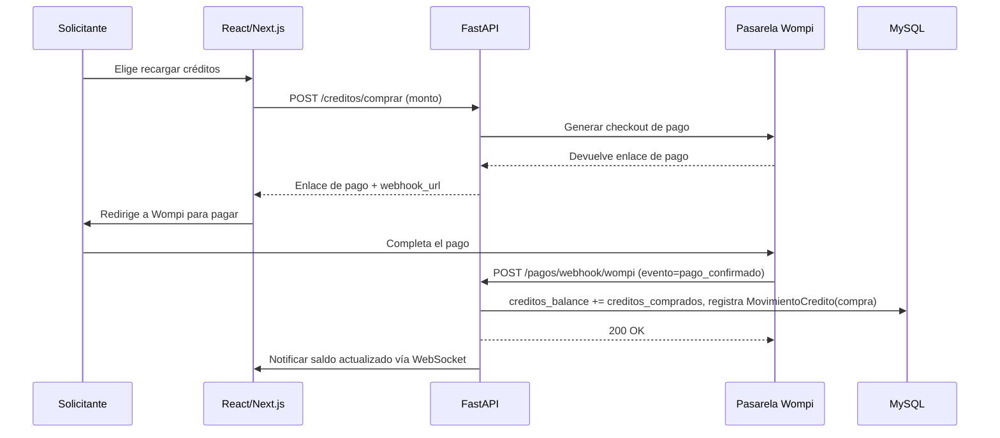
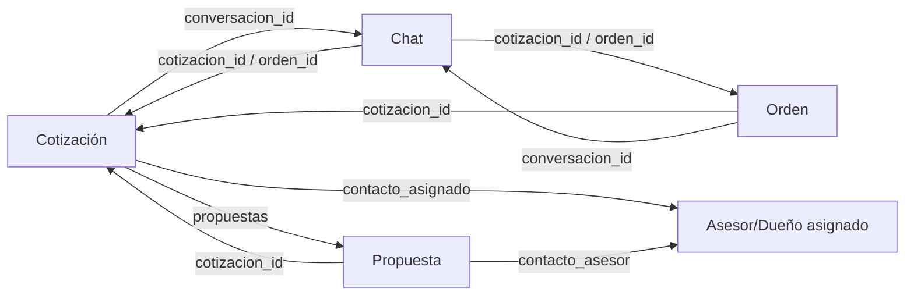

# API REST — ImportacionesQ8

## Descripción general

La API REST es el motor central de la plataforma, construida con **FastAPI** en Python 3. Gestiona toda la lógica del negocio: autenticación, cotizaciones, órdenes, pagos y chat.

---

## Endpoints principales

### Salud / readiness (ops — 2026-07-13)

| Método | Endpoint | Descripción |
|--------|----------|-------------|
| GET | `/health` | Liveness: el proceso responde (no comprueba dependencias) |
| GET | `/health/ready` | Readiness: MySQL `SELECT 1` + Redis `PING`; **503** si alguna falla |

Usar `/health/ready` en orquestadores y CI smoke. Detalle: [[Remediaciones-Backend-Jul-2026]].

### Autenticación

| Método | Endpoint | Descripción |
|--------|----------|-------------|
| POST | `/auth/register` | Registro de solicitante (persona natural o jurídica; ver [[Autenticacion]]). `rol="importador"` responde placeholder, ver Semana 4 |
| POST | `/auth/login` | Inicio de sesión y obtención de JWT token |
| POST | `/auth/refresh` | Renovación de token JWT expirado |
| POST | `/auth/logout` | Cierre de sesión y revocación de token |
| POST | `/auth/forgot-password` | (Semana 4) Solicita recuperación de contraseña: envía OTP + enlace por correo (SMTP real) |
| POST | `/auth/reset-password` | (Semana 4) Confirma la recuperación con `{token, otp, nueva_password}` |

### Páginas legales (Semana 4)

| Método | Endpoint | Descripción |
|--------|----------|-------------|
| GET | `/legal/politica-tratamiento-datos` | Placeholder "En construcción..." |
| GET | `/legal/terminos-condiciones` | Placeholder "En construcción..." |

### Cotizaciones

| Método | Endpoint | Descripción |
|--------|----------|-------------|
| GET | `/cotizaciones` | Listar cotizaciones del usuario autenticado |
| GET | `/cotizaciones/{id}` | Obtener detalles de una cotización específica |
| POST | `/cotizaciones` | Crear nueva cotización (solicitante) |
| PUT | `/cotizaciones/{id}/modalidad` | Actualizar modalidad de cotización |
| DELETE | `/cotizaciones/{id}` | Eliminar cotización (solo si no tiene orden asociada) |

### Importadores

| Método | Endpoint | Descripción |
|--------|----------|-------------|
| GET | `/importadores` | Listar importadores disponibles (filtros: `especialidad`, `pais`, `certificado`; orden: `orden=calificacion\|reciente`) |
| GET | `/importadores/{id}` | Obtener detalles de un importador específico |
| POST | `/importadores` | Registrar nueva empresa importadora (admin) |
| GET | `/importadores/destacados` | (Semana 4) Top N por `calificacion_promedio` desc, para el dashboard del solicitante |
| GET | `/importadores/por-categoria` | (Semana 4) Importadores agrupados por `especialidad_producto` (`{categoria: [importadores]}`) |
| GET | `/importadores/certificados` | (Semana 4) Solo empresas con `verificado=true` |

### Órdenes

| Método | Endpoint | Descripción |
|--------|----------|-------------|
| GET | `/ordenes` | Listar órdenes del usuario autenticado |
| GET | `/ordenes/{id}` | Obtener detalles de una orden específica |
| PUT | `/ordenes/{id}/estado` | Actualizar estado de una orden (importador/admin) |

### Créditos y pagos (Semana 4 — reemplaza el modelo de comisión)

> El pago vía Wompi ya no paga una orden directamente: **compra créditos**, que se consumen al crear cotizaciones. Ver [[Pagos-Wompi]].

| Método | Endpoint | Rol | Descripción |
|--------|----------|-----|-------------|
| POST | `/creditos/comprar` | Solicitante | Genera enlace de pago con Wompi para recargar créditos |
| GET | `/creditos/saldo` | Solicitante | Saldo actual de créditos |
| GET | `/creditos/movimientos` | Solicitante | Historial de movimientos de créditos |
| GET | `/pagos/{id}` | Dueño del pago | Obtener estado de un pago de créditos |
| POST | `/pagos/webhook/wompi` | Wompi | Webhook de confirmación: acredita créditos al confirmarse el pago |
| POST | `/cotizaciones/{id}/solicitar-recreacion` | Solicitante o asesor/dueño asignado | Solicita anular una cotización aceptada por error |
| GET | `/admin/recreaciones` | Admin | Lista solicitudes de recreación pendientes/resueltas |
| PUT | `/admin/recreaciones/{id}/resolver` | Admin | Decide la parte responsable; reembolsa créditos si aplica |

> **Endpoint eliminado (Semana 4):** `POST /ordenes/crear-orden`. La orden ahora se crea automáticamente al confirmarse la doble aceptación de una propuesta (`POST /propuestas/{id}/pre-aceptar`), sin pago de por medio.

### Chat

| Método | Endpoint | Descripción |
|--------|----------|-------------|
| GET | `/chat/conversaciones` | Listar conversaciones del usuario autenticado |
| GET | `/chat/conversaciones/{id}/mensajes` | Obtener mensajes de una conversación |
| POST | `/chat/conversaciones/{id}/mensajes` | Enviar mensaje a una conversación |
| WS | `/ws/chat/{conversacion_id}?token=...` | Conexión WebSocket para chat en tiempo real |

### Usuarios y asesores (Semana 3, rol renombrado de "trabajador" a "asesor" en Semana 4)

| Método | Endpoint | Rol | Descripción |
|--------|----------|-----|-------------|
| GET | `/usuarios/me` | Cualquiera autenticado | Perfil personal de la cuenta |
| PUT | `/usuarios/me` | Cualquiera autenticado | Personalizar perfil (nombre, teléfono, foto, WhatsApp) |
| POST | `/importadores/asesores` | Dueño (importador) | Crear cuenta de asesor de la empresa (persona natural, suscrita a la empresa) |
| GET | `/importadores/asesores` | Dueño | Listar asesores de la empresa |
| PUT | `/importadores/asesores/{id}/estado` | Dueño | Activar/desactivar un asesor |
| GET | `/cotizaciones/pool-empresa` | Dueño + asesor | Cotizaciones de la empresa sin reclamar (estilo "Uber": el primero en reclamar la atiende) |
| POST | `/cotizaciones/{id}/reclamar` | Asesor | Reclamo atómico de una cotización del pool |
| GET | `/asesores/me/cotizaciones` | Asesor | Cotizaciones asignadas al asesor autenticado |
| PUT | `/importadores/{id}` | Dueño | Autoservicio del perfil de la empresa |

### Propuestas: redacción, envío y doble aceptación (Semana 4)

> El asesor **redacta y edita**; solo el **dueño (importador)** envía la propuesta al solicitante, tras validar que la categoría de la empresa sea congruente con la línea de producto de la cotización.

| Método | Endpoint | Rol | Descripción |
|--------|----------|-----|-------------|
| POST | `/cotizaciones/{id}/propuestas/borrador` | Asesor asignado | Crea/actualiza una propuesta en estado `borrador`, no visible al solicitante |
| PUT | `/propuestas/{id}` | Asesor dueño del borrador | Edita la propuesta (en `borrador` o ya `enviada`, para reflejar ajustes negociados por chat) |
| POST | `/cotizaciones/{id}/propuestas/enviar` | Dueño (importador) | Envía la propuesta (`borrador → pendiente`) tras validar congruencia de categoría |
| POST | `/propuestas/{id}/aceptar` | Solicitante | Abre el chat con el asesor asignado (ya no finaliza la propuesta) |
| POST | `/propuestas/{id}/pre-aceptar` | Solicitante o asesor/dueño de la empresa | Marca el lado propio de la doble aceptación mutua; revertible mientras el otro lado no haya aceptado. Al completarse ambos lados: finaliza la propuesta, rechaza las demás, crea la `Orden` automáticamente y traspasa el chat al dueño (supervisor) |

### Formulario de cotización personalizable (Semana 3)

| Método | Endpoint | Rol | Descripción |
|--------|----------|-----|-------------|
| POST | `/importadores/campos-personalizados` | Dueño (`solo_cotizaciones_directas=true`) | Crear campo del formulario propio |
| GET | `/importadores/campos-personalizados` | Dueño | Listar campos propios |
| PUT | `/importadores/campos-personalizados/{id}` | Dueño | Actualizar un campo propio |
| DELETE | `/importadores/campos-personalizados/{id}` | Dueño | Eliminar un campo propio |
| GET | `/importadores/{id}/formulario` | Público | Formulario efectivo (estándar o personalizado) de una empresa |

### Disputas y administración (Semana 3)

| Método | Endpoint | Rol | Descripción |
|--------|----------|-----|-------------|
| PUT | `/ordenes/{id}/reportar-problema` | Solicitante | Abrir una disputa sobre su orden |
| POST | `/admin/importadores` | Admin | Crear empresa importadora + cuenta dueña en un solo paso |
| POST | `/admin/importadores/{id}/verificar` | Admin | Verificar/activar una empresa |
| PUT | `/admin/importadores/{id}/estado` | Admin | Activar/desactivar una empresa |
| GET | `/admin/usuarios` | Admin | Monitoreo de cuentas (filtrable por rol/estado) |
| PUT | `/admin/usuarios/{id}/estado` | Admin | Activar/desactivar cualquier cuenta |
| GET | `/admin/cotizaciones-abiertas` | Admin | Vista de todas las cotizaciones abiertas |
| GET | `/admin/disputas` | Admin | Listar órdenes con disputa abierta |
| PUT | `/admin/disputas/{id}/resolver` | Admin | Resolver una disputa |
| GET | `/admin/metricas` | Admin | Métricas de éxito de la plataforma (sección del PDF) |

> **Nota:** `POST /auth/register` solo acepta `rol="solicitante"` desde la Semana 3 (ver [[Autenticacion]]); las cuentas `importador` y `asesor` se crean desde los endpoints de arriba. (Semana 4) El registro de `solicitante` ahora distingue persona natural/jurídica con validación condicional de campos.

---

## Modelos de datos principales

> Los modelos de esta sección reflejan el esquema real implementado (verificado con 159/159 tests). Ver [[Base-Datos]] para el detalle completo columna por columna, incluyendo las tablas nuevas de la Semana 3 (`campos_personalizados`, y los cambios en `usuarios`/`ordenes`/`conversaciones_chat`).

### Cotización

```python
class Cotizacion(BaseModel):
    id: UUID
    solicitante_id: UUID
    importador_id: Optional[UUID]  # Solo para modalidad dirigida
    modalidad: Literal["dirigida", "abierta"]
    foto_producto: Optional[str]  # URL de la imagen
    pais_importacion: str
    nivel_personalizacion: Literal["estandar", "personalizacion_marca", "personalizacion_diseño_completo"]
    nombre_producto: str
    descripcion_cliente: str
    link_referencia: Optional[str]
    linea_producto: str
    tipo_calidad: Literal["economica", "estandar", "premium"]
    modalidad_importacion: Literal["ecommerce", "corporativo"]
    cantidad_minima: int
    precio_objetivo_usd: float
    incoterm: str
    notas_adicionales: Optional[str]
    campos_personalizados_valores: Optional[Dict[str, Any]]  # (Semana 3) {campo_id: valor} si la empresa dirigida es solo_cotizaciones_directas
    asesor_asignado_id: Optional[UUID]  # (Semana 3-4) quién reclamó la cotización del pool de la empresa (renombrado de trabajador_asignado_id)
    costo_creditos: Optional[float]  # (Semana 4) créditos descontados al crearla
    cotizacion_origen_id: Optional[UUID]  # (Semana 4) si es reemplazo de una cancelada por error
    cancelada_por_error: Optional[Literal["solicitante", "importador"]]  # (Semana 4)
    motivo_cancelacion: Optional[str]  # (Semana 4)
    conversacion_id: Optional[UUID]  # (Semana 4) navegación cruzada al chat, si existe
    contacto_asignado: Optional[Dict[str, Any]]  # (Semana 4) {nombre, foto_url, whatsapp} del asesor/dueño asignado, o None si aún no hay respuesta
    estado: Literal[
        "creada",
        "dirigida",
        "abierta",
        "propuestas_recibidas",
        "cotizacion_aceptada",
        "orden_activa",
        "cancelada"
    ]
    fecha_creacion: datetime
    fecha_actualizacion: datetime
```

### Orden

```python
class Orden(BaseModel):
    id: UUID
    cotizacion_id: UUID
    importador_id: UUID
    solicitante_id: UUID
    asesor_asignado_id: Optional[UUID]  # (Semana 3-4) heredado de la propuesta ganadora al crearse automáticamente
    estado: Literal[
        "cotizacion_aceptada",
        "en_produccion",
        "transito_internacional",
        "aduana_nacionalizacion",
        "bodega_local",
        "entregado"
    ]
    precio_acordado_usd: float
    tiempo_estimado_entrega: Optional[str]
    condiciones_adicionales: Optional[str]
    en_disputa: bool  # (Semana 3)
    motivo_disputa: Optional[str]  # (Semana 3)
    documentos_adjuntos: List[Dict[str, str]]  # [{nombre, url}]
    historial_estados: List[Dict[str, Union[str, datetime]]]
    conversacion_id: Optional[UUID]  # (Semana 4) navegación cruzada al chat
    fecha_creacion: datetime
    fecha_actualizacion: datetime
```

> **Nota (Semana 4):** la `Orden` **ya no se crea vía pago**. Nace automáticamente cuando ambas partes (solicitante y empresa) marcan `pre-aceptar` sobre la misma propuesta — la plataforma solo conecta, no se responsabiliza del cumplimiento de la orden entre las partes.

### Propuesta (ampliado — Semana 4)

```python
class Propuesta(BaseModel):
    id: UUID
    cotizacion_id: UUID
    importador_id: UUID
    creado_por_usuario_id: Optional[UUID]  # (Semana 4) asesor o dueño que redactó/editó por última vez
    preaceptada_por_solicitante: bool  # (Semana 4)
    preaceptada_por_empresa: bool  # (Semana 4)
    contacto_asesor: Optional[Dict[str, Any]]  # (Semana 4) navegación cruzada: contacto del asesor/dueño asignado
    estado: Literal["borrador", "pendiente", "aceptada", "rechazada"]  # (Semana 4) se agregó "borrador"
    fecha_envio: Optional[datetime]
```

### Importador

```python
class Importador(BaseModel):
    id: UUID
    nombre_empresa: str
    logo_url: Optional[str]
    especialidad_producto: List[str]  # ["Textiles", "Electrónica"]
    paises_origen: List[str]  # ["China", "Vietnam"]
    calificacion_promedio: float
    tiempo_respuesta_promedio: str  # "24h"
    capacidad_volumen: Optional[int]
    estado: Literal["activo", "inactivo"]
    solo_cotizaciones_directas: bool  # (Semana 3) True = formulario propio, fuera del matching abierto
    verificado: bool  # (Semana 4) badge de "socio verificado" del catálogo, solo lo fija el admin
    fecha_registro: datetime
```

> **Nota (Semana 3):** el campo `asesores` (lista embebida) se retiró de este modelo. Los "asesores" ahora son cuentas propias (`Usuario(rol="asesor", importador_id=<esta empresa>)`) consultables vía `GET /importadores/asesores`, no un array dentro del importador.

### Usuario

```python
class Usuario(BaseModel):
    id: UUID
    email: str
    password_hash: str
    rol: Literal["solicitante", "importador", "asesor", "admin"]  # (Semana 4) renombrado de "trabajador" a "asesor"
    importador_id: Optional[UUID]  # (Semana 3) empresa a la que pertenece (dueño o asesor)
    nombre: Optional[str]
    apellido: Optional[str]  # (Semana 4) persona natural
    telefono: Optional[str]
    indicativo_pais_telefono: Optional[str]  # (Semana 4) ej. "+57"
    foto_url: Optional[str]
    whatsapp: Optional[str]
    tipo_persona: Optional[Literal["natural", "juridica"]]  # (Semana 4) solo solicitante
    tipo_documento: Optional[str]  # (Semana 4) persona natural
    numero_documento: Optional[str]  # (Semana 4) persona natural
    nit: Optional[str]  # (Semana 4) persona jurídica
    razon_social: Optional[str]  # (Semana 4) persona jurídica
    acepto_politica_datos: bool  # (Semana 4)
    creditos_balance: float  # (Semana 4) saldo consumible al crear cotizaciones
    activo: bool  # (Semana 3) cuentas desactivadas no pueden iniciar sesión
    perfil_completo: bool
    fecha_creacion: datetime
```

### CampoPersonalizado (nuevo — Semana 3)

```python
class CampoPersonalizado(BaseModel):
    id: UUID
    importador_id: UUID  # solo empresas con solo_cotizaciones_directas=True
    etiqueta: str
    tipo: Literal["texto", "numero", "select", "booleano"]
    opciones: Optional[List[str]]  # si tipo="select"
    obligatorio: bool
    orden: int
```

---

## Autenticación y autorización

### Flujo de autenticación JWT

1. El cliente envía credenciales (email + contraseña) al endpoint `/auth/login`
2. FastAPI valida las credenciales contra la base de datos, **y rechaza la cuenta si `activo=False`** (Semana 3)
3. Se genera un token JWT con los claims: `sub` (user_id), `rol`, `importador_id` (Semana 3), `exp`, `iat`
4. El token se devuelve al cliente en el body de la respuesta
5. El cliente incluye el token en el header `Authorization: Bearer <token>` para todas las peticiones posteriores
6. FastAPI valida el token en cada endpoint protegido usando dependencias; las comprobaciones de propiedad entre empresas (IDOR) usan el claim `importador_id`, no el `sub` de la cuenta — así una cuenta dueña y sus asesores comparten el mismo acceso a los datos de la empresa

> Ver [[Autenticacion]] para el detalle completo del JWT y el cierre del auto-registro de `admin`/`importador`.

### Roles y permisos por endpoint

| Rol | Cotizaciones | Importadores | Órdenes | Créditos | Chat | Asesores | Admin |
|-----|-------------|--------------|---------|-------|------|--------------|-------|
| Solicitante | ✅ Propias, reportar disputa, solicitar recreación | 🔍 Solo lectura + catálogo enriquecido | ✅ Propias (no las crea directamente) | ✅ Comprar créditos | ✅ Propio | ❌ | ❌ |
| Importador (dueño) | ✅ Recibidas + **enviar** propuesta | ✅ Perfil propio + formulario personalizado | ✅ Propias (heredadas de doble aceptación) | ❌ | ✅ Asignado (recibe el chat traspasado como supervisor) | ✅ Crear/listar/activar los suyos | ❌ |
| Asesor (Semana 3, renombrado en Semana 4) | ✅ Reclamar del pool de su empresa, **redactar/editar** borradores de propuesta | ❌ | ❌ | ❌ | ✅ Solo el asignado (hasta el traspaso al dueño) | ❌ (no crea a otros) | ❌ |
| Admin | ✅ Todas (solo lectura vía panel), resolver recreaciones | ✅ Crear empresa + dueño, verificar, activar | ✅ Todas (vía disputas) | ✅ Ver todos los pagos | ❌ (media por fuera del chat) | ❌ | ✅ Todo, incluido monitoreo/desactivación de cuentas y métricas |

---

## Webhooks de Wompi (Semana 4 — compra de créditos, no de órdenes)

### Flujo de webhook de pago



### Eventos de Wompi que se manejan

| Evento | Acción en la plataforma |
|--------|----------------------|
| `payment.confirmed` | Acredita créditos al `Usuario.creditos_balance`, registra `MovimientoCredito` tipo `compra` (idempotente por `wompi_payment_id` único) |
| `payment.failed` | El pago queda en estado `fallido`, no se acreditan créditos |
| `payment.refunded` | Se notifica y ajusta el estado del pago; no afecta órdenes (la plataforma no gestiona pagos entre solicitante e importador) |

> La creación de la `Orden` ya **no depende de ningún pago**: ocurre automáticamente por doble aceptación de una propuesta (ver Fase 5 de Semana 4).

---

## Navegación cruzada entre entidades (Semana 4)

Todas las respuestas relevantes exponen los IDs necesarios para que el frontend pueda "saltar" de una entidad a otra sin peticiones adicionales:



- **Cotización → Chat/Propuesta:** `CotizacionResponse.conversacion_id` (si existe) y `contacto_asignado` (contacto del asesor/dueño con propuesta `enviada`/`aceptada`; `null` si "aún no hay respuesta").
- **Cotización abierta:** la lista de propuestas incluye el contacto del asesor de cada una, para poder chatear con cualquiera antes de elegir oferta.
- **Propuesta → Cotización/Chat:** `PropuestaResponse.cotizacion_id` y `contacto_asesor`.
- **Orden → Cotización/Chat:** `OrdenResponse.cotizacion_id` y `conversacion_id`.
- **Chat → Cotización/Orden:** `ConversacionChatResponse` incluye `cotizacion_id` y `orden_id` (poblado tras la doble aceptación, cuando el chat se traspasa al dueño).

---

## Endpoints de administración (solo admin)

> Lista completa y actualizada en la sección **"Disputas y administración (Semana 3)"** más arriba (incluye `POST /admin/importadores`, `GET/PUT /admin/usuarios[/{id}/estado]` y `GET /admin/metricas`), más `GET /admin/recreaciones` y `PUT /admin/recreaciones/{id}/resolver` (Semana 4, sección **"Créditos y pagos"**).

---

## Convenciones de la API

- **Formato de respuesta:** JSON con estructura uniforme: `{"success": true/false, "data": {...}, "error": null}`
- **Paginación:** Todos los endpoints que retornan listas soportan `?page=1&limit=20`
- **Filtros:** Los endpoints GET soportan filtros query params (ej. `/importadores?especialidad=textiles&pais=china`)
- **Errores HTTP:** 400 (Bad Request), 401 (Unauthorized), 403 (Forbidden), 404 (Not Found), 402 (créditos insuficientes), 409 (conflicto/carrera), 500 (Internal Server Error), 503 (no ready)
- **Documentación automática:** Swagger UI en `/docs` y OpenAPI spec en `/openapi.json`
- **Carga / capacidad:** resultados de 1000 usuarios concurrentes en [[Pruebas-Carga-1000-Concurrentes]]; workers vía `WEB_CONCURRENCY`