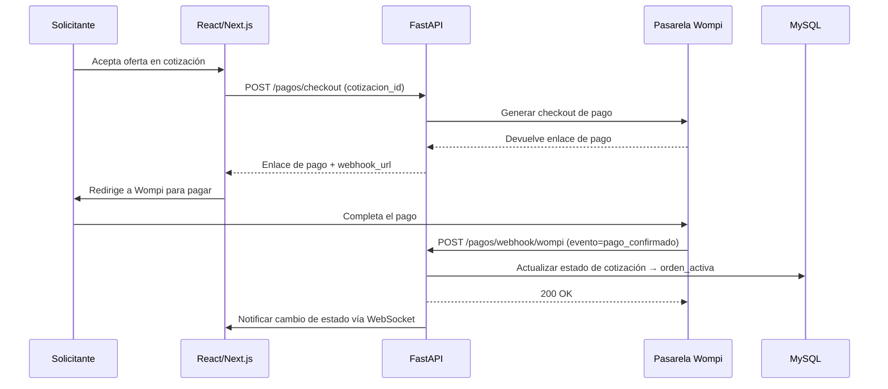

# API REST — ImportacionesQ8

## Descripción general

La API REST es el motor central de la plataforma, construida con **FastAPI** en Python 3. Gestiona toda la lógica del negocio: autenticación, cotizaciones, órdenes, pagos y chat.

---

## Endpoints principales

### Autenticación

| Método | Endpoint | Descripción |
|--------|----------|-------------|
| POST | `/auth/register` | Registro de nuevo usuario (solicitante o importador) |
| POST | `/auth/login` | Inicio de sesión y obtención de JWT token |
| POST | `/auth/refresh` | Renovación de token JWT expirado |
| POST | `/auth/logout` | Cierre de sesión y revocación de token |

### Cotizaciones

| Método | Endpoint | Descripción |
|--------|----------|-------------|
| GET | `/cotizaciones` | Listar cotizaciones del usuario autenticado |
| GET | `/cotizaciones/{id}` | Obtener detalles de una cotización específica |
| POST | `/cotizaciones` | Crear nueva cotización (solicitante) |
| PUT | `/cotizaciones/{id}/modalidad` | Actualizar modalidad de cotización |
| DELETE | `/cotizaciones/{id}` | Eliminar cotización (solo si no tiene orden asociada) |

### Importadores

| Método | Endpoint | Descripción |
|--------|----------|-------------|
| GET | `/importadores` | Listar importadores disponibles (con filtros) |
| GET | `/importadores/{id}` | Obtener detalles de un importador específico |
| POST | `/importadores` | Registrar nueva empresa importadora (admin) |

### Órdenes

| Método | Endpoint | Descripción |
|--------|----------|-------------|
| GET | `/ordenes` | Listar órdenes del usuario autenticado |
| GET | `/ordenes/{id}` | Obtener detalles de una orden específica |
| PUT | `/ordenes/{id}/estado` | Actualizar estado de una orden (importador/admin) |

### Pagos

| Método | Endpoint | Descripción |
|--------|----------|-------------|
| POST | `/pagos/checkout` | Generar enlace de pago con Wompi |
| GET | `/pagos/{id}` | Obtener estado del pago |
| POST | `/pagos/webhook/wompi` | Webhook de confirmación de pago (Wompi) |

### Chat

| Método | Endpoint | Descripción |
|--------|----------|-------------|
| GET | `/chat/conversaciones` | Listar conversaciones del usuario autenticado |
| GET | `/chat/conversaciones/{id}/mensajes` | Obtener mensajes de una conversación |
| POST | `/chat/conversaciones/{id}/mensajes` | Enviar mensaje a una conversación |
| WS | `/ws/chat/{conversacion_id}?token=...` | Conexión WebSocket para chat en tiempo real |

### Usuarios y trabajadores (Semana 3)

| Método | Endpoint | Rol | Descripción |
|--------|----------|-----|-------------|
| GET | `/usuarios/me` | Cualquiera autenticado | Perfil personal de la cuenta |
| PUT | `/usuarios/me` | Cualquiera autenticado | Personalizar perfil (nombre, teléfono, foto, WhatsApp) |
| POST | `/importadores/trabajadores` | Dueño (importador) | Crear cuenta de trabajador de la empresa |
| GET | `/importadores/trabajadores` | Dueño | Listar trabajadores de la empresa |
| PUT | `/importadores/trabajadores/{id}/estado` | Dueño | Activar/desactivar un trabajador |
| GET | `/cotizaciones/pool-empresa` | Dueño + trabajador | Cotizaciones de la empresa sin reclamar |
| POST | `/cotizaciones/{id}/reclamar` | Trabajador | Reclamo atómico de una cotización del pool |
| GET | `/trabajadores/me/cotizaciones` | Trabajador | Cotizaciones asignadas al trabajador autenticado |
| PUT | `/importadores/{id}` | Dueño | Autoservicio del perfil de la empresa |

### Formulario de cotización personalizable (Semana 3)

| Método | Endpoint | Rol | Descripción |
|--------|----------|-----|-------------|
| POST | `/importadores/campos-personalizados` | Dueño (`solo_cotizaciones_directas=true`) | Crear campo del formulario propio |
| GET | `/importadores/campos-personalizados` | Dueño | Listar campos propios |
| PUT | `/importadores/campos-personalizados/{id}` | Dueño | Actualizar un campo propio |
| DELETE | `/importadores/campos-personalizados/{id}` | Dueño | Eliminar un campo propio |
| GET | `/importadores/{id}/formulario` | Público | Formulario efectivo (estándar o personalizado) de una empresa |

### Disputas y administración (Semana 3)

| Método | Endpoint | Rol | Descripción |
|--------|----------|-----|-------------|
| PUT | `/ordenes/{id}/reportar-problema` | Solicitante | Abrir una disputa sobre su orden |
| POST | `/admin/importadores` | Admin | Crear empresa importadora + cuenta dueña en un solo paso |
| POST | `/admin/importadores/{id}/verificar` | Admin | Verificar/activar una empresa |
| PUT | `/admin/importadores/{id}/estado` | Admin | Activar/desactivar una empresa |
| GET | `/admin/usuarios` | Admin | Monitoreo de cuentas (filtrable por rol/estado) |
| PUT | `/admin/usuarios/{id}/estado` | Admin | Activar/desactivar cualquier cuenta |
| GET | `/admin/cotizaciones-abiertas` | Admin | Vista de todas las cotizaciones abiertas |
| GET | `/admin/disputas` | Admin | Listar órdenes con disputa abierta |
| PUT | `/admin/disputas/{id}/resolver` | Admin | Resolver una disputa |
| GET | `/admin/metricas` | Admin | Métricas de éxito de la plataforma (sección del PDF) |

> **Nota:** `POST /auth/register` solo acepta `rol="solicitante"` desde la Semana 3 (ver [[Autenticacion]]); las cuentas `importador` y `trabajador` se crean desde los endpoints de arriba.

---

## Modelos de datos principales

> Los modelos de esta sección reflejan el esquema real implementado (verificado con 159/159 tests). Ver [[Base-Datos]] para el detalle completo columna por columna, incluyendo las tablas nuevas de la Semana 3 (`campos_personalizados`, y los cambios en `usuarios`/`ordenes`/`conversaciones_chat`).

### Cotización

```python
class Cotizacion(BaseModel):
    id: UUID
    solicitante_id: UUID
    importador_id: Optional[UUID]  # Solo para modalidad dirigida
    modalidad: Literal["dirigida", "abierta"]
    foto_producto: Optional[str]  # URL de la imagen
    pais_importacion: str
    nivel_personalizacion: Literal["estandar", "personalizacion_marca", "personalizacion_diseño_completo"]
    nombre_producto: str
    descripcion_cliente: str
    link_referencia: Optional[str]
    linea_producto: str
    tipo_calidad: Literal["economica", "estandar", "premium"]
    modalidad_importacion: Literal["ecommerce", "corporativo"]
    cantidad_minima: int
    precio_objetivo_usd: float
    incoterm: str
    notas_adicionales: Optional[str]
    campos_personalizados_valores: Optional[Dict[str, Any]]  # (Semana 3) {campo_id: valor} si la empresa dirigida es solo_cotizaciones_directas
    trabajador_asignado_id: Optional[UUID]  # (Semana 3) quién reclamó la cotización del pool de la empresa
    estado: Literal[
        "creada",
        "dirigida",
        "abierta",
        "propuestas_recibidas",
        "cotizacion_aceptada",
        "orden_activa"
    ]
    fecha_creacion: datetime
    fecha_actualizacion: datetime
```

### Orden

```python
class Orden(BaseModel):
    id: UUID
    cotizacion_id: UUID
    importador_id: UUID
    solicitante_id: UUID
    trabajador_asignado_id: Optional[UUID]  # (Semana 3) reemplaza a "asesor_asignado_id"; heredado de la cotización
    estado: Literal[
        "cotizacion_aceptada",
        "en_produccion",
        "transito_internacional",
        "aduana_nacionalizacion",
        "bodega_local",
        "entregado"
    ]
    precio_acordado_usd: float
    tiempo_estimado_entrega: Optional[str]
    condiciones_adicionales: Optional[str]
    en_disputa: bool  # (Semana 3)
    motivo_disputa: Optional[str]  # (Semana 3)
    documentos_adjuntos: List[Dict[str, str]]  # [{nombre, url}]
    historial_estados: List[Dict[str, Union[str, datetime]]]
    fecha_creacion: datetime
    fecha_actualizacion: datetime
```

### Importador

```python
class Importador(BaseModel):
    id: UUID
    nombre_empresa: str
    logo_url: Optional[str]
    especialidad_producto: List[str]  # ["Textiles", "Electrónica"]
    paises_origen: List[str]  # ["China", "Vietnam"]
    calificacion_promedio: float
    tiempo_respuesta_promedio: str  # "24h"
    capacidad_volumen: Optional[int]
    estado: Literal["activo", "inactivo"]
    solo_cotizaciones_directas: bool  # (Semana 3) True = formulario propio, fuera del matching abierto
    fecha_registro: datetime
```

> **Nota (Semana 3):** el campo `asesores` (lista embebida) se retiró de este modelo. Los "asesores" ahora son cuentas propias (`Usuario(rol="trabajador", importador_id=<esta empresa>)`) consultables vía `GET /importadores/trabajadores`, no un array dentro del importador.

### Usuario

```python
class Usuario(BaseModel):
    id: UUID
    email: str
    password_hash: str
    rol: Literal["solicitante", "importador", "trabajador", "admin"]  # (Semana 3) rol "trabajador" nuevo
    importador_id: Optional[UUID]  # (Semana 3) empresa a la que pertenece (dueño o trabajador)
    nombre: Optional[str]
    telefono: Optional[str]
    foto_url: Optional[str]
    whatsapp: Optional[str]
    activo: bool  # (Semana 3) cuentas desactivadas no pueden iniciar sesión
    perfil_completo: bool
    fecha_creacion: datetime
```

### CampoPersonalizado (nuevo — Semana 3)

```python
class CampoPersonalizado(BaseModel):
    id: UUID
    importador_id: UUID  # solo empresas con solo_cotizaciones_directas=True
    etiqueta: str
    tipo: Literal["texto", "numero", "select", "booleano"]
    opciones: Optional[List[str]]  # si tipo="select"
    obligatorio: bool
    orden: int
```

---

## Autenticación y autorización

### Flujo de autenticación JWT

1. El cliente envía credenciales (email + contraseña) al endpoint `/auth/login`
2. FastAPI valida las credenciales contra la base de datos, **y rechaza la cuenta si `activo=False`** (Semana 3)
3. Se genera un token JWT con los claims: `sub` (user_id), `rol`, `importador_id` (Semana 3), `exp`, `iat`
4. El token se devuelve al cliente en el body de la respuesta
5. El cliente incluye el token en el header `Authorization: Bearer <token>` para todas las peticiones posteriores
6. FastAPI valida el token en cada endpoint protegido usando dependencias; las comprobaciones de propiedad entre empresas (IDOR) usan el claim `importador_id`, no el `sub` de la cuenta — así una cuenta dueña y sus trabajadores comparten el mismo acceso a los datos de la empresa

> Ver [[Autenticacion]] para el detalle completo del JWT y el cierre del auto-registro de `admin`/`importador`.

### Roles y permisos por endpoint

| Rol | Cotizaciones | Importadores | Órdenes | Pagos | Chat | Trabajadores | Admin |
|-----|-------------|--------------|---------|-------|------|--------------|-------|
| Solicitante | ✅ Propias, reportar disputa | 🔍 Solo lectura | ✅ Propias | ✅ Pagar | ✅ Propio | ❌ | ❌ |
| Importador (dueño) | ✅ Recibidas + enviar propuesta | ✅ Perfil propio + formulario personalizado | ✅ Propias | ❌ | ✅ Asignado | ✅ Crear/listar/activar los suyos | ❌ |
| Trabajador (Semana 3) | ✅ Solo reclamar del pool de su empresa | ❌ | ❌ | ❌ | ✅ Solo el asignado | ❌ (no crea a otros) | ❌ |
| Admin | ✅ Todas (solo lectura vía panel) | ✅ Crear empresa + dueño, verificar, activar | ✅ Todas (vía disputas) | ✅ Todos | ❌ (media por fuera del chat) | ❌ | ✅ Todo, incluido monitoreo/desactivación de cuentas y métricas |

---

## Webhooks de Wompi

### Flujo de webhook de pago



### Eventos de Wompi que se manejan

| Evento | Acción en la plataforma |
|--------|----------------------|
| `payment.confirmed` | Cotización → Orden activa, notificar al solicitante y importador |
| `payment.failed` | Mantener cotización en estado "pendiente de pago" |
| `payment.refunded` | Notificar disputa, cambiar estado de orden a "en disputa/reembolso" |

---

## Endpoints de administración (solo admin)

> Lista completa y actualizada en la sección **"Disputas y administración (Semana 3)"** más arriba (incluye `POST /admin/importadores`, `GET/PUT /admin/usuarios[/{id}/estado]` y `GET /admin/metricas`, agregados en la ampliación de seguridad y monitoreo de la Semana 3).

---

## Convenciones de la API

- **Formato de respuesta:** JSON con estructura uniforme: `{"success": true/false, "data": {...}, "error": null}`
- **Paginación:** Todos los endpoints que retornan listas soportan `?page=1&limit=20`
- **Filtros:** Los endpoints GET soportan filtros query params (ej. `/importadores?especialidad=textiles&pais=china`)
- **Errores HTTP:** 400 (Bad Request), 401 (Unauthorized), 403 (Forbidden), 404 (Not Found), 500 (Internal Server Error)
- **Documentación automática:** Swagger UI en `/docs` y OpenAPI spec en `/openapi.json`