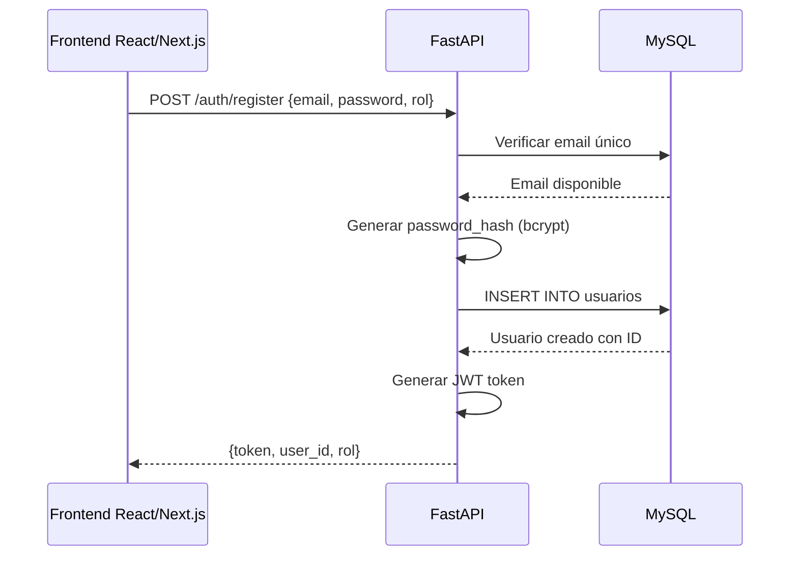
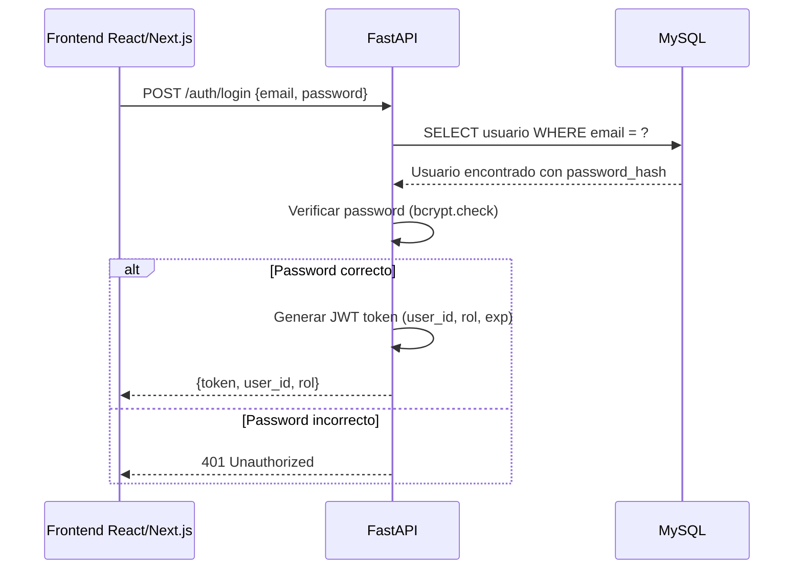
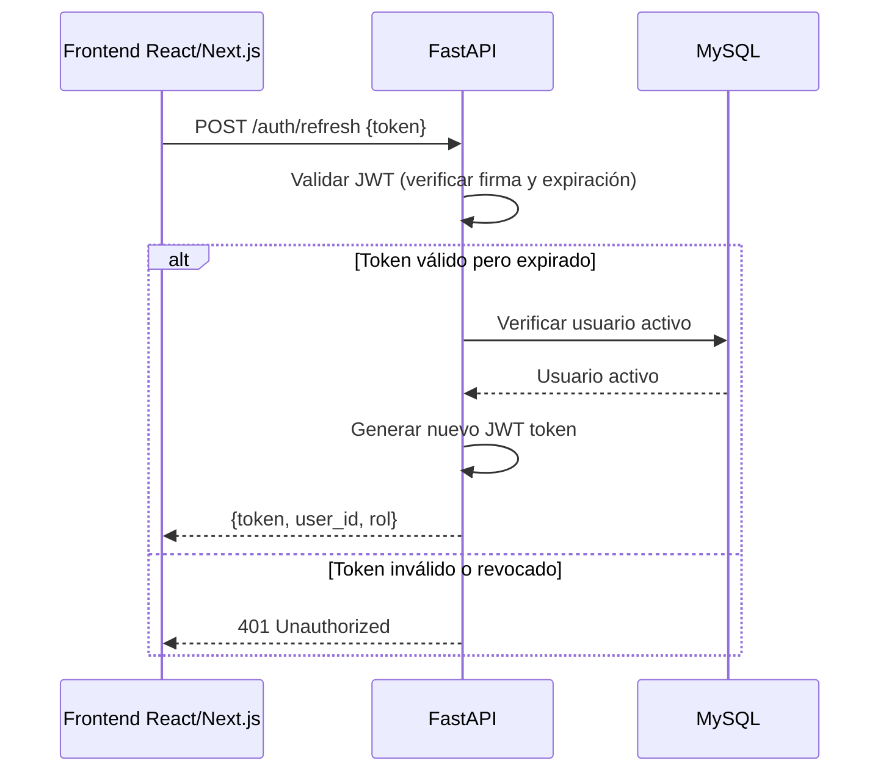
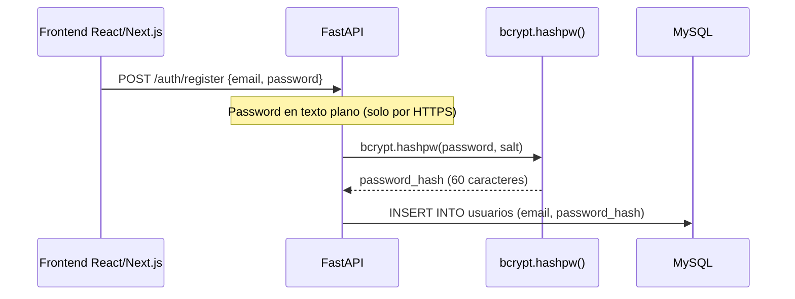
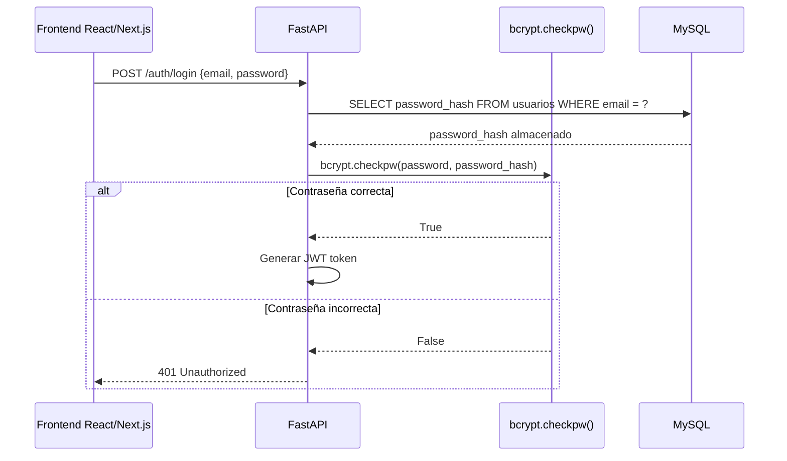
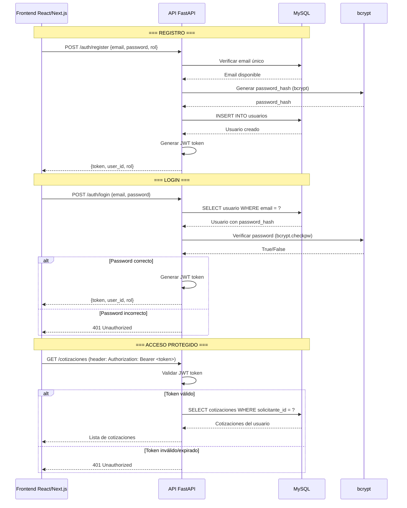

# Autenticación — ImportacionesQ8

## Descripción general

Sistema de autenticación basado en **JWT (JSON Web Tokens)** gestionado por FastAPI. Estándar ligero, sin dependencias pesadas, compatible con backend desacoplado del frontend.

---

## Flujo de autenticación

### Registro de nuevo usuario



### Inicio de sesión



### Renovación de token



---

## Estructura del JWT Token

### Claims del token

| Claim | Tipo | Descripción |
|-------|------|-------------|
| `sub` (subject) | UUID | ID del usuario |
| `rol` | string | Rol del usuario: "solicitante", "importador", "trabajador" o "admin" |
| `importador_id` | UUID \| null | **(Semana 3)** Empresa a la que pertenece la cuenta (dueño o trabajador). `null` para solicitantes y admins |
| `exp` | timestamp | Fecha de expiración del token |
| `iat` | timestamp | Fecha de emisión del token |

> **Por qué se agregó `importador_id` (Semana 3):** antes se asumía `Usuario.id == Importador.id` para el rol "importador", lo que hacía imposible tener varias cuentas (dueño + trabajadores) por empresa. Ahora todas las comprobaciones de propiedad entre empresas (IDOR) usan este claim en vez del `sub` de la cuenta. Ver `utils/security.py::create_access_token` y `utils/dependencies.py::get_current_user`.

### Ejemplo de payload JWT

```json
{
    "sub": "550e8400-e29b-41d4-a716-446655440000",
    "rol": "trabajador",
    "importador_id": "660f9500-f39c-52e5-b827-557766551111",
    "exp": 1751736000,
    "iat": 1751649600
}
```

### Configuración del token

| Parámetro | Valor | Descripción |
|-----------|-------|-------------|
| Algoritmo | HS256 (HMAC-SHA256) | Firma simétrica del token |
| Duración | 24 horas | Tiempo de validez del token JWT |
| Refresh Token | No implementado en MVP | Se renueva el JWT directamente con `/auth/refresh` |

---

## Gestión de contraseñas

### Flujo de hash de contraseña



### Verificación de contraseña



---

## Protección de endpoints con dependencias FastAPI

### Dependencia de autenticación

```python
from fastapi import Depends, HTTPException, status
from fastapi.security import HTTPBearer, HTTPAuthorizationCredentials
import jwt

security = HTTPBearer()

SECRET_KEY = "tu-secreto-aqui"
ALGORITHM = "HS256"

async def get_current_user(
    credentials: HTTPAuthorizationCredentials = Depends(security)
):
    """Dependencia que extrae y valida el JWT token del header Authorization"""
    token = credentials.credentials
    
    try:
        payload = jwt.decode(token, SECRET_KEY, algorithms=[ALGORITHM])
        user_id = payload.get("sub")
        rol = payload.get("rol")
        
        if user_id is None or rol is None:
            raise HTTPException(
                status_code=status.HTTP_401_UNAUTHORIZED,
                detail="Token inválido",
                headers={"WWW-Authenticate": "Bearer"},
            )
    except jwt.ExpiredSignatureError:
        raise HTTPException(
            status_code=status.HTTP_401_UNAUTHORIZED,
            detail="Token expirado. Renueva tu sesión.",
            headers={"WWW-Authenticate": "Bearer"},
        )
    except jwt.InvalidTokenError:
        raise HTTPException(
            status_code=status.HTTP_401_UNAUTHORIZED,
            detail="Token inválido",
            headers={"WWW-Authenticate": "Bearer"},
        )
    
    return {"user_id": user_id, "rol": rol}
```

### Uso en endpoints protegidos

```python
from fastapi import Depends

@app.post("/cotizaciones")
async def crear_cotizacion(
    cotizacion_data: CotizacionCreate,
    current_user: dict = Depends(get_current_user)
):
    """Endpoint protegido: solo usuarios autenticados"""
    if current_user["rol"] != "solicitante":
        raise HTTPException(status_code=403, detail="No autorizado")
    
    # Crear cotización...
```

### Dependencia de autorización por rol

```python
def require_rol(rol: str):
    """Dependencia que verifica el rol del usuario"""
    async def verificar_rol(current_user: dict = Depends(get_current_user)):
        if current_user["rol"] != rol:
            raise HTTPException(status_code=403, detail="No autorizado")
        return current_user
    return verificar_rol

# Uso en endpoints de admin
@app.get("/admin/cotizaciones-abiertas")
async def listar_cotizaciones_abiertas(
    current_user: dict = Depends(require_rol("admin"))
):
    # Solo admins pueden acceder
```

---

## Roles y permisos del sistema

| Rol | Descripción | Endpoints accesibles |
|-----|-------------|---------------------|
| **solicitante** | Cliente final que solicita cotizaciones | Cotizaciones propias, Órdenes propias, Chat propio, Pagos propios, reportar disputas |
| **importador** | Cuenta **dueña** de la empresa importadora | Envío de propuestas, gestión de trabajadores, perfil de empresa, formulario personalizado, pool de la empresa, chat asignado |
| **trabajador** | Cuenta de un empleado de la empresa importadora (Semana 3) | Solo: reclamar cotizaciones del pool de su empresa, ver sus cotizaciones asignadas, chat de las conversaciones asignadas, su propio perfil personal |
| **admin** | Miembro del equipo de la plataforma | Todos los endpoints + alta de empresas importadoras, monitoreo/activación de cualquier cuenta, disputas y métricas |

> **Cierre de auto-registro (Semana 3):** `POST /auth/register` **solo** acepta `rol="solicitante"`. Las cuentas `importador` (dueño) las crea un admin con `POST /admin/importadores` (junto con la empresa), las cuentas `trabajador` las crea el dueño con `POST /importadores/trabajadores`, y no existe ningún camino de auto-registro para `admin`. Esto cierra el hueco de seguridad donde cualquiera podía crearse una cuenta con rol elevado.

---

## Flujo completo de registro e inicio de sesión



---

## Convenciones y seguridad

- **HTTPS obligatorio:** Todas las comunicaciones deben ser sobre HTTPS para proteger credenciales en tránsito
- **Password hashing con bcrypt:** Nunca almacenar contraseñas en texto plano (`passlib[bcrypt]`, ver `utils/security.py`)
- **JWT sin refresh tokens (MVP):** El token expira a las 24 horas; el usuario debe volver a iniciar sesión
- **Rate limiting en login:** Máximo 5 intentos de login por minuto por IP para prevenir fuerza bruta
- **CORS configurado:** Solo permitir orígenes autorizados (dominios del frontend)

### Estado de implementación (revisado 2026-07-06)

| Convención | Estado | Detalle |
|---|---|---|
| Password hashing con bcrypt | ✅ Implementado | `passlib.hash.bcrypt` en `utils/security.py` |
| JWT HS256 con `sub`/`rol`/`exp`/`iat` | ✅ Implementado | `utils/security.py::create_access_token` |
| Rate limiting en `/auth/login` | ✅ Implementado (antes solo era una convención documentada, sin código) | `slowapi`, límite configurable vía `RATE_LIMIT_LOGIN` (por defecto `5/minute` por IP), ver `routers/auth.py` |
| Rate limiting en `/auth/register` | ✅ Implementado | `RATE_LIMIT_REGISTER` (por defecto `10/minute` por IP) — previene registro masivo automatizado de cuentas |
| CORS restringido a orígenes conocidos | ✅ Implementado | `config.CORS_ORIGINS`, configurable por entorno |
| No filtrar detalles internos en errores 500 | ✅ Implementado | Manejador global de excepciones en `main.py`: cualquier excepción no controlada se registra en logs pero al cliente solo se le responde `{"error": "Error interno del servidor"}` |
| HTTPS en producción | ⬜ Depende del despliegue | No aplica en local/Docker; se debe configurar en el proveedor de hosting/reverse proxy |

### Estado de implementación (Semana 3, 2026-07-07)

| Convención | Estado | Detalle |
|---|---|---|
| Claim `importador_id` en el JWT | ✅ Implementado | `utils/security.py::create_access_token`, propagado en login/refresh (`services/auth_service.py`) |
| Cierre de auto-registro de `admin`/`importador` | ✅ Implementado | `services/auth_service.py::register_user` rechaza cualquier rol distinto de `solicitante` con `400 Bad Request` |
| Cuentas desactivables (`Usuario.activo`) | ✅ Implementado | Login y refresh de token rechazan cuentas con `activo=False` (`401 Unauthorized`), gestionable desde `PUT /admin/usuarios/{id}/estado` |
| Rol `trabajador` con permisos limitados | ✅ Implementado | `require_rol_in`/`require_rol` en `utils/dependencies.py`; ver `Fases-Desarrollo/Semana-3-Chat-y-Pulido/Tareas-Semana-3.md` |
| Suite de tests de autenticación | ✅ 26/26 pasando | `tests/test_auth.py`, incluye rechazo de auto-registro elevado y bloqueo de cuentas desactivadas |