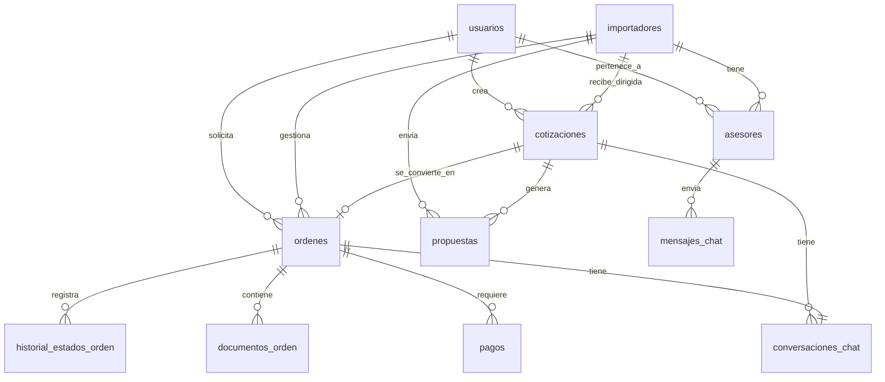

# Base de Datos — ImportacionesQ8

## Descripción general

**MySQL** como base de datos principal para almacenar usuarios, empresas importadoras, cotizaciones, órdenes y pagos. Volumen y complejidad moderados adecuados para esta etapa del negocio.

---

## Esquema de la base de datos

### Tabla: `usuarios`

| Columna | Tipo | Descripción |
|---------|------|-------------|
| id | UUID PK | Identificador único del usuario |
| email | VARCHAR(255) UNIQUE | Email del usuario (login) |
| password_hash | VARCHAR(255) | Hash de la contraseña (bcrypt) |
| rol | ENUM('solicitante', 'importador', 'admin') | Rol del usuario en el sistema |
| perfil_completo | BOOLEAN DEFAULT FALSE | Si el usuario completó su perfil |
| fecha_creacion | TIMESTAMP | Fecha de registro |

### Tabla: `importadores`

| Columna | Tipo | Descripción |
|---------|------|-------------|
| id | UUID PK | Identificador único del importador |
| nombre_empresa | VARCHAR(255) | Nombre de la empresa importadora |
| logo_url | VARCHAR(500) NULL | URL del logo de la empresa |
| especialidad_producto | JSON | Array de categorías (ej: ["Textiles", "Electrónica"]) |
| paises_origen | JSON | Array de países de origen (ej: ["China", "Vietnam"]) |
| calificacion_promedio | DECIMAL(3,2) DEFAULT 0.00 | Calificación promedio de la empresa |
| tiempo_respuesta_promedio | VARCHAR(10) | Tiempo promedio de respuesta (ej: "24h") |
| capacidad_volumen | INT NULL | Capacidad máxima de volumen por pedido |
| estado | ENUM('activo', 'inactivo') DEFAULT 'activo' | Estado del importador en la red |
| fecha_registro | TIMESTAMP | Fecha de registro en la plataforma |

### Tabla: `asesores`

| Columna | Tipo | Descripción |
|---------|------|-------------|
| id | UUID PK | Identificador único del asesor |
| importador_id | UUID FK → importadores.id | Importador al que pertenece el asesor |
| nombre | VARCHAR(255) | Nombre completo del asesor |
| foto_url | VARCHAR(500) NULL | URL de la foto del asesor |
| whatsapp | VARCHAR(20) | Número de WhatsApp del asesor |

### Tabla: `cotizaciones`

| Columna | Tipo | Descripción |
|---------|------|-------------|
| id | UUID PK | Identificador único de la cotización |
| solicitante_id | UUID FK → usuarios.id | Solicitante que creó la cotización |
| importador_id | UUID NULL | Importador específico (solo modalidad dirigida) |
| modalidad | ENUM('dirigida', 'abierta') | Tipo de cotización |
| foto_producto | VARCHAR(500) NULL | URL de la imagen del producto |
| pais_importacion | VARCHAR(100) | País desde donde se importa |
| nivel_personalizacion | ENUM('estandar', 'personalizacion_marca', 'personalizacion_diseno_completo') | Nivel de personalización deseado |
| nombre_producto | VARCHAR(255) | Nombre del producto a importar |
| descripcion_cliente | TEXT | Descripción detallada del producto |
| link_referencia | VARCHAR(500) NULL | URL de referencia (Alibaba, 1688) |
| linea_producto | VARCHAR(100) | Categoría/línea del producto |
| tipo_calidad | ENUM('economica', 'estandar', 'premium') | Tipo de calidad deseada |
| modalidad_importacion | ENUM('ecommerce', 'corporativo') | Modalidad de importación |
| cantidad_minima | INT | Cantidad mínima a importar |
| precio_objetivo_usd | DECIMAL(10,2) | Precio objetivo en USD |
| incoterm | VARCHAR(50) | Incoterm acordado (FOB, CIF, etc.) |
| notas_adicionales | TEXT NULL | Notas adicionales del solicitante |
| estado | ENUM('creada', 'dirigida', 'abierta', 'propuestas_recibidas', 'cotizacion_aceptada', 'orden_activa') | Estado actual de la cotización |
| fecha_creacion | TIMESTAMP | Fecha de creación |
| fecha_actualizacion | TIMESTAMP | Última actualización |

### Tabla: `propuestas`

| Columna | Tipo | Descripción |
|---------|------|-------------|
| id | UUID PK | Identificador único de la propuesta |
| cotizacion_id | UUID FK → cotizaciones.id | Cotización a la que responde |
| importador_id | UUID FK → importadores.id | Importador que envía la propuesta |
| precio_ofrecido_usd | DECIMAL(10,2) | Precio ofrecido por el importador |
| tiempo_estimado_entrega | VARCHAR(50) | Tiempo estimado de entrega |
| condiciones_adicionales | TEXT NULL | Condiciones adicionales (incoterm, garantías, etc.) |
| estado | ENUM('pendiente', 'aceptada', 'rechazada') | Estado de la propuesta |
| fecha_envio | TIMESTAMP | Fecha y hora de envío de la propuesta |

### Tabla: `ordenes`

| Columna | Tipo | Descripción |
|---------|------|-------------|
| id | UUID PK | Identificador único de la orden |
| cotizacion_id | UUID FK → cotizaciones.id | Cotización origen de la orden |
| importador_id | UUID FK → importadores.id | Importador asignado a la orden |
| solicitante_id | UUID FK → usuarios.id | Solicitante de la orden |
| asesor_asignado_id | UUID FK → asesores.id | Asesor asignado por el importador |
| estado | ENUM('cotizacion_aceptada', 'en_produccion', 'transito_internacional', 'aduana_nacionalizacion', 'bodega_local', 'entregado') | Estado actual de la orden |
| precio_acordado_usd | DECIMAL(10,2) | Precio acordado en la cotización aceptada |
| tiempo_estimado_entrega | VARCHAR(50) NULL | Tiempo estimado de entrega acordado |
| condiciones_adicionales | TEXT NULL | Condiciones adicionales acordadas |
| fecha_creacion | TIMESTAMP | Fecha de creación de la orden |
| fecha_actualizacion | TIMESTAMP | Última actualización del estado |

### Tabla: `historial_estados_orden`

| Columna | Tipo | Descripción |
|---------|------|-------------|
| id | UUID PK | Identificador único del registro |
| orden_id | UUID FK → ordenes.id | Orden a la que pertenece el cambio de estado |
| estado_anterior | VARCHAR(50) NULL | Estado anterior (NULL si es el primer estado) |
| estado_nuevo | VARCHAR(50) | Nuevo estado |
| fecha_cambio | TIMESTAMP | Fecha y hora del cambio |

### Tabla: `documentos_orden`

| Columna | Tipo | Descripción |
|---------|------|-------------|
| id | UUID PK | Identificador único del documento |
| orden_id | UUID FK → ordenes.id | Orden a la que pertenece el documento |
| nombre | VARCHAR(255) | Nombre descriptivo del documento (ej: "Factura Proforma") |
| url | VARCHAR(500) | URL del archivo almacenado |
| tipo | ENUM('factura_proforma', 'factura_comercial', 'packing_list', 'comprobante_pago') | Tipo de documento |

### Tabla: `pagos`

| Columna | Tipo | Descripción |
|---------|------|-------------|
| id | UUID PK | Identificador único del pago |
| orden_id | UUID FK → ordenes.id | Orden asociada al pago |
| wompi_payment_id | VARCHAR(100) UNIQUE | ID del pago en Wompi |
| monto_usd | DECIMAL(10,2) | Monto pagado en USD |
| estado | ENUM('pendiente', 'confirmado', 'fallido', 'reembolsado') | Estado del pago según Wompi |
| webhook_url | VARCHAR(500) | URL de webhook configurada para Wompi |
| fecha_creacion | TIMESTAMP | Fecha de creación del pago |
| fecha_confirmacion | TIMESTAMP NULL | Fecha de confirmación del pago (NULL si no confirmado) |

### Tabla: `conversaciones_chat`

| Columna | Tipo | Descripción |
|---------|------|-------------|
| id | UUID PK | Identificador único de la conversación |
| orden_id | UUID FK → ordenes.id | Orden asociada a la conversación (NULL si es antes de crear la orden) |
| solicitante_id | UUID FK → usuarios.id | Solicitante en la conversación |
| importador_id | UUID FK → importadores.id | Importador en la conversación |

### Tabla: `mensajes_chat`

| Columna | Tipo | Descripción |
|---------|------|-------------|
| id | UUID PK | Identificador único del mensaje |
| conversacion_id | UUID FK → conversaciones_chat.id | Conversación a la que pertenece el mensaje |
| remitente_id | UUID FK → usuarios.id | Usuario que envió el mensaje |
| contenido | TEXT | Contenido del mensaje |
| tipo | ENUM('texto', 'archivo') | Tipo de mensaje |
| archivo_url | VARCHAR(500) NULL | URL del archivo adjunto (NULL si es texto) |
| fecha_envio | TIMESTAMP | Fecha y hora de envío |

---

## Relaciones entre tablas



---

## Índices recomendados

| Tabla | Columna(s) | Tipo de índice | Razón |
|-------|-----------|---------------|-------|
| cotizaciones | solicitante_id, estado | Compuesto | Búsqueda rápida de cotizaciones del solicitante por estado |
| cotizaciones | importador_id, modalidad | Compuesto | Filtrado de cotizaciones dirigidas/abiertas por importador |
| cotizaciones | estado, fecha_creacion | Compuesto | Listado de cotizaciones activas ordenadas por fecha |
| cotizaciones | modalida | Índice simple | Filtro principal para matching de cotizaciones abiertas |
| propuestas | cotizacion_id, importador_id | Compuesto | Búsqueda rápida de propuestas de una cotización específica |
| propuestas | estado, fecha_envio | Compuesto | Listado de propuestas pendientes ordenadas por tiempo |
| ordenes | solicitante_id, estado | Compuesto | Búsqueda de órdenes del solicitante por estado |
| ordenes | importador_id, estado | Compuesto | Búsqueda de órdenes asignadas al importador por estado |
| pagos | wompi_payment_id | Único | Verificación rápida de pagos por ID de Wompi |
| pagos | orden_id | Simple | Búsqueda del pago asociado a una orden |
| conversaciones_chat | orden_id | Simple | Búsqueda de conversación por orden |
| conversaciones_chat | solicitante_id, importador_id | Compuesto | Búsqueda de conversación entre dos usuarios específicos |

---

## Migraciones y esquema inicial

### Script de creación del esquema (pseudocódigo SQL)

```sql
-- Crear base de datos
CREATE DATABASE importacionesq8;

-- Tabla de usuarios
CREATE TABLE usuarios (
    id UUID PRIMARY KEY DEFAULT (UUID()),
    email VARCHAR(255) UNIQUE NOT NULL,
    password_hash VARCHAR(255) NOT NULL,
    rol ENUM('solicitante', 'importador', 'admin') NOT NULL,
    perfil_completo BOOLEAN DEFAULT FALSE,
    fecha_creacion TIMESTAMP DEFAULT CURRENT_TIMESTAMP
);

-- Tabla de importadores
CREATE TABLE importadores (
    id UUID PRIMARY KEY DEFAULT (UUID()),
    nombre_empresa VARCHAR(255) NOT NULL,
    logo_url VARCHAR(500),
    especialidad_producto JSON,
    paises_origen JSON,
    calificacion_promedio DECIMAL(3,2) DEFAULT 0.00,
    tiempo_respuesta_promedio VARCHAR(10),
    capacidad_volumen INT,
    estado ENUM('activo', 'inactivo') DEFAULT 'activo',
    fecha_registro TIMESTAMP DEFAULT CURRENT_TIMESTAMP
);

-- Tabla de asesores
CREATE TABLE asesores (
    id UUID PRIMARY KEY DEFAULT (UUID()),
    importador_id UUID NOT NULL,
    nombre VARCHAR(255) NOT NULL,
    foto_url VARCHAR(500),
    whatsapp VARCHAR(20),
    FOREIGN KEY (importador_id) REFERENCES importadores(id) ON DELETE CASCADE
);

-- Tabla de cotizaciones
CREATE TABLE cotizaciones (
    id UUID PRIMARY KEY DEFAULT (UUID()),
    solicitante_id UUID NOT NULL,
    importador_id UUID,
    modalidad ENUM('dirigida', 'abierta') NOT NULL,
    foto_producto VARCHAR(500),
    pais_importacion VARCHAR(100) NOT NULL,
    nivel_personalizacion ENUM('estandar', 'personalizacion_marca', 'personalizacion_diseno_completo'),
    nombre_producto VARCHAR(255) NOT NULL,
    descripcion_cliente TEXT NOT NULL,
    link_referencia VARCHAR(500),
    linea_producto VARCHAR(100) NOT NULL,
    tipo_calidad ENUM('economica', 'estandar', 'premium') NOT NULL,
    modalidad_importacion ENUM('ecommerce', 'corporativo'),
    cantidad_minima INT NOT NULL,
    precio_objetivo_usd DECIMAL(10,2),
    incoterm VARCHAR(50) NOT NULL,
    notas_adicionales TEXT,
    estado ENUM('creada', 'dirigida', 'abierta', 'propuestas_recibidas', 'cotizacion_aceptada', 'orden_activa') DEFAULT 'creada',
    fecha_creacion TIMESTAMP DEFAULT CURRENT_TIMESTAMP,
    fecha_actualizacion TIMESTAMP DEFAULT CURRENT_TIMESTAMP ON UPDATE CURRENT_TIMESTAMP,
    FOREIGN KEY (solicitante_id) REFERENCES usuarios(id),
    FOREIGN KEY (importador_id) REFERENCES importadores(id)
);

-- Tabla de propuestas
CREATE TABLE propuestas (
    id UUID PRIMARY KEY DEFAULT (UUID()),
    cotizacion_id UUID NOT NULL,
    importador_id UUID NOT NULL,
    precio_ofrecido_usd DECIMAL(10,2),
    tiempo_estimado_entrega VARCHAR(50),
    condiciones_adicionales TEXT,
    estado ENUM('pendiente', 'aceptada', 'rechazada') DEFAULT 'pendiente',
    fecha_envio TIMESTAMP DEFAULT CURRENT_TIMESTAMP,
    FOREIGN KEY (cotizacion_id) REFERENCES cotizaciones(id) ON DELETE CASCADE,
    FOREIGN KEY (importador_id) REFERENCES importadores(id),
    UNIQUE KEY unique_propuesta_cotizacion_importador (cotizacion_id, importador_id)
);

-- Tabla de órdenes
CREATE TABLE ordenes (
    id UUID PRIMARY KEY DEFAULT (UUID()),
    cotizacion_id UUID NOT NULL,
    importador_id UUID NOT NULL,
    solicitante_id UUID NOT NULL,
    asesor_asignado_id UUID,
    estado ENUM('cotizacion_aceptada', 'en_produccion', 'transito_internacional', 'aduana_nacionalizacion', 'bodega_local', 'entregado') DEFAULT 'cotizacion_aceptada',
    precio_acordado_usd DECIMAL(10,2),
    tiempo_estimado_entrega VARCHAR(50),
    condiciones_adicionales TEXT,
    fecha_creacion TIMESTAMP DEFAULT CURRENT_TIMESTAMP,
    fecha_actualizacion TIMESTAMP DEFAULT CURRENT_TIMESTAMP ON UPDATE CURRENT_TIMESTAMP,
    FOREIGN KEY (cotizacion_id) REFERENCES cotizaciones(id),
    FOREIGN KEY (importador_id) REFERENCES importadores(id),
    FOREIGN KEY (solicitante_id) REFERENCES usuarios(id),
    FOREIGN KEY (asesor_asignado_id) REFERENCES asesores(id)
);

-- Tabla de historial de estados de orden
CREATE TABLE historial_estados_orden (
    id UUID PRIMARY KEY DEFAULT (UUID()),
    orden_id UUID NOT NULL,
    estado_anterior VARCHAR(50),
    estado_nuevo VARCHAR(50) NOT NULL,
    fecha_cambio TIMESTAMP DEFAULT CURRENT_TIMESTAMP,
    FOREIGN KEY (orden_id) REFERENCES ordenes(id) ON DELETE CASCADE
);

-- Tabla de documentos de orden
CREATE TABLE documentos_orden (
    id UUID PRIMARY KEY DEFAULT (UUID()),
    orden_id UUID NOT NULL,
    nombre VARCHAR(255) NOT NULL,
    url VARCHAR(500) NOT NULL,
    tipo ENUM('factura_proforma', 'factura_comercial', 'packing_list', 'comprobante_pago') NOT NULL,
    FOREIGN KEY (orden_id) REFERENCES ordenes(id) ON DELETE CASCADE
);

-- Tabla de pagos
CREATE TABLE pagos (
    id UUID PRIMARY KEY DEFAULT (UUID()),
    orden_id UUID NOT NULL,
    wompi_payment_id VARCHAR(100) UNIQUE,
    monto_usd DECIMAL(10,2),
    estado ENUM('pendiente', 'confirmado', 'fallido', 'reembolsado') DEFAULT 'pendiente',
    webhook_url VARCHAR(500),
    fecha_creacion TIMESTAMP DEFAULT CURRENT_TIMESTAMP,
    fecha_confirmacion TIMESTAMP NULL,
    FOREIGN KEY (orden_id) REFERENCES ordenes(id)
);

-- Tabla de conversaciones de chat
CREATE TABLE conversaciones_chat (
    id UUID PRIMARY KEY DEFAULT (UUID()),
    orden_id UUID,
    solicitante_id UUID NOT NULL,
    importador_id UUID NOT NULL,
    FOREIGN KEY (orden_id) REFERENCES ordenes(id),
    FOREIGN KEY (solicitante_id) REFERENCES usuarios(id),
    FOREIGN KEY (importador_id) REFERENCES importadores(id),
    UNIQUE KEY unique_conversacion_orden (orden_id),
    UNIQUE KEY unique_conversacion_solicitante_importador (solicitante_id, importador_id)
);

-- Tabla de mensajes de chat
CREATE TABLE mensajes_chat (
    id UUID PRIMARY KEY DEFAULT (UUID()),
    conversacion_id UUID NOT NULL,
    remitente_id UUID NOT NULL,
    contenido TEXT NOT NULL,
    tipo ENUM('texto', 'archivo') DEFAULT 'texto',
    archivo_url VARCHAR(500),
    fecha_envio TIMESTAMP DEFAULT CURRENT_TIMESTAMP,
    FOREIGN KEY (conversacion_id) REFERENCES conversaciones_chat(id) ON DELETE CASCADE,
    FOREIGN KEY (remitente_id) REFERENCES usuarios(id)
);

-- Índices recomendados
CREATE INDEX idx_cotizaciones_solicitante_estado ON cotizaciones(solicitante_id, estado);
CREATE INDEX idx_cotizaciones_importador_modalidad ON cotizaciones(importador_id, modalidad);
CREATE INDEX idx_cotizaciones_estado_fecha ON cotizaciones(estado, fecha_creacion DESC);
CREATE INDEX idx_propuestas_cotizacion_importador ON propuestas(cotizacion_id, importador_id);
CREATE INDEX idx_ordenes_solicitante_estado ON ordenes(solicitante_id, estado);
```

---

## Notas de arquitectura de base de datos

- **Arquitectura multi-tenant desde el inicio:** cada importador vinculado es una entidad independiente con su propio equipo de asesores
- **JSON para arrays de categorías:** `especialidad_producto` y `paises_origen` usan tipo JSON en lugar de tablas separadas para simplificar las consultas iniciales
- **UUIDs como primary keys:** mejor seguridad (no exponer IDs secuenciales) y facilidad para generar IDs distribuidos sin conflictos
- **Timestamps automáticos:** uso de `DEFAULT CURRENT_TIMESTAMP` y `ON UPDATE CURRENT_TIMESTAMP` para mantener trazabilidad sin lógica adicional en el backend