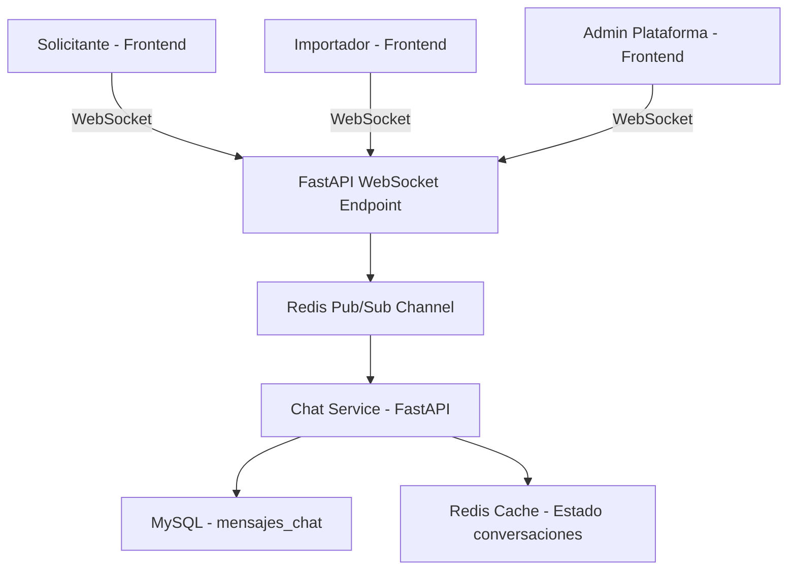
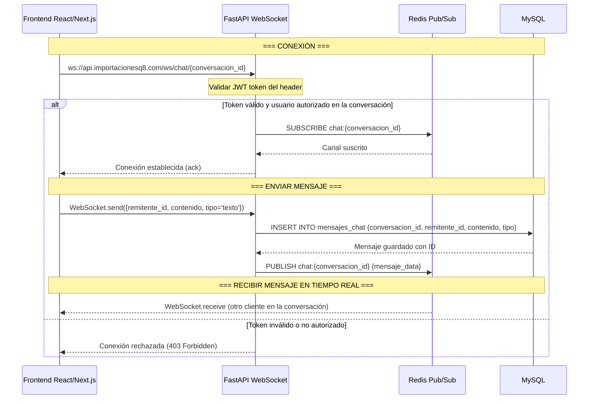
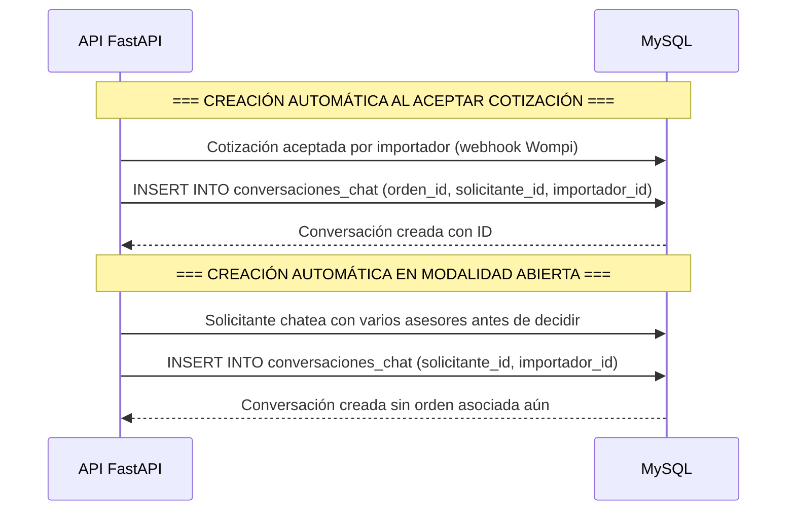

# 💬 Chat con WebSocket — ImportacionesQ8

## Descripción general

Chat en tiempo real dentro de la plataforma, construido sobre **WebSockets** con **Redis Pub/Sub** como canal de mensajería. Redis maneja los canales de mensajería en tiempo real sin sobrecargar MySQL con escrituras de alta frecuencia. Historial de chat ligado a la orden, no solo al usuario, para que el contexto no se pierda si cambia el asesor.

---

## 📋 Arquitectura del Chat



---

## 📐 Endpoints de Chat

### REST API — Gestión de conversaciones

| Método | Endpoint | Descripción |
|--------|----------|-------------|
| GET | `/chat/conversaciones` | Listar conversaciones del usuario autenticado |
| GET | `/chat/conversaciones/{id}/mensajes` | Obtener mensajes de una conversación (paginados) |
| POST | `/chat/conversaciones/{id}/mensajes` | Enviar mensaje a una conversación (vía REST como fallback) |

### WebSocket — Mensajería en tiempo real

| Endpoint | Descripción |
|----------|-------------|
| `ws://api.importacionesq8.com/ws/chat/{conversacion_id}` | Conexión WebSocket para chat en tiempo real |

---

## 🔄 Flujo de conexión WebSocket



---

## 📐 Estructura de mensajes WebSocket

### Mensaje enviado por el frontend

| Campo | Tipo | Descripción |
|-------|------|-------------|
| `remitente_id` | UUID | ID del usuario que envía el mensaje |
| `contenido` | string | Contenido del mensaje (texto) |
| `tipo` | string | Tipo de mensaje: "texto" o "archivo" |
| `archivo_url` | string NULL | URL del archivo adjunto (NULL si es texto) |

**Ejemplo de mensaje enviado:**
```json
{
    "remitente_id": "550e8400-e29b-41d4-a716-446655440000",
    "contenido": "Hola, tengo una duda sobre mi pedido",
    "tipo": "texto"
}
```

### Mensaje recibido por el frontend (vía WebSocket)

| Campo | Tipo | Descripción |
|-------|------|-------------|
| `id` | UUID | ID del mensaje en la base de datos |
| `conversacion_id` | UUID | Conversación a la que pertenece |
| `remitente_id` | UUID | Usuario que envió el mensaje |
| `contenido` | string | Contenido del mensaje |
| `tipo` | string | Tipo: "texto" o "archivo" |
| `archivo_url` | string NULL | URL del archivo adjunto (NULL si es texto) |
| `fecha_envio` | datetime | Fecha y hora de envío |

**Ejemplo de mensaje recibido:**
```json
{
    "id": "660f9500-f39c-52e5-b827-557766551111",
    "conversacion_id": "771a0600-a4ad-63f6-c938-668877662222",
    "remitente_id": "882b1700-b5be-74g7-d049-779988773333",
    "contenido": "Claro, con gusto te ayudo. ¿Cuál es tu orden?",
    "tipo": "texto",
    "archivo_url": null,
    "fecha_envio": "2026-07-05T14:30:00Z"
}
```

---

## 📊 Creación automática de conversaciones

### Flujo de creación de conversación



### Regla de unicidad de conversaciones

- **Con orden:** Solo puede existir UNA conversación por orden (`UNIQUE KEY unique_conversacion_orden`)
- **Sin orden (modalidad abierta):** Solo puede existir UNA conversación entre un solicitante y un importador específico (`UNIQUE KEY unique_conversacion_solicitante_importador`)

---

## 🛡️ Autorización de conversaciones

### Reglas de acceso a conversaciones

| Rol | Conversaciones accesibles |
|-----|--------------------------|
| **Solicitante** | Solo las conversaciones donde es `solicitante_id` |
| **Importador** | Solo las conversaciones donde es `importador_id` |
| **Admin** | Todas las conversaciones (para mediar en disputas) |

### Verificación de autorización en WebSocket

```python
async def websocket_chat_endpoint(
    websocket: WebSocket,
    conversacion_id: UUID,
    token: str = Query(...)
):
    """Endpoint WebSocket para chat en tiempo real"""
    
    # 1. Validar JWT token
    user_data = await validar_jwt(token)
    
    # 2. Verificar que el usuario está autorizado en la conversación
    conversacion = await obtener_conversacion(conversacion_id)
    
    if not conversacion:
        await websocket.close(code=4004, reason="Conversación no encontrada")
        return
    
    if user_data["rol"] == "solicitante" and conversacion.solicitante_id != user_data.user_id:
        await websocket.close(code=4003, reason="No autorizado en esta conversación")
        return
    
    if user_data["rol"] == "importador" and conversacion.importador_id != user_data.user_id:
        await websocket.close(code=4003, reason="No autorizado en esta conversación")
        return
    
    # 3. Conectar al canal Redis y aceptar WebSocket
    await redis.subscribe(f"chat:{conversacion_id}")
    await websocket.accept()
```

---

## 📝 Notas de implementación

- **Redis Pub/Sub para mensajería:** Cada conversación tiene su propio canal en Redis (`chat:{conversacion_id}`). Los clientes se suscriben al canal cuando abren la conversación.
- **Fallback REST:** Si la conexión WebSocket falla, el frontend puede enviar mensajes vía `POST /chat/conversaciones/{id}/mensajes` como fallback.
- **Historial de chat:** Los mensajes se guardan en MySQL y se cargan paginados (últimos 50 mensajes) al abrir una conversación.
- **Indicador "en línea":** Se puede implementar con Redis para rastrear conexiones WebSocket activas por usuario.
- **Archivos adjuntos:** Los archivos se suben a un servicio de almacenamiento (S3, Cloudinary) y la URL se envía como parte del mensaje.