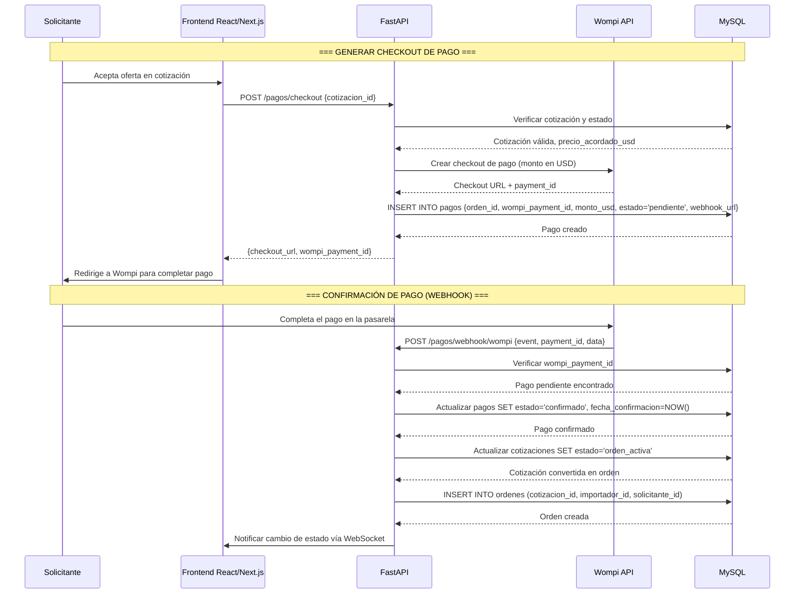
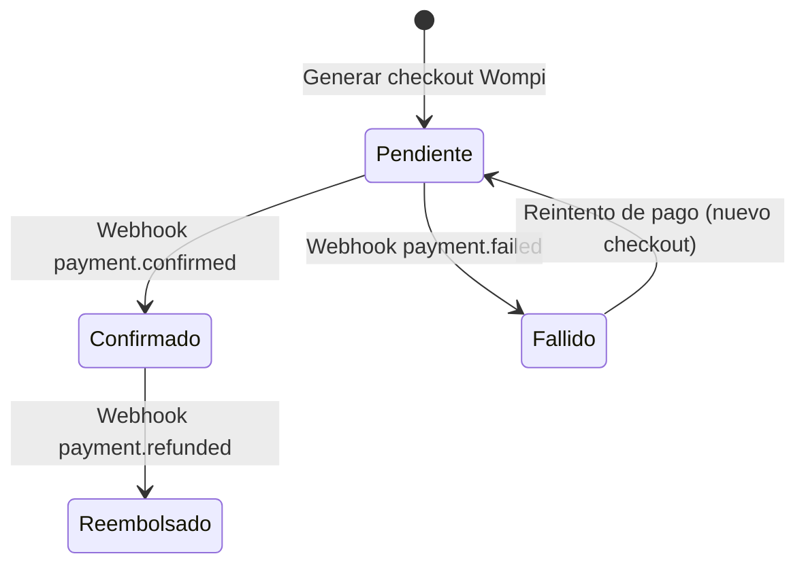

# Pagos con Wompi — ImportacionesQ8

## Descripción general

Integración de **Wompi** como pasarela de pagos para el mercado colombiano. Delega el cumplimiento de seguridad de pagos (PCI) al proveedor, evitando que el equipo tenga que construir o certificar esa capa. Integración rápida y confiable, ideal para un sprint de 3 semanas.

---

## Flujo de pago con Wompi



---

## Endpoints de pagos

### Generar checkout de pago

| Método | Endpoint | Descripción |
|--------|----------|-------------|
| POST | `/pagos/checkout` | Genera enlace de pago con Wompi para una cotización aceptada |

**Request body:**
```json
{
    "cotizacion_id": "550e8400-e29b-41d4-a716-446655440000"
}
```

**Response (200 OK):**
```json
{
    "success": true,
    "data": {
        "checkout_url": "https://pay.wompi.co/checkout/abc123",
        "wompi_payment_id": "wpm_abc123"
    }
}
```

**Response (400 Bad Request):**
```json
{
    "success": false,
    "error": "La cotización no está en estado 'cotizacion_aceptada'"
}
```

### Obtener estado del pago

| Método | Endpoint | Descripción |
|--------|----------|-------------|
| GET | `/pagos/{id}` | Obtiene el estado actual de un pago |

**Response (200 OK):**
```json
{
    "success": true,
    "data": {
        "id": "550e8400-e29b-41d4-a716-446655440000",
        "orden_id": "660f9500-f39c-52e5-b827-557766551111",
        "wompi_payment_id": "wpm_abc123",
        "monto_usd": 150.00,
        "estado": "confirmado",
        "fecha_creacion": "2026-07-05T10:00:00Z",
        "fecha_confirmacion": "2026-07-05T10:05:00Z"
    }
}
```

### Webhook de confirmación de pago (Wompi)

| Método | Endpoint | Descripción |
|--------|----------|-------------|
| POST | `/pagos/webhook/wompi` | Recibe notificaciones de Wompi sobre el estado del pago |

**Request body (evento de pago confirmado):**
```json
{
    "event": "payment.confirmed",
    "data": {
        "id": "wpm_abc123",
        "amount_including_taxes": 150.00,
        "currency": "USD",
        "status": "confirmed"
    }
}
```

**Response (200 OK):**
```json
{
    "success": true
}
```

---

## Eventos de Wompi manejados

| Evento | Acción en la plataforma | Estado del pago |
|--------|----------------------|-----------------|
| `payment.confirmed` | Cotización → Orden activa, notificar al solicitante y importador vía WebSocket | `confirmado` |
| `payment.failed` | Mantener cotización en estado "pendiente de pago", notificar al solicitante | `fallido` |
| `payment.refunded` | Notificar disputa, cambiar estado de orden a "en disputa/reembolso" | `reembolsado` |

---

## Estados del pago



---

## Integración con Wompi — Configuración

### Credenciales necesarias

| Variable | Descripción |
|----------|-------------|
| `WOMPI_PUBLIC_KEY` | Clave pública de Wompi para generar el checkout |
| `WOMPI_SECRET_KEY` | Clave secreta de Wompi para verificar webhooks |
| `WOMPI_WEBHOOK_URL` | URL del webhook en nuestra API (ej: `https://api.importacionesq8.com/pagos/webhook/wompi`) |

### Flujo de configuración inicial con Wompi

1. Crear cuenta en Wompi y obtener las credenciales (sandbox para desarrollo, producción para lanzamiento)
2. Configurar el webhook URL en el panel de administración de Wompi
3. Configurar la variable `WOMPI_WEBHOOK_URL` en las variables de entorno del backend
4. Probar con pagos sandbox antes de activar producción

---

## Notas de implementación

- **Moneda:** Los pagos se procesan en USD (moneda principal del proyecto). Wompi soporta múltiples monedas.
- **Monto dinámico:** El monto del pago se obtiene de `precio_acordado_usd` de la cotización aceptada, no es un valor fijo.
- **Webhook seguro:** Verificar la firma del webhook de Wompi usando `WOMPI_SECRET_KEY` para evitar falsificaciones.
- **Idempotencia:** El webhook puede recibir el mismo evento múltiples veces; verificar que el pago ya esté confirmado antes de procesar.
- **No se almacenan datos de tarjetas:** La plataforma nunca maneja directamente los datos de la tarjeta o cuenta bancaria del solicitante — Wompi es responsable del cumplimiento PCI.