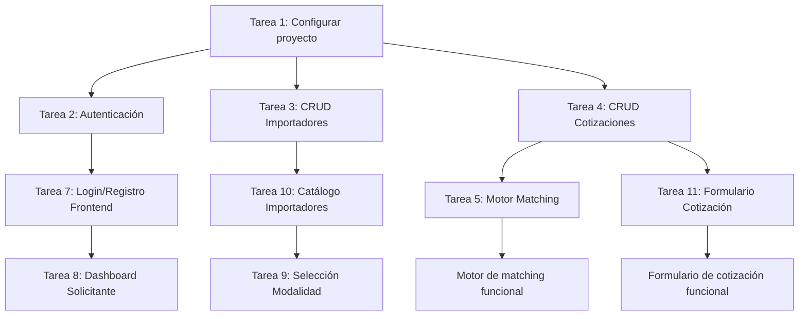

# 📅 Semana 1: Fundaciones y Módulo de Cotizaciones — ImportacionesQ8

## Descripción general

Semana 1 del MVP a 3 semanas. Entregables: Autenticación, perfiles (solicitante / importador), formulario de cotización, selección de modalidad dirigida vs. abierta, directorio básico de importadores.

---

## 📋 Resumen de entregables

| Entregable | Módulo | Prioridad |
|------------|--------|-----------|
| Autenticación con JWT | Backend/Autenticacion | P0 |
| Perfiles (Solicitante / Importador) | Backend/Base-Datos | P0 |
| Formulario de cotización | Frontend/Pantallas-Solicitante | P0 |
| Selección de modalidad dirigida vs. abierta | Frontend/Pantallas-Solicitante | P0 |
| Directorio básico de importadores | Frontend/Pantallas-Solicitante | P0 |

---

## 🔧 Tareas Backend

### Tarea 1: Configurar proyecto FastAPI y base de datos MySQL

**Módulo:** Backend/API-Rest, Backend/Base-Datos  
**Duración estimada:** 1 día  
**Responsable:** Desarrollador Backend

- [ ] Inicializar proyecto Python con FastAPI
- [ ] Configurar variables de entorno (.env) para MySQL
- [ ] Crear modelo de base de datos con SQLAlchemy ORM
- [ ] Ejecutar migraciones iniciales (usuarios, importadores, asesores)
- [ ] Verificar conexión a la base de datos

**Documentación relacionada:** [[Backend/Base-Datos]], [[Backend/API-Rest]]

---

### Tarea 2: Implementar autenticación con JWT

**Módulo:** Backend/Autenticacion  
**Duración estimada:** 1.5 días  
**Responsable:** Desarrollador Backend

- [ ] Endpoint POST /auth/register (registro de nuevo usuario)
- [ ] Endpoint POST /auth/login (inicio de sesión y obtención de JWT token)
- [ ] Endpoint POST /auth/refresh (renovación de token JWT expirado)
- [ ] Endpoint POST /auth/logout (cierre de sesión y revocación de token)
- [ ] Implementar dependencias FastAPI para protección de endpoints:
  - `get_current_user` — Validación de JWT token
  - `require_rol(rol)` — Verificación de rol del usuario

**Documentación relacionada:** [[Backend/Autenticacion]]

---

### Tarea 3: Crear modelos y CRUD de importadores

**Módulo:** Backend/Base-Datos  
**Duración estimada:** 1 día  
**Responsable:** Desarrollador Backend

- [ ] Modelo Importador con campos: nombre_empresa, logo_url, especialidad_producto (JSON), paises_origen (JSON), calificacion_promedio, tiempo_respuesta_promedio, capacidad_volumen, estado
- [ ] Endpoint GET /importadores (listar importadores disponibles con filtros)
- [ ] Endpoint GET /importadores/{id} (obtener detalles de un importador específico)
- [ ] Endpoint POST /importadores (registrar nueva empresa importadora — solo admin)

**Documentación relacionada:** [[Backend/Base-Datos]], [[Backend/API-Rest]]

---

### Tarea 4: Crear modelo y CRUD de cotizaciones

**Módulo:** Backend/Base-Datos, Backend/Matching-Cotizaciones  
**Duración estimada:** 1.5 días  
**Responsable:** Desarrollador Backend

- [ ] Modelo Cotización con todos los campos del formulario
- [ ] Endpoint POST /cotizaciones (crear nueva cotización)
- [ ] Endpoint GET /cotizaciones (listar cotizaciones del usuario autenticado)
- [ ] Endpoint GET /cotizaciones/{id} (obtener detalles de una cotización específica)
- [ ] Implementar lógica de matching para cotizaciones abiertas:
  - Motor de matching por país + categoría de producto
  - Distribución automática a importadores matching vía Redis Pub/Sub

**Documentación relacionada:** [[Backend/Base-Datos]], [[Backend/Matching-Cotizaciones]]

---

### Tarea 5: Implementar motor de matching para cotizaciones abiertas

**Módulo:** Backend/Matching-Cotizaciones  
**Duración estimada:** 1 día  
**Responsable:** Desarrollador Backend

- [ ] Función de matching: `matching(cotizacion_id, pais_importacion, linea_producto)`
- [ ] Query SQL con JSON_CONTAINS para buscar importadores matching
- [ ] Redis: SET cotizacion_abierta:{id} {importador_ids} EX 259200 (72h)
- [ ] Notificación a importadores matching vía WebSocket/SSE

**Documentación relacionada:** [[Backend/Matching-Cotizaciones]]

---

## 🎨 Tareas Frontend

### Tarea 6: Configurar proyecto React/Next.js con TypeScript

**Módulo:** Frontend  
**Duración estimada:** 0.5 día  
**Responsable:** Desarrollador Frontend

- [ ] Inicializar proyecto Next.js con TypeScript
- [ ] Configurar Tailwind CSS para estilos
- [ ] Configurar sistema de diseño (tokens de colores, tipografía, espaciado)
- [ ] Crear componentes base reutilizables:
  - Botones (Primary, Secondary, Danger)
  - Tarjetas (Card)
  - Etiquetas (Badge)
  - Formularios (Input, Textarea)
  - Tabs de navegación

**Documentación relacionada:** [[Frontend/UX-UI-Guia]]

---

### Tarea 7: Implementar pantalla de Login / Registro

**Módulo:** Frontend/Pantallas-Solicitante  
**Duración estimada:** 1 día  
**Responsable:** Desarrollador Frontend

- [ ] Pantalla P1 — Login / Registro (un solo punto de entrada, el rol define el panel)
- [ ] Formulario con campos: email + contraseña, selector de rol
- [ ] Integración con API REST: POST /auth/login y POST /auth/register
- [ ] Almacenamiento del JWT token en localStorage/cookies
- [ ] Redirección según rol (Dashboard Solicitante o Bandeja Importador)

**Documentación relacionada:** [[Frontend/Pantallas-Solicitante]], [[Frontend/Wireframes]]

---

### Tarea 8: Implementar Dashboard del solicitante

**Módulo:** Frontend/Pantallas-Solicitante  
**Duración estimada:** 1 día  
**Responsable:** Desarrollador Frontend

- [ ] Pantalla P2 — Dashboard del solicitante
- [ ] Tabs de navegación: Cotizaciones | Órdenes | Pagos
- [ ] Botón "Nueva Cotización" (redirige a selección de modalidad)
- [ ] Lista de cotizaciones recientes con estado y tiempo
- [ ] Tarjeta de asesor asignado (foto, nombre, empresa, contacto)

**Documentación relacionada:** [[Frontend/Pantallas-Solicitante]], [[Frontend/Wireframes]]

---

### Tarea 9: Implementar selección de modalidad (dirigida / abierta)

**Módulo:** Frontend/Pantallas-Solicitante  
**Duración estimada:** 0.5 día  
**Responsable:** Desarrollador Frontend

- [ ] Pantalla P3 — Selección de modalidad
- [ ] Dos opciones grandes: Cotización Dirigida y Red de Importadores
- [ ] Descripción breve de cada modalidad debajo de cada opción
- [ ] Botón "Continuar" habilitado solo cuando se selecciona una modalidad
- [ ] Comportamiento:
  - Cotización Dirigida → Redirige a Catálogo de importadores (P4)
  - Red de Importadores → Redirige a Formulario de cotización con modalidad="abierta"

**Documentación relacionada:** [[Frontend/Pantallas-Solicitante]], [[Frontend/Wireframes]]

---

### Tarea 10: Implementar catálogo de importadores

**Módulo:** Frontend/Pantallas-Solicitante  
**Duración estimada:** 1 día  
**Responsable:** Desarrollador Frontend

- [ ] Pantalla P4 — Catálogo de importadores
- [ ] Barra de búsqueda por nombre o especialidad del importador
- [ ] Filtros desplegables: País de origen y categoría de producto
- [ ] Tarjetas de importador con: logo, nombre, especialidad, calificación (estrellas), tiempo de respuesta, botón "Seleccionar"
- [ ] Integración con API REST: GET /importadores

**Documentación relacionada:** [[Frontend/Pantallas-Solicitante]], [[Frontend/Wireframes]]

---

### Tarea 11: Implementar formulario de cotización

**Módulo:** Frontend/Pantallas-Solicitante  
**Duración estimada:** 2 días  
**Responsable:** Desarrollador Frontend

- [ ] Pantalla P5 — Formulario de cotización
- [ ] Zona de carga de imagen (drag & drop con preview)
- [ ] Selector de país: dropdown con lista de países
- [ ] Radio buttons: Nivel de personalización, Tipo de calidad
- [ ] Text inputs: Nombre del producto, Descripción del cliente, Link de referencia, Notas adicionales
- [ ] Selector de línea de producto: dropdown con categorías predefinidas
- [ ] Toggle: Modalidad Ecommerce / Corporativo
- [ ] Number inputs: Cantidad mínima, Precio objetivo
- [ ] Validaciones en tiempo real para todos los campos
- [ ] Integración con API REST: POST /cotizaciones

**Documentación relacionada:** [[Frontend/Pantallas-Solicitante]], [[Frontend/Wireframes]]

---

## 📊 Criterios de aceptación — Semana 1

| Entregable | Criterio de aceptación |
|------------|----------------------|
| Autenticación | Usuarios pueden registrarse, iniciar sesión y obtener JWT token. Los endpoints protegidos requieren autenticación válida. |
| Perfiles | Se pueden crear importadores desde el backend (admin). Los importadores tienen campos de especialidad y país de origen. |
| Formulario de cotización | El formulario se puede completar con todos los campos requeridos y enviar al backend. Las validaciones funcionan correctamente. |
| Selección de modalidad | El usuario puede elegir entre "Cotización Dirigida" y "Red de Importadores". La selección redirige a la pantalla correcta. |
| Catálogo de importadores | Se pueden listar, buscar y filtrar importadores por país y categoría. Se puede seleccionar un importador para cotización dirigida. |

---

## 🔗 Dependencias entre tareas

---

## 📝 Notas adicionales

- **Prioridad:** Las tareas P0 deben completarse antes de las P1. No se puede avanzar a la Semana 2 sin tener el formulario de cotización funcional.
- **Testing:** Cada tarea debe incluir al menos pruebas unitarias básicas para los endpoints y componentes principales.
- **Documentación:** Actualizar la documentación del vault en Obsidian con cualquier cambio significativo en los endpoints o pantallas.