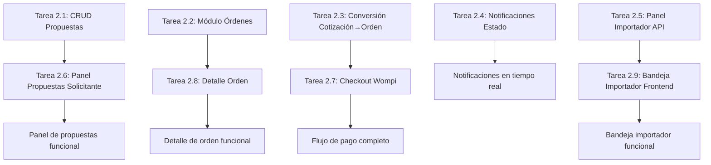

# Semana 2: Red de Importadores y Ordenes — ImportacionesQ8

## Descripción general

Semana 2 del MVP a 3 semanas. Entregables: Distribución automática de cotizaciones abiertas, panel de propuestas recibidas, conexión con importador elegido, módulo de órdenes con estados y notificaciones.

---

## Resumen de entregables

| Entregable | Módulo | Prioridad |
|------------|--------|-----------|
| Distribución automática de cotizaciones abiertas | Backend/Matching-Cotizaciones | P0 |
| Panel de propuestas recibidas | Frontend/Pantallas-Solicitante | P0 |
| Conexión con importador elegido | Backend/Pagos-Wompi, Frontend/Pantallas-Solicitante | P0 |
| Módulo de órdenes con estados y notificaciones | Backend/Base-Datos, Frontend/Pantallas-Solicitante | P0 |

---

## Tareas Backend — Semana 2

### Tarea 2.1: Implementar modelo y CRUD de propuestas

**Módulo:** Backend/Base-Datos  
**Duración estimada:** 1 día  
**Responsable:** Desarrollador Backend

#### Descripción
Implementar el modelo ORM para Propuesta con campos para precio ofrecido, tiempo estimado y condiciones adicionales. Los importadores usan este modelo para enviar sus propuestas a las cotizaciones abiertas.

#### Pasos de implementación

1. **Crear esquema Pydantic para Propuesta** (`schemas/cotizacion.py`)
   ```python
   from pydantic import BaseModel
   from typing import Optional
   
   class PropuestaCreate(BaseModel):
       cotizacion_id: str  # ID de la cotización a la que responde
       precio_ofrecido_usd: float  # Precio ofrecido por el importador
       tiempo_estimado_entrega: str  # Tiempo estimado (ej: "45 días")
       condiciones_adicionales: Optional[str] = None  # Condiciones adicionales
   
   class PropuestaResponse(BaseModel):
       id: str
       cotizacion_id: str
       importador_id: str
       precio_ofrecido_usd: float
       tiempo_estimado_entrega: str
       condiciones_adicionales: Optional[str]
       estado: str  # "pendiente", "aceptada", "rechazada"
   ```

2. **Crear modelo ORM para Propuesta** (`models/cotizacion.py`)
   - Campos: id (UUID), cotizacion_id FK → cotizaciones.id, importador_id FK → importadores.id, precio_ofrecido_usd, tiempo_estimado_entrega, condiciones_adicionales, estado (ENUM: "pendiente", "aceptada", "rechazada"), fecha_envio
   - **Restricción única:** Un importador solo puede enviar UNA propuesta por cotización (`UNIQUE KEY unique_propuesta_cotizacion_importador (cotizacion_id, importador_id)`)

3. **Implementar endpoint POST /propuestas** (`routers/cotizaciones.py`) — Solo para importadores
   ```python
   @app.post("/propuestas", response_model=PropuestaResponse)
   async def enviar_propuesta(
       propuesta: PropuestaCreate,
       current_user: dict = Depends(require_rol("importador")),
       db: Session = Depends(get_db)
   ):
       # 1. Verificar que la cotización existe y es abierta
       cotizacion = db.query(Cotizacion).filter(
           Cotizacion.id == propuesta.cotizacion_id,
           Cotizacion.modalidad == "abierta"
       ).first()
       
       if not cotizacion:
           raise HTTPException(status_code=404, detail="Cotización no encontrada o no es abierta")
       
       # 2. Verificar que el importador está en la lista de matching para esta cotización
       importadores_matching = redis_client.hgetall(f"cotizacion_abierta:{propuesta.cotizacion_id}")
       if str(current_user["user_id"]) not in importadores_matching:
           raise HTTPException(status_code=403, detail="No autorizado para responder esta cotización")
       
       # 3. Verificar que el importador no ha enviado ya una propuesta a esta cotización
       propuesta_existente = db.query(Propuesta).filter(
           Propuesta.cotizacion_id == propuesta.cotizacion_id,
           Propuesta.importador_id == current_user["user_id"]
       ).first()
       
       if propuesta_existente:
           raise HTTPException(status_code=400, detail="Ya has enviado una propuesta a esta cotización")
       
       # 4. Crear nueva propuesta en la base de datos
       nueva_propuesta = Propuesta(
           cotizacion_id=propuesta.cotizacion_id,
           importador_id=current_user["user_id"],
           precio_ofrecido_usd=propuesta.precio_ofrecido_usd,
           tiempo_estimado_entrega=propuesta.tiempo_estimado_entrega,
           condiciones_adicionales=propuesta.condiciones_adicionales,
           estado="pendiente"
       )
       db.add(nueva_propuesta)
       
       # 5. Actualizar estado en Redis
       redis_client.hset(f"cotizacion_abierta:{propuesta.cotizacion_id}", current_user["user_id"], "respondido")
       redis_client.incr(f"cotizacion_abierta:{propuesta.cotizacion_id}:respuestas")
       
       db.commit()
       db.refresh(nueva_propuesta)
       
       return PropuestaResponse(
           id=str(nueva_propuesta.id),
           cotizacion_id=propuesta.cotizacion_id,
           importador_id=current_user["user_id"],
           precio_ofrecido_usd=nueva_propuesta.precio_ofrecido_usd,
           tiempo_estimado_entrega=nueva_propuesta.tiempo_estimado_entrega,
           condiciones_adicionales=nueva_propuesta.condiciones_adicionales,
           estado="pendiente"
       )
   ```

4. **Implementar endpoint GET /cotizaciones/{id}/propuestas** (`routers/cotizaciones.py`) — Solo para el solicitante de la cotización
   - Listar todas las propuestas recibidas para una cotización abierta

#### Criterios de aceptación

- [ ] POST /propuestas con datos válidos crea nueva propuesta (201 Created)
- [ ] POST /propuestas sin rol importador retorna 403 Forbidden
- [ ] POST /propuestas para una cotización cerrada retorna 404 Not Found
- [ ] POST /propuestas si el importador ya envió una propuesta a esa cotización retorna 400 Bad Request
- [ ] GET /cotizaciones/{id}/propuestas retorna lista de propuestas recibidas (200 OK)

#### Entregables

1. Modelo ORM para Propuesta con restricción única (un importador, una propuesta por cotización)
2. Endpoint POST /propuestas funcional con validación de permisos
3. Endpoint GET /cotizaciones/{id}/propuestas funcional

---

### Tarea 2.2: Implementar módulo de órdenes

**Módulo:** Backend/Base-Datos  
**Duración estimada:** 1.5 días  
**Responsable:** Desarrollador Backend Senior

#### Descripción
Implementar el modelo ORM para Orden con campos para seguimiento del ciclo de vida del pedido, y los endpoints REST para gestionar órdenes.

#### Pasos de implementación

1. **Crear esquema Pydantic para Orden** (`schemas/orden.py`)
   ```python
   from pydantic import BaseModel
   from typing import Optional, List
   
   class EstadoOrden(BaseModel):
       id: str
       orden_id: str
       estado_anterior: Optional[str]
       estado_nuevo: str
       fecha_cambio: datetime
   
   class DocumentoOrden(BaseModel):
       id: str
       orden_id: str
       nombre: str
       url: str
       tipo: str  # "factura_proforma", "factura_comercial", "packing_list", "comprobante_pago"
   
   class OrdenCreate(BaseModel):
       cotizacion_id: str
       importador_id: str
       solicitante_id: str
       asesor_asignado_id: Optional[str] = None
   
   class OrdenResponse(BaseModel):
       id: str
       cotizacion_id: str
       importador_id: str
       solicitante_id: str
       asesor_asignado_id: Optional[str]
       estado: str  # "cotizacion_aceptada", "en_produccion", etc.
       precio_acordado_usd: float
       tiempo_estimado_entrega: Optional[str]
       condiciones_adicionales: Optional[str]
       historial_estados: List[EstadoOrden]
       documentos_adjuntos: List[DocumentoOrden]
   ```

2. **Crear modelo ORM para Orden** (`models/orden.py`)
   - Campos: id (UUID), cotizacion_id FK, importador_id FK, solicitante_id FK, asesor_asignado_id FK, estado (ENUM), precio_acordado_usd, tiempo_estimado_entrega, condiciones_adicionales, fecha_creacion, fecha_actualizacion

3. **Crear modelo ORM para HistorialEstadosOrden** (`models/orden.py`)
   - Campos: id (UUID), orden_id FK → ordenes.id, estado_anterior, estado_nuevo, fecha_cambio

4. **Crear modelo ORM para DocumentoOrden** (`models/orden.py`)
   - Campos: id (UUID), orden_id FK → ordenes.id, nombre, url, tipo (ENUM)

5. **Implementar endpoint GET /ordenes** (`routers/ordenes.py`) — Listar órdenes del usuario autenticado
6. **Implementar endpoint GET /ordenes/{id}** (`routers/ordenes.py`) — Obtener detalles de una orden específica
7. **Implementar endpoint PUT /ordenes/{id}/estado** (`routers/ordenes.py`) — Actualizar estado de una orden (importador/admin)

#### Criterios de aceptación

- [ ] Modelo Orden con todos los campos del ciclo de vida del pedido
- [ ] Modelo HistorialEstadosOrden para rastrear cambios de estado con fecha y hora
- [ ] GET /ordenes retorna solo las órdenes del usuario autenticado (200 OK)
- [ ] GET /ordenes/{id} retorna detalles de una orden específica o 404 si no existe
- [ ] PUT /ordenes/{id}/estado actualiza el estado y registra en historial_estados_orden

#### Entregables

1. Modelos ORM para Orden, HistorialEstadosOrden y DocumentoOrden
2. Endpoint GET /ordenes filtrado por usuario autenticado
3. Endpoint GET /ordenes/{id}
4. Endpoint PUT /ordenes/{id}/estado con registro en historial de estados

---

### Tarea 2.3: Implementar flujo de conversión cotización → orden tras pago confirmado

**Módulo:** Backend/Pagos-Wompi  
**Duración estimada:** 1 día  
**Responsable:** Desarrollador Backend Senior

#### Descripción
Implementar el flujo completo de conversión de cotización aceptada en orden activa cuando se confirma el pago con Wompi. Este es el flujo más crítico del negocio.

#### Pasos de implementación

1. **Crear esquema Pydantic para Checkout** (`schemas/pago.py`)
   ```python
   from pydantic import BaseModel
   
   class CheckoutRequest(BaseModel):
       cotizacion_id: str  # ID de la cotización aceptada
   
   class CheckoutResponse(BaseModel):
       checkout_url: str  # URL del checkout de Wompi
       wompi_payment_id: str  # ID del pago en Wompi
   ```

2. **Implementar endpoint POST /pagos/checkout** (`routers/pagos.py`) — Generar enlace de pago con Wompi
   ```python
   @app.post("/pagos/checkout", response_model=CheckoutResponse)
   async def generar_checkout(
       checkout: CheckoutRequest,
       current_user: dict = Depends(require_rol("solicitante")),
       db: Session = Depends(get_db)
   ):
       # 1. Verificar que la cotización existe y está en estado "cotizacion_aceptada"
       cotizacion = db.query(Cotizacion).filter(
           Cotizacion.id == checkout.cotizacion_id,
           Cotizacion.solicitante_id == current_user["user_id"],
           Cotizacion.estado == "cotizacion_aceptada"
       ).first()
       
       if not cotizacion:
           raise HTTPException(status_code=400, detail="Cotización no encontrada o no está en estado de pago")
       
       # 2. Obtener el importador y la propuesta aceptada para calcular el monto del servicio
       propuesta = db.query(Propuesta).filter(
           Propuesta.cotizacion_id == checkout.cotizacion_id,
           Propuesta.estado == "aceptada"
       ).first()
       
       # Calcular comisión de la plataforma (ej: 10% del precio acordado)
       monto_comision = propuesta.precio_ofrecido_usd * 0.10
       
       # 3. Generar checkout con Wompi
       wompi_payment_id = await generar_checkout_wompi(monto_comision)
       
       # 4. Crear registro de pago en la base de datos
       nuevo_pago = Pago(
           orden_id=None,  # Se asignará cuando se cree la orden
           wompi_payment_id=wompi_payment_id,
           monto_usd=monto_comision,
           estado="pendiente",
           webhook_url=f"{API_URL}/pagos/webhook/wompi"
       )
       db.add(nuevo_pago)
       db.commit()
       
       return CheckoutResponse(
           checkout_url=wompi_payment_id.checkout_url,
           wompi_payment_id=wompi_payment_id.id
       )
   ```

3. **Implementar endpoint POST /pagos/webhook/wompi** (`routers/pagos.py`) — Recibir confirmación de pago
   ```python
   @app.post("/pagos/webhook/wompi")
   async def webhook_wompi(evento: dict):
       """
       Webhook de Wompi que recibe notificaciones sobre el estado del pago.
       
       Eventos manejados:
       - payment.confirmed: Pago confirmado → Cotización → Orden activa
       - payment.failed: Pago fallido → Mantener cotización en estado pendiente
       - payment.refunded: Reembolso → Notificar disputa
       """
       # 1. Verificar la firma del webhook usando WOMPI_SECRET_KEY
       if not verificar_firma_wompi(evento):
           raise HTTPException(status_code=403, detail="Firma inválida")
       
       wompi_payment_id = evento["data"]["id"]
       estado_wompi = evento["data"]["status"]
       
       # 2. Buscar el pago en la base de datos
       pago = db.query(Pago).filter(Pago.wompi_payment_id == wompi_payment_id).first()
       
       if not pago:
           raise HTTPException(status_code=404, detail="Pago no encontrado")
       
       # 3. Verificar que el pago ya fue procesado (idempotencia)
       if pago.estado != "pendiente":
           return {"success": True}
       
       # 4. Procesar según el estado del evento
       if evento["event"] == "payment.confirmed":
           # Actualizar estado del pago a confirmado
           pago.estado = "confirmado"
           pago.fecha_confirmacion = datetime.now()
           
           # Obtener la cotización asociada al pago
           cotizacion = db.query(Cotizacion).filter(
               Cotizacion.id == pago.orden_id  # Se asigna cuando se crea el checkout
           ).first()
           
           if cotizacion:
               # Convertir cotización en orden
               nueva_orden = Orden(
                   cotizacion_id=cotizacion.id,
                   importador_id=cotizacion.importador_id,
                   solicitante_id=cotizacion.solicitante_id,
                   asesor_asignado_id=None,  # Se asignará cuando el importador acepte la orden
                   estado="cotizacion_aceptada",
                   precio_acordado_usd=propuesta.precio_ofrecido_usd,
                   tiempo_estimado_entrega=propuesta.tiempo_estimado_entrega,
                   condiciones_adicionales=propuesta.condiciones_adicionales
               )
               db.add(nueva_orden)
               
               # Registrar cambio de estado en historial
               nuevo_estado = HistorialEstadosOrden(
                   orden_id=nueva_orden.id,
                   estado_anterior=None,
                   estado_nuevo="cotizacion_aceptada",
                   fecha_cambio=datetime.now()
               )
               db.add(nuevo_estado)
               
               # Actualizar estado de la cotización a "orden_activa"
               cotizacion.estado = "orden_activa"
               
               # Crear conversación de chat automáticamente entre solicitante y importador
               nueva_conversacion = ConversacionChat(
                   orden_id=nueva_orden.id,
                   solicitante_id=cotizacion.solicitante_id,
                   importador_id=cotizacion.importador_id
               )
               db.add(nueva_conversacion)
               
       elif evento["event"] == "payment.failed":
           pago.estado = "fallido"
       
       elif evento["event"] == "payment.refunded":
           pago.estado = "reembolsado"
           # Actualizar estado de la orden a "en disputa/reembolso"
       
       db.commit()
       
       return {"success": True}
   ```

#### Criterios de aceptación

- [ ] POST /pagos/checkout con cotización válida genera enlace de pago con Wompi (200 OK)
- [ ] POST /pagos/webhook/wompi con evento payment.confirmed convierte cotización en orden activa
- [ ] El webhook verifica la firma de Wompi para evitar falsificaciones
- [ ] El webhook es idempotente: no procesa el mismo evento dos veces
- [ ] Al confirmar pago, se crea automáticamente una conversación de chat entre solicitante e importador

#### Entregables

1. Endpoint POST /pagos/checkout funcional con integración Wompi
2. Endpoint POST /pagos/webhook/wompi funcional con verificación de firma
3. Flujo completo: cotización aceptada → checkout → pago confirmado → orden activa
4. Creación automática de conversación de chat al confirmar pago

---

### Tarea 2.4: Implementar notificaciones por cambio de estado de orden

**Módulo:** Backend/Chat-WebSocket  
**Duración estimada:** 1 día  
**Responsable:** Desarrollador Backend

#### Descripción
Implementar las notificaciones en tiempo real para cambios de estado de orden usando WebSocket + Redis Pub/Sub. Cuando el importador actualiza el estado de una orden, el solicitante recibe la notificación inmediatamente.

#### Pasos de implementación

1. **Implementar endpoint PUT /ordenes/{id}/estado** (`routers/ordenes.py`) — Actualizar estado de una orden
   ```python
   @app.put("/ordenes/{orden_id}/estado")
   async def actualizar_estado_orden(
       orden_id: str,
       nuevo_estado: dict,  # {"estado": "en_produccion"}
       current_user: dict = Depends(require_rol("importador")),
       db: Session = Depends(get_db)
   ):
       # 1. Verificar que la orden existe y el importador es el asignado
       orden = db.query(Orden).filter(
           Orden.id == orden_id,
           Orden.importador_id == current_user["user_id"]
       ).first()
       
       if not orden:
           raise HTTPException(status_code=404, detail="Orden no encontrada")
       
       # 2. Verificar que el nuevo estado es válido (transición permitida)
       estados_validos = {
           "cotizacion_aceptada": ["en_produccion"],
           "en_produccion": ["transito_internacional"],
           "transito_internacional": ["aduana_nacionalizacion"],
           "aduana_nacionalizacion": ["bodega_local"],
           "bodega_local": ["entregado"]
       }
       
       estado_actual = orden.estado
       nuevo_estado_valor = nuevo_estado["estado"]
       
       if nuevo_estado_valor not in estados_validos.get(estado_actual, []):
           raise HTTPException(status_code=400, detail=f"Transición de estado inválida: {estado_actual} → {nuevo_estado_valor}")
       
       # 3. Actualizar el estado de la orden
       orden.estado = nuevo_estado_valor
       orden.fecha_actualizacion = datetime.now()
       
       # 4. Registrar cambio en historial de estados
       nuevo_historial = HistorialEstadosOrden(
           orden_id=orden_id,
           estado_anterior=estado_actual,
           estado_nuevo=nuevo_estado_valor,
           fecha_cambio=datetime.now()
       )
       db.add(nuevo_historial)
       
       # 5. Notificar al solicitante vía WebSocket/Redis Pub/Sub
       redis_client.publish(
           f"orden:{orden_id}:notificaciones",
           json.dumps({
               "tipo": "cambio_estado",
               "orden_id": orden_id,
               "estado_anterior": estado_actual,
               "estado_nuevo": nuevo_estado_valor,
               "fecha_cambio": datetime.now().isoformat()
           })
       )
       
       db.commit()
       
       return {"success": True, "nuevo_estado": nuevo_estado_valor}
   ```

2. **Implementar endpoint GET /ordenes/importador/{id}** (`routers/ordenes.py`) — Listar órdenes asignadas al importador

#### Criterios de aceptación

- [ ] PUT /ordenes/{id}/estado con estado válido actualiza la orden y registra en historial
- [ ] PUT /ordenes/{id}/estado con transición inválida retorna 400 Bad Request
- [ ] El solicitante recibe notificación en tiempo real vía Redis Pub/Sub cuando cambia el estado de su orden
- [ ] GET /ordenes/importador/{id} retorna órdenes asignadas al importador

#### Entregables

1. Endpoint PUT /ordenes/{id}/estado funcional con validación de transiciones
2. Notificaciones en tiempo real para cambios de estado vía Redis Pub/Sub
3. Endpoint GET /ordenes/importador/{id}

---

### Tarea 2.5: Implementar panel del importador — bandeja de solicitudes

**Módulo:** Backend/API-Rest  
**Duración estimada:** 1 día  
**Responsable:** Desarrollador Backend

#### Descripción
Implementar los endpoints REST para que el importador pueda ver todas las solicitudes dirigidas y abiertas que le aplican, así como sus órdenes activas.

#### Pasos de implementación

1. **Implementar endpoint GET /importadores/{id}/solicitudes-dirigidas** (`routers/importadores.py`)
   - Listar cotizaciones dirigidas al importador con estado "dirigida" o "propuestas_recibidas"

2. **Implementar endpoint GET /importadores/{id}/solicitudes-abiertas** (`routers/importadores.py`)
   - Listar cotizaciones abiertas que aplican al importador (usando el motor de matching)
   - Solo cotizaciones con estado "abierta" o "propuestas_recibidas"

3. **Implementar endpoint GET /ordenes/importador/{id}/activas** (`routers/ordenes.py`)
   - Listar órdenes asignadas al importador con estado diferente a "entregado"

#### Criterios de aceptación

- [ ] GET /importadores/{id}/solicitudes-dirigidas retorna cotizaciones dirigidas al importador (200 OK)
- [ ] GET /importadores/{id}/solicitudes-abiertas retorna cotizaciones abiertas que aplican al importador (200 OK)
- [ ] GET /ordenes/importador/{id}/activas retorna órdenes activas del importador (200 OK)

#### Entregables

1. Endpoint GET /importadores/{id}/solicitudes-dirigidas funcional
2. Endpoint GET /importadores/{id}/solicitudes-abiertas funcional
3. Endpoint GET /ordenes/importador/{id}/activas funcional

---

## Tareas Frontend — Semana 2

### Tarea 2.6: Implementar panel de propuestas recibidas (solicitante)

**Módulo:** Frontend/Pantallas-Solicitante  
**Duración estimada:** 1.5 días  
**Responsable:** Desarrollador Frontend Senior

#### Descripción
Implementar la pantalla P6 — Panel de Propuestas Recibidas donde el solicitante ve las propuestas de los importadores y puede elegir con cuál conectarse.

#### Pasos de implementación

1. **Crear página de panel de propuestas** (`app/cotizacion/propuestas/page.tsx`)
   - Contador de propuestas: "X de Y importadores respondieron"
   - Lista de propuestas activas como tarjetas
   - Lista de propuestas pendientes como tarjetas

2. **Crear componente de tarjeta de propuesta activa** (`components/PropuestaCard.tsx`)
   ```typescript
   interface PropuestaCardProps {
     id: string;
     importadorNombre: string;
     importadorLogo?: string;
     precioOfrecidoUsd: number;
     tiempoEstimadoEntrega: string;
     incoterm: string;
     condicionesAdicionales?: string;
     onConnect: (propuestaId: string) => void;
   }
   
   export function PropuestaCard({ importadorNombre, importadorLogo, precioOfrecidoUsd, tiempoEstimadoEntrega, incoterm, condicionesAdicionales, onConnect }: PropuestaCardProps) {
     return (
       <div className="bg-white rounded-xl shadow-sm p-6">
         <div className="flex items-center gap-4 mb-4">
           {importadorLogo && }
           <h3 className="text-lg font-semibold">{importadorNombre}</h3>
         </div>
         
         <div className="space-y-2 mb-4">
           <p><strong>Precio:</strong> ${precioOfrecidoUsd.toFixed(2)} USD</p>
           <p><strong>Tiempo estimado:</strong> {tiempoEstimadoEntrega}</p>
           <p><strong>Incoterm:</strong> {incoterm}</p>
           {condicionesAdicionales && <p><strong>Condiciones:</strong> {condicionesAdicionales}</p>}
         </div>
         
         <button 
           onClick={() => onConnect(id)}
           className="w-full bg-blue-600 text-white py-3 rounded-lg hover:bg-blue-700 transition-colors"
         >
           Conectar con este importador
         </button>
       </div>
     );
   }
   ```

3. **Crear componente de tarjeta de propuesta pendiente** (`components/PropuestaPendienteCard.tsx`)
   - Logo del importador, nombre, indicador de espera (spinner)

4. **Implementar fetch de propuestas** — Llamar a GET /cotizaciones/{id}/propuestas al cargar la página

5. **Implementar conexión con importador elegido** — Al hacer clic en "Conectar con este importador", redirigir al checkout de pago Wompi (P7)

#### Criterios de aceptación

- [ ] El panel muestra el contador de propuestas: "X de Y importadores respondieron"
- [ ] Las propuestas activas se muestran como tarjetas con precio, tiempo estimado e incoterm
- [ ] Las propuestas pendientes se muestran como tarjetas con indicador de espera
- [ ] Al hacer clic en "Conectar con este importador", redirige al checkout de pago Wompi

#### Entregables

1. Página de panel de propuestas funcional
2. Componente de tarjeta de propuesta activa con toda la información relevante
3. Componente de tarjeta de propuesta pendiente con indicador de espera
4. Fetch de propuestas desde el backend
5. Navegación al checkout tras seleccionar un importador

---

### Tarea 2.7: Implementar checkout de pago (Wompi)

**Módulo:** Frontend/Pantallas-Solicitante  
**Duración estimada:** 1 día  
**Responsable:** Desarrollador Frontend

#### Descripción
Implementar la pantalla P7 — Checkout de Pago Wompi con resumen del pedido y redirección a la pasarela de pagos.

#### Pasos de implementación

1. **Crear página de checkout** (`app/pagos/checkout/page.tsx`)
   - Resumen del pedido: importador, producto, precio acordado, costo de servicio
   - Selector de método de pago (tarjeta, PSE, efectivo)
   - Botón de pago que redirige al checkout de Wompi

2. **Implementar fetch de datos del checkout** — Llamar a POST /pagos/checkout con el cotizacion_id

3. **Redirección al checkout de Wompi** — Abrir la URL del checkout en una nueva ventana o iframe

4. **Manejo de redirección tras completar el pago** — Escuchar eventos de redirección de Wompi y redirigir al detalle de la orden (P8)

#### Criterios de aceptación

- [ ] El checkout muestra resumen del pedido con importador, producto, precio acordado y costo de servicio
- [ ] Al hacer clic en "Pagar", se redirige a la URL de checkout de Wompi
- [ ] Tras completar el pago, el usuario es redirigido al detalle de la orden

#### Entregables

1. Página de checkout funcional con resumen del pedido
2. Redirección al checkout de Wompi
3. Manejo de redirección tras completar el pago

---

### Tarea 2.8: Implementar detalle de orden con línea de estados

**Módulo:** Frontend/Pantallas-Solicitante  
**Duración estimada:** 1.5 días  
**Responsable:** Desarrollador Frontend Senior

#### Descripción
Implementar la pantalla P8 — Detalle de Orden con línea de estados visual, historial de cambios y acceso a chat y documentos.

#### Pasos de implementación

1. **Crear página de detalle de orden** (`app/ordenes/[id]/page.tsx`)
   - Línea de estados visual (timeline horizontal)
   - Información general: importador, asesor, precio, tiempo estimado
   - Historial de cambios de estado con fecha y hora
   - Sección de documentos adjuntos
   - Botones: "Chat con asesor", "Reportar problema"

2. **Crear componente de línea de estados** (`components/EstadoOrdenTimeline.tsx`)
   ```typescript
   interface EstadoOrdenTimelineProps {
     estadoActual: string;
     historialEstados: Array<{estado_nuevo: string; fecha_cambio: string}>;
   }
   
   const ESTADOS = [
     "cotizacion_aceptada",
     "en_produccion",
     "transito_internacional",
     "aduana_nacionalizacion",
     "bodega_local",
     "entregado"
   ];
   
   export function EstadoOrdenTimeline({ estadoActual, historialEstados }: EstadoOrdenTimelineProps) {
     const indiceActual = ESTADOS.indexOf(estadoActual);
     
     return (
       <div className="flex items-center justify-between mb-8">
         {ESTADOS.map((estado, index) => {
           const completado = index <= indiceActual;
           const esActual = estado === estadoActual;
           
           return (
             <React.Fragment key={estado}>
               <div className={`w-10 h-10 rounded-full flex items-center justify-center ${
                 completado ? 'bg-green-500' : esActual ? 'bg-blue-500' : 'bg-gray-200'
               }`}>
                 {completado ? (
                   <CheckIcon className="w-6 h-6 text-white" />
                 ) : esActual ? (
                   <ClockIcon className="w-6 h-6 text-white" />
                 ) : (
                   <div className="w-4 h-4 rounded-full bg-gray-300" />
                 )}
               </div>
               {index < ESTADOS.length - 1 && (
                 <div className={`flex-1 h-1 mx-2 ${completado ? 'bg-green-500' : 'bg-gray-200'}`} />
               )}
             </React.Fragment>
           );
         })}
       </div>
     );
   }
   ```

3. **Implementar fetch de datos de la orden** — Llamar a GET /ordenes/{id} al cargar la página

4. **Implementar actualización en tiempo real del estado** — Escuchar eventos de Redis Pub/Sub para cambios de estado

#### Criterios de aceptación

- [ ] La línea de estados visual muestra los 6 estados con iconos (✅ completado, 🔵 actual, ⬜ pendiente)
- [ ] El historial de cambios de estado se muestra con fecha y hora
- [ ] Los botones "Chat con asesor" y "Reportar problema" son funcionales
- [ ] La sección de documentos adjuntos lista los archivos disponibles

#### Entregables

1. Página de detalle de orden funcional con línea de estados visual
2. Componente de línea de estados con iconos según estado (✅, 🔵, ⬜)
3. Historial de cambios de estado con fecha y hora
4. Sección de documentos adjuntos

---

### Tarea 2.9: Implementar bandeja de solicitudes del importador

**Módulo:** Frontend/Pantallas-Importador  
**Duración estimada:** 1.5 días  
**Responsable:** Desarrollador Frontend Senior

#### Descripción
Implementar la pantalla P10 — Bandeja de Solicitudes del Importador con tabs, filtros y tarjetas de solicitud recibida.

#### Pasos de implementación

1. **Crear página de bandeja de solicitudes** (`app/importador/solicitudes/page.tsx`)
   - Tabs: Solicitudes | Órdenes Activas
   - Filtros: Modalidad (Dirigida/Abierta/Todas), Estado (Pendiente/Respondido/Todos)
   - Tarjetas de solicitud recibida con foto del producto, nombre, etiqueta de modalidad, cantidad, precio objetivo, tiempo desde recepción

2. **Crear componente de tarjeta de solicitud** (`components/SolicitudCard.tsx`)
   ```typescript
   interface SolicitudCardProps {
     id: string;
     nombreProducto: string;
     modalida: 'dirigida' | 'abierta';
     cantidad: number;
     precioObjetivoUsd: number;
     tiempoDesdeRecepcion: string;
     estado: 'pendiente' | 'respondido';
     onClick: (id: string) => void;
   }
   
   export function SolicitudCard({ nombreProducto, modalida, cantidad, precioObjetivoUsd, tiempoDesdeRecepcion, estado, onClick }: SolicitudCardProps) {
     return (
       <div className="bg-white rounded-xl shadow-sm p-6">
         <div className="flex items-center justify-between mb-4">
           <h3 className="text-lg font-semibold">{nombreProducto}</h3>
           <span className={`px-2 py-1 rounded-full text-xs ${
             modalida === 'dirigida' ? 'bg-green-100 text-green-800' : 'bg-yellow-100 text-yellow-800'
           }`}>
             {modalida === 'dirigida' ? '🏷️ Dirigida' : '🌐 Abierta'}
           </span>
         </div>
         
         <p className="text-sm text-gray-600 mb-2">Cantidad: {cantidad} unidades</p>
         <p className="text-sm text-gray-600 mb-2">Precio objetivo: ${precioObjetivoUsd.toFixed(2)} USD</p>
         <p className="text-xs text-gray-400">{tiempoDesdeRecepcion}</p>
         
         <button 
           onClick={() => onClick(id)}
           className="w-full mt-4 bg-blue-600 text-white py-3 rounded-lg hover:bg-blue-700 transition-colors"
         >
           Responder cotización
         </button>
       </div>
     );
   }
   ```

3. **Implementar fetch de solicitudes** — Llamar a GET /importadores/{id}/solicitudes-dirigidas y GET /importadores/{id}/solicitudes-abiertas

4. **Implementar filtros** — Actualizar el estado de solicitudes cuando cambian los filtros

#### Criterios de aceptación

- [ ] La bandeja muestra tabs funcionales (Solicitudes | Órdenes Activas)
- [ ] Los filtros (modalidad, estado) filtran correctamente las solicitudes
- [ ] Las tarjetas de solicitud muestran foto del producto, nombre, etiqueta de modalidad, cantidad y precio objetivo
- [ ] Al hacer clic en "Responder cotización", redirige al formulario de respuesta

#### Entregables

1. Página de bandeja de solicitudes funcional con tabs y filtros
2. Componente de tarjeta de solicitud con etiqueta de modalidad (Dirigida/Abierta)
3. Fetch de solicitudes desde el backend
4. Filtros funcionales por modalidad y estado

---

### Tarea 2.10: Implementar formulario de respuesta a cotización (importador)

**Módulo:** Frontend/Pantallas-Importador  
**Duración estimada:** 1 día  
**Responsable:** Desarrollador Frontend

#### Descripción
Implementar la pantalla P11 — Formulario de Respuesta a Cotización donde el importador envía su propuesta con precio, tiempo estimado y condiciones.

#### Pasos de implementación

1. **Crear página de formulario de respuesta** (`app/importador/propuestas/nueva/page.tsx`)
   - Sección de datos de la solicitud (solo lectura): muestra toda la información del formulario del solicitante
   - Campo de precio ofrecido: number input con prefijo USD
   - Campo de tiempo estimado: text input (ej: "45 días")
   - Selector de incoterm: dropdown con opciones FOB, CIF, EXW, DDP
   - Área de texto para condiciones adicionales

2. **Implementar fetch de datos de la solicitud** — Llamar a GET /cotizaciones/{id} al cargar la página

3. **Implementar envío del formulario** — Llamar a POST /propuestas con los datos de la propuesta

4. **Validaciones en tiempo real** — Precio positivo, tiempo mínimo 7 días

#### Criterios de aceptación

- [ ] El formulario muestra todos los datos de la solicitud (solo lectura)
- [ ] Los campos de precio, tiempo estimado e incoterm son editables por el importador
- [ ] Las validaciones en tiempo real muestran mensajes de error apropiados
- [ ] Al enviar el formulario, se llama al endpoint POST /propuestas del backend

#### Entregables

1. Página de formulario de respuesta funcional con datos de la solicitud (solo lectura)
2. Campos editables para precio, tiempo estimado e incoterm
3. Validaciones en tiempo real
4. Envío del formulario al backend

---

## Criterios de aceptacion — Semana 2 (Resumen)

| Entregable | Criterio de aceptación |
|------------|----------------------|
| Propuestas | Los importadores matching pueden enviar propuestas. El solicitante ve las propuestas recibidas en tiempo real. |
| Órdenes | Al confirmar el pago con Wompi, la cotización se convierte automáticamente en orden. Las órdenes tienen estados visuales. |
| Checkout Wompi | El solicitante puede completar el pago a través de Wompi y ser redirigido al detalle de la orden tras confirmación. |
| Bandeja importador | El importador ve todas las solicitudes dirigidas y abiertas que le aplican, con filtros por modalidad y estado. |
| Formulario respuesta | El importador puede enviar una propuesta con precio, tiempo estimado e incoterm para cualquier solicitud recibida. |

---

## Dependencias entre tareas



---

## Notas adicionales

- **Prioridad:** Las tareas P0 deben completarse antes de las P1. No se puede avanzar a la Semana 3 sin tener el flujo completo de cotización → propuesta → pago → orden.
- **Testing:** Cada tarea debe incluir al menos pruebas unitarias básicas para los endpoints y componentes principales.
- **Documentación:** Actualizar la documentación del vault en Obsidian con cualquier cambio significativo en los endpoints o pantallas.