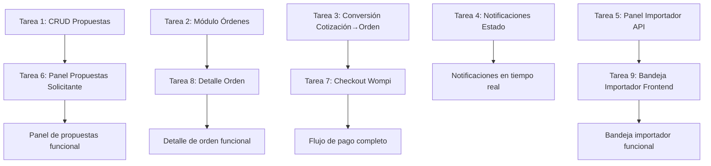

# 📅 Semana 2: Red de Importadores y Órdenes — ImportacionesQ8

## Descripción general

Semana 2 del MVP a 3 semanas. Entregables: Distribución automática de cotizaciones abiertas, panel de propuestas recibidas, conexión con importador elegido, módulo de órdenes con estados y notificaciones.

---

## 📋 Resumen de entregables

| Entregable | Módulo | Prioridad |
|------------|--------|-----------|
| Distribución automática de cotizaciones abiertas | Backend/Matching-Cotizaciones | P0 |
| Panel de propuestas recibidas | Frontend/Pantallas-Solicitante | P0 |
| Conexión con importador elegido | Backend/Pagos-Wompi, Frontend/Pantallas-Solicitante | P0 |
| Módulo de órdenes con estados y notificaciones | Backend/Base-Datos, Frontend/Pantallas-Solicitante | P0 |

---

## 🔧 Tareas Backend

### Tarea 1: Implementar modelo y CRUD de propuestas

**Módulo:** Backend/Base-Datos  
**Duración estimada:** 1 día  
**Responsable:** Desarrollador Backend

- [ ] Modelo Propuesta con campos: cotizacion_id, importador_id, precio_ofrecido_usd, tiempo_estimado_entrega, condiciones_adicionales, estado
- [ ] Endpoint POST /propuestas (importador envía propuesta para una cotización)
- [ ] Endpoint GET /cotizaciones/{id}/propuestas (solicitante ve propuestas recibidas)
- [ ] Validar que solo el importador matching pueda enviar propuesta a una cotización abierta
- [ ] Validar que solo un importador pueda enviar UNA propuesta por cotización

**Documentación relacionada:** [[Backend/Base-Datos]], [[Backend/API-Rest]]

---

### Tarea 2: Implementar módulo de órdenes

**Módulo:** Backend/Base-Datos  
**Duración estimada:** 1.5 días  
**Responsable:** Desarrollador Backend

- [ ] Modelo Orden con campos: cotizacion_id, importador_id, solicitante_id, asesor_asignado_id, estado
- [ ] Endpoint GET /ordenes (listar órdenes del usuario autenticado)
- [ ] Endpoint GET /ordenes/{id} (obtener detalles de una orden específica)
- [ ] Endpoint PUT /ordenes/{id}/estado (actualizar estado de una orden — importador/admin)
- [ ] Modelo HistorialEstadosOrden para rastrear cambios de estado con fecha

**Documentación relacionada:** [[Backend/Base-Datos]]

---

### Tarea 3: Implementar flujo de conversión cotización → orden tras pago confirmado

**Módulo:** Backend/Pagos-Wompi  
**Duración estimada:** 1 día  
**Responsable:** Desarrollador Backend

- [ ] Endpoint POST /pagos/checkout (generar enlace de pago con Wompi)
- [ ] Endpoint POST /pagos/webhook/wompi (recibir confirmación de pago)
- [ ] Al recibir webhook `payment.confirmed`:
  - Actualizar estado del pago a "confirmado" en MySQL
  - Convertir cotización en orden: INSERT INTO ordenes con datos de la cotización aceptada
  - Crear conversación de chat automáticamente entre solicitante y importador
  - Notificar al solicitante e importador vía WebSocket

**Documentación relacionada:** [[Backend/Pagos-Wompi]]

---

### Tarea 4: Implementar notificaciones por cambio de estado de orden

**Módulo:** Backend/Chat-WebSocket  
**Duración estimada:** 1 día  
**Responsable:** Desarrollador Backend

- [ ] Endpoint PUT /ordenes/{id}/estado (actualizar estado de una orden)
- [ ] Al actualizar el estado, insertar registro en historial_estados_orden con fecha y hora
- [ ] Notificar al solicitante vía WebSocket cuando cambie el estado de su orden
- [ ] Notificar al importador vía WebSocket cuando se le asigne una nueva orden

**Documentación relacionada:** [[Backend/Chat-WebSocket]]

---

### Tarea 5: Implementar panel del importador — bandeja de solicitudes

**Módulo:** Backend/API-Rest  
**Duración estimada:** 1 día  
**Responsable:** Desarrollador Backend

- [ ] Endpoint GET /importadores/{id}/solicitudes-dirigidas (listar solicitudes dirigidas al importador)
- [ ] Endpoint GET /importadores/{id}/solicitudes-abiertas (listar cotizaciones abiertas que aplican al importador)
- [ ] Endpoint POST /propuestas (importador envía propuesta para una cotización abierta)
- [ ] Endpoint GET /ordenes/importador/{id} (listar órdenes asignadas al importador)

**Documentación relacionada:** [[Backend/API-Rest]]

---

## 🎨 Tareas Frontend

### Tarea 6: Implementar panel de propuestas recibidas (solicitante)

**Módulo:** Frontend/Pantallas-Solicitante  
**Duración estimada:** 1.5 días  
**Responsable:** Desarrollador Frontend

- [ ] Pantalla P6 — Panel de Propuestas Recibidas
- [ ] Contador de propuestas: "X de Y importadores respondieron"
- [ ] Tarjetas de propuesta activa con: logo del importador, precio ofrecido, tiempo estimado, incoterm, condiciones, botón "Conectar con este importador"
- [ ] Tarjetas de propuesta pendiente con: logo del importador, indicador de espera
- [ ] Actualización en tiempo real vía WebSocket cuando un importador responde
- [ ] Integración con API REST: GET /cotizaciones/{id}/propuestas

**Documentación relacionada:** [[Frontend/Pantallas-Solicitante]], [[Frontend/Wireframes]]

---

### Tarea 7: Implementar checkout de pago (Wompi)

**Módulo:** Frontend/Pantallas-Solicitante  
**Duración estimada:** 1 día  
**Responsable:** Desarrollador Frontend

- [ ] Pantalla P7 — Checkout de Pago Wompi
- [ ] Resumen del pedido: importador, producto, precio acordado, costo de servicio
- [ ] Selector de método de pago (tarjeta, PSE, efectivo)
- [ ] Botón de pago que redirige al checkout de Wompi
- [ ] Manejo de redirección tras completar el pago

**Documentación relacionada:** [[Frontend/Pantallas-Solicitante]], [[Frontend/Wireframes]]

---

### Tarea 8: Implementar detalle de orden con línea de estados

**Módulo:** Frontend/Pantallas-Solicitante  
**Duración estimada:** 1.5 días  
**Responsable:** Desarrollador Frontend

- [ ] Pantalla P8 — Detalle de Orden
- [ ] Línea de estados visual (timeline horizontal): Cotización aceptada → En producción → En tránsito internacional → En aduana/nacionalización → En bodega local → Entregado
- [ ] Estado actual resaltado con color diferente
- [ ] Historial de cambios de estado con fecha y hora
- [ ] Información general: importador, asesor, precio, tiempo estimado
- [ ] Sección de documentos adjuntos (factura proforma, packing list)
- [ ] Botones: "Chat con asesor", "Reportar problema"

**Documentación relacionada:** [[Frontend/Pantallas-Solicitante]], [[Frontend/Wireframes]]

---

### Tarea 9: Implementar bandeja de solicitudes del importador

**Módulo:** Frontend/Pantallas-Importador  
**Duración estimada:** 1.5 días  
**Responsable:** Desarrollador Frontend

- [ ] Pantalla P10 — Bandeja de Solicitudes del Importador
- [ ] Tabs: Solicitudes | Órdenes Activas
- [ ] Filtros: Modalidad (Dirigida/Abierta/Todas), Estado (Pendiente/Respondido/Todos)
- [ ] Tarjetas de solicitud recibida con: foto del producto, nombre, etiqueta de modalidad (Dirigida/Abierta), cantidad, precio objetivo, tiempo desde recepción
- [ ] Lista de órdenes activas con estado actual y botón "Ver detalle"
- [ ] Prioridad visual para solicitudes dirigidas sobre abiertas

**Documentación relacionada:** [[Frontend/Pantallas-Importador]], [[Frontend/Wireframes]]

---

### Tarea 10: Implementar formulario de respuesta a cotización (importador)

**Módulo:** Frontend/Pantallas-Importador  
**Duración estimada:** 1 día  
**Responsable:** Desarrollador Frontend

- [ ] Pantalla P11 — Formulario de Respuesta a Cotización
- [ ] Sección de datos de la solicitud (solo lectura): muestra toda la información del formulario del solicitante
- [ ] Campo de precio ofrecido: number input con prefijo USD
- [ ] Campo de tiempo estimado: text input (ej: "45 días")
- [ ] Selector de incoterm: dropdown con opciones FOB, CIF, EXW, DDP
- [ ] Área de texto para condiciones adicionales
- [ ] Validaciones en tiempo real
- [ ] Integración con API REST: POST /propuestas

**Documentación relacionada:** [[Frontend/Pantallas-Importador]], [[Frontend/Wireframes]]

---

## 📊 Criterios de aceptación — Semana 2

| Entregable | Criterio de aceptación |
|------------|----------------------|
| Propuestas | Los importadores matching pueden enviar propuestas. El solicitante ve las propuestas recibidas en tiempo real. |
| Órdenes | Al confirmar el pago con Wompi, la cotización se convierte automáticamente en orden. Las órdenes tienen estados visuales. |
| Checkout Wompi | El solicitante puede completar el pago a través de Wompi y ser redirigido al detalle de la orden tras confirmación. |
| Bandeja importador | El importador ve todas las solicitudes dirigidas y abiertas que le aplican, con filtros por modalidad y estado. |
| Formulario respuesta | El importador puede enviar una propuesta con precio, tiempo estimado e incoterm para cualquier solicitud recibida. |

---

## 🔗 Dependencias entre tareas

---

## 📝 Notas adicionales

- **Prioridad:** Las tareas P0 deben completarse antes de las P1. No se puede avanzar a la Semana 3 sin tener el flujo completo de cotización → propuesta → pago → orden.
- **Testing:** Cada tarea debe incluir al menos pruebas unitarias básicas para los endpoints y componentes principales.
- **Documentación:** Actualizar la documentación del vault en Obsidian con cualquier cambio significativo en los endpoints o pantallas.