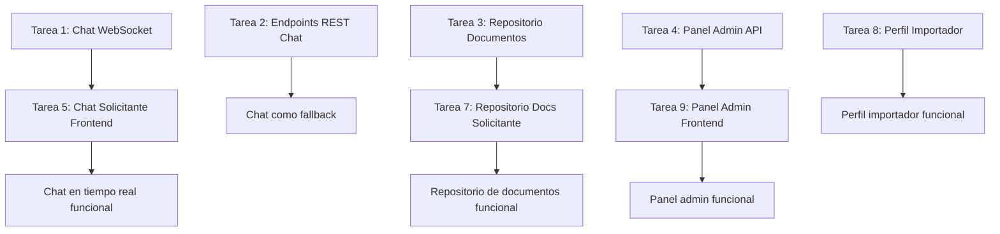

# 📅 Semana 3: Chat, Documentos y Pulido — ImportacionesQ8

## Descripción general

Semana 3 del MVP a 3 semanas. Entregables: Chat 1 a 1 en tiempo real ligado a orden, repositorio de documentos básico (sin facturación electrónica), pruebas con importadores piloto, ajustes de UI/UX.

---

## 📋 Resumen de entregables

| Entregable | Módulo | Prioridad |
|------------|--------|-----------|
| Chat 1 a 1 en tiempo real ligado a orden | Backend/Chat-WebSocket, Frontend/Pantallas-Solicitante | P0 |
| Repositorio de documentos básico | Backend/API-Rest, Frontend/Pantallas-Solicitante | P1 |
| Pruebas con importadores piloto | General | P0 |
| Ajustes de UI/UX | Frontend | P0 |

---

## 🔧 Tareas Backend

### Tarea 1: Implementar chat en tiempo real con WebSocket + Redis Pub/Sub

**Módulo:** Backend/Chat-WebSocket  
**Duración estimada:** 2 días  
**Responsable:** Desarrollador Backend

- [ ] Endpoint WebSocket: `ws://api.importacionesq8.com/ws/chat/{conversacion_id}`
- [ ] Validar JWT token en la conexión WebSocket
- [ ] Verificar que el usuario está autorizado en la conversación (solicitante o importador)
- [ ] Suscribirse al canal Redis Pub/Sub correspondiente a la conversación: `chat:{conversacion_id}`
- [ ] Al recibir mensaje del cliente, guardar en MySQL y publicar en Redis:
  - INSERT INTO mensajes_chat (conversacion_id, remitente_id, contenido, tipo)
  - PUBLISH chat:{conversacion_id} {mensaje_data}
- [ ] Crear conversación automáticamente al confirmar pago (webhook Wompi)

**Documentación relacionada:** [[Backend/Chat-WebSocket]]

---

### Tarea 2: Implementar endpoints REST de chat como fallback

**Módulo:** Backend/API-Rest  
**Duración estimada:** 0.5 día  
**Responsable:** Desarrollador Backend

- [ ] Endpoint GET /chat/conversaciones (listar conversaciones del usuario autenticado)
- [ ] Endpoint GET /chat/conversaciones/{id}/mensajes (obtener mensajes de una conversación — paginados, últimos 50)
- [ ] Endpoint POST /chat/conversaciones/{id}/mensajes (enviar mensaje vía REST como fallback)

**Documentación relacionada:** [[Backend/API-Rest]]

---

### Tarea 3: Implementar repositorio de documentos por orden

**Módulo:** Backend/API-Rest  
**Duración estimada:** 1 día  
**Responsable:** Desarrollador Backend

- [ ] Modelo DocumentoOrden con campos: orden_id, nombre, url, tipo
- [ ] Endpoint GET /ordenes/{id}/documentos (listar documentos de una orden)
- [ ] Endpoint POST /ordenes/{id}/documentos (subir documento a una orden — importador/admin)
- [ ] Tipos de documentos: factura_proforma, factura_comercial, packing_list, comprobante_pago

**Documentación relacionada:** [[Backend/API-Rest]]

---

### Tarea 4: Implementar panel de administración interno (disputas)

**Módulo:** Backend/API-Rest  
**Duración estimada:** 1 día  
**Responsable:** Desarrollador Backend

- [ ] Endpoint GET /admin/cotizaciones-abiertas (listar todas las cotizaciones abiertas activas — solo admin)
- [ ] Endpoint GET /admin/disputas (listar órdenes en disputa — solo admin)
- [ ] Endpoint POST /admin/importadores/{id}/verificar (verificar empresa importadora — solo admin)
- [ ] Endpoint PUT /admin/importadores/{id}/estado (activar/desactivar importador de la red — solo admin)

**Documentación relacionada:** [[Backend/API-Rest]]

---

## 🎨 Tareas Frontend

### Tarea 5: Implementar chat con asesor (solicitante)

**Módulo:** Frontend/Pantallas-Solicitante  
**Duración estimada:** 2 días  
**Responsable:** Desarrollador Frontend

- [ ] Pantalla P9 — Chat con Asesor
- [ ] Panel lateral izquierdo: lista de conversaciones (por orden/cotización) con último mensaje y hora
- [ ] Área principal de chat: mensajes en tiempo real, burbujas de mensajes (izquierda = importador, derecha = solicitante)
- [ ] Indicador "en línea" del importador cuando está conectado vía WebSocket
- [ ] Campo de texto para escribir mensajes con botón de adjuntar archivos
- [ ] Botón enviar: envía el mensaje vía WebSocket
- [ ] Fallback REST si la conexión WebSocket falla
- [ ] Integración con API REST: GET /chat/conversaciones, GET /chat/conversaciones/{id}/mensajes

**Documentación relacionada:** [[Frontend/Pantallas-Solicitante]], [[Frontend/Wireframes]]

---

### Tarea 6: Implementar chat con asesor (importador)

**Módulo:** Frontend/Pantallas-Importador  
**Duración estimada:** 1 día  
**Responsable:** Desarrollador Frontend

- [ ] Chat integrado en la bandeja de solicitudes del importador
- [ ] Conversaciones organizadas por orden/cotización
- [ ] Mensajes en tiempo real vía WebSocket
- [ ] Indicador "en línea" del solicitante cuando está conectado

**Documentación relacionada:** [[Frontend/Pantallas-Importador]], [[Frontend/Wireframes]]

---

### Tarea 7: Implementar repositorio de documentos (solicitante)

**Módulo:** Frontend/Pantallas-Solicitante  
**Duración estimada:** 1 día  
**Responsable:** Desarrollador Frontend

- [ ] Pantalla P12 — Repositorio de Documentos
- [ ] Sección de facturas: factura proforma, comprobante de pago
- [ ] Sección de documentos del proveedor: packing list
- [ ] Enlaces de descarga para cada documento
- [ ] Integración con API REST: GET /ordenes/{id}/documentos

**Documentación relacionada:** [[Frontend/Pantallas-Solicitante]], [[Frontend/Wireframes]]

---

### Tarea 8: Implementar perfil y configuración de empresa importadora (P1)

**Módulo:** Frontend/Pantallas-Importador  
**Duración estimada:** 1 día  
**Responsable:** Desarrollador Frontend

- [ ] Pantalla P13 — Perfil y Configuración de Empresa Importadora
- [ ] Formulario de perfil: nombre, logo, países, categorías, capacidad
- [ ] Tags de países y categorías con botón "+" para agregar nuevos
- [ ] Lista de asesores con foto, nombre, email, WhatsApp del asesor
- [ ] Botón "Agregar Asesor": modal o formulario inline

**Documentación relacionada:** [[Frontend/Pantallas-Importador]], [[Frontend/Wireframes]]

---

### Tarea 9: Implementar panel de administración interno (P1)

**Módulo:** Frontend/Pantallas-Admin  
**Duración estimada:** 1.5 días  
**Responsable:** Desarrollador Frontend

- [ ] Pantalla P14 — Panel de Administración Interno
- [ ] Tabs: Cotizaciones Abiertas | Disputas | Importadores Vinculados
- [ ] Tarjetas de cotización abierta activa con solicitante, importadores matching, propuestas recibidas, ventana restante
- [ ] Tarjetas de disputa con orden, solicitante, importador, motivo, botón "Mediar"
- [ ] Tarjetas de importador vinculado con estado, especialidad, calificación, verificado, botones de acción

**Documentación relacionada:** [[Frontend/Pantallas-Admin]], [[Frontend/Wireframes]]

---

### Tarea 10: Ajustes de UI/UX y pulido general

**Módulo:** Frontend  
**Duración estimada:** 2 días  
**Responsable:** Desarrollador Frontend

- [ ] Revisar consistencia visual entre todas las pantallas
- [ ] Verificar que los botones de acción principal estén en posición fija y predecible
- [ ] Asegurar distinción visual clara entre "dirigida" y "abierta" con etiquetas de color
- [ ] Optimizar mobile-first para formulario de cotización y chat
- [ ] Agregar indicadores de carga (skeleton loading, spinners) en todas las acciones asíncronas
- [ ] Revisar accesibilidad: contraste de colores, navegación por teclado, atributos ARIA

**Documentación relacionada:** [[Frontend/UX-UI-Guia]]

---

## 🧪 Tareas de Testing y QA

### Tarea 11: Pruebas con importadores piloto

**Módulo:** General  
**Duración estimada:** 2 días  
**Responsable:** Equipo completo

- [ ] Identificar y contactar a 2-3 empresas importadoras adicionales para pruebas
- [ ] Configurar cuentas de prueba en el entorno de staging
- [ ] Ejecutar flujo completo: solicitud → propuesta → pago → orden → seguimiento
- [ ] Recopilar feedback de los importadores piloto sobre la experiencia de uso
- [ ] Documentar bugs y problemas encontrados

---

### Tarea 12: Pruebas unitarias e integración

**Módulo:** General  
**Duración estimada:** 1.5 días  
**Responsable:** Desarrollador Backend + Frontend

- [ ] Pruebas unitarias para endpoints de autenticación
- [ ] Pruebas unitarias para CRUD de cotizaciones y órdenes
- [ ] Pruebas de integración para flujo completo: registro → login → crear cotización → enviar propuesta → checkout → orden
- [ ] Pruebas de WebSocket para chat en tiempo real
- [ ] Pruebas de UI para componentes críticos (formulario, chat, línea de estados)

---

## 📊 Criterios de aceptación — Semana 3

| Entregable | Criterio de aceptación |
|------------|----------------------|
| Chat en tiempo real | Los usuarios pueden chatear en tiempo real con WebSocket. El historial se guarda en MySQL y se carga paginado. |
| Repositorio de documentos | Las órdenes tienen documentos adjuntos accesibles desde el detalle de la orden. |
| Panel admin | El equipo de administración puede ver cotizaciones abiertas, disputas e importadores vinculados. |
| Ajustes UI/UX | Todas las pantallas son consistentes visualmente y funcionales en móvil. |
| Pruebas con importadores piloto | Al menos 2-3 importadores han probado el flujo completo sin bloqueos críticos. |

---

## 🔗 Dependencias entre tareas

---

## 📝 Notas adicionales

- **Prioridad:** Las tareas P0 deben completarse antes de las P1. El chat en tiempo real es el entregable más crítico de esta semana.
- **Testing con importadores piloto:** Es fundamental validar que el flujo completo funcione sin bloqueos críticos antes del lanzamiento.
- **Documentación:** Actualizar la documentación del vault en Obsidian con cualquier cambio significativo en los endpoints o pantallas.