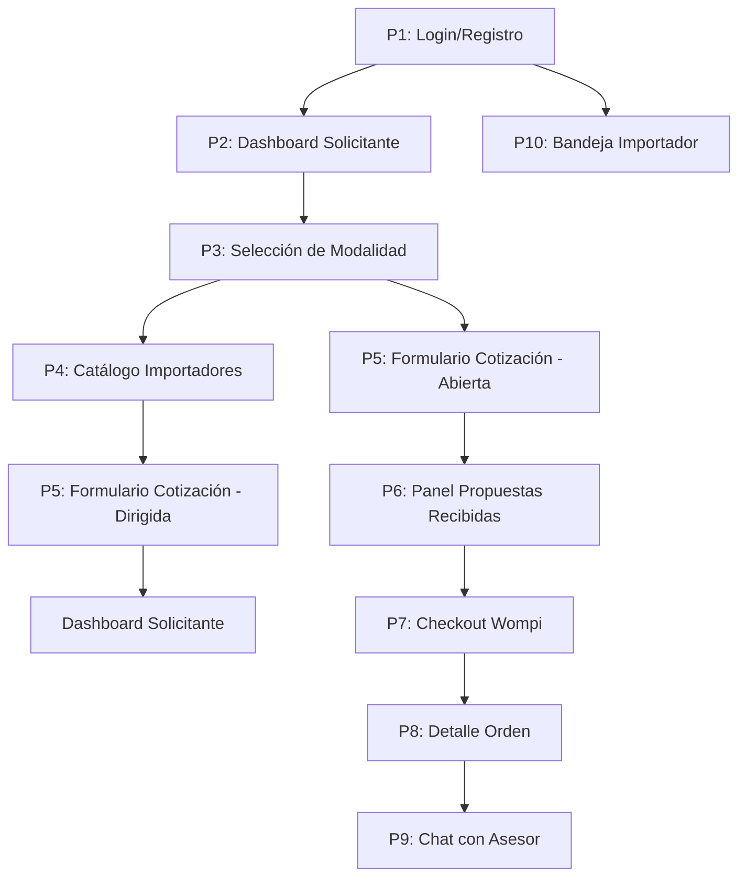

# 🎨 Guía de Diseño UX/UI — ImportacionesQ8

## Descripción general

Guía de diseño transversal que define las convenciones visuales, componentes reutilizables y principios de diseño para todo el equipo de desarrollo frontend. Construida con **React/Next.js** con TypeScript.

---

## Principios de diseño

### 1. Consistencia con el formulario de referencia
Los nombres y el orden de los campos de cotización deben sentirse familiares para un solicitante que ya usó el sistema original, para no generar fricción de adopción.

### 2. Estado siempre visible
En cualquier pantalla de orden o cotización, el usuario debe poder ver en qué punto del proceso está sin tener que preguntarle al asesor por chat.

### 3. Distinción visual clara entre "dirigida" y "abierta"
Usar una etiqueta de color, no solo texto, para distinguir las modalidades en todas las vistas donde ambas coexistan (bandeja del importador, historial del solicitante).

### 4. Mobile-first
Es razonable esperar que muchos solicitantes completen la solicitud o respondan al asesor desde el celular. El formulario de cotización y el chat deben ser completamente funcionales en móvil.

### 5. Botón de acción principal fijo
El botón de acción principal (solicitar cotización, aceptar oferta, responder, pagar) siempre debe estar en una posición fija y predecible, para reducir curva de aprendizaje entre pantallas.

---

## Sistema de diseño — Tokens

### Colores

| Token | Color | Uso |
|-------|-------|-----|
| `--color-primary` | #2563EB (Azul) | Botones principales, enlaces activos |
| `--color-secondary` | #6B7280 (Gris) | Botones secundarios, texto inactivo |
| `--color-success` | #10B981 (Verde) | Estados completados, confirmaciones |
| `--color-warning` | #F59E0B (Amarillo) | Advertencias, cotizaciones abiertas |
| `--color-danger` | #EF4444 (Rojo) | Errores, disputas |
| `--color-info` | #3B82F6 (Azul claro) | Información, estados en tránsito |
| `--color-muted` | #9CA3AF (Gris claro) | Texto secundario, bordes inactivos |

### Estados de cotizaciones — Colores

| Estado | Color | Icono |
|--------|-------|-------|
| Cotización creada | 🔵 Azul (#3B82F6) | Círculo azul |
| Dirigida | 🟢 Verde (#10B981) | Check verde |
| Abierta / Propuestas recibidas | 🟡 Amarillo (#F59E0B) | Reloj amarillo |
| Cotización aceptada | 🟣 Morado (#8B5CF6) | Check morado |
| Orden activa | 🟠 Naranja (#F97316) | Flecha naranja |

### Etiquetas de modalidad — Colores

| Modalidad | Color | Icono |
|-----------|-------|-------|
| Dirigida | 🟢 Verde (#10B981) | 🏷️ |
| Abierta | 🟡 Amarillo (#F59E0B) | 🌐 |

### Estados de órdenes — Colores

| Estado | Icono | Color |
|--------|-------|-------|
| Cotización aceptada | ✅ | Verde (#10B981) |
| En producción | ✅ | Verde (#10B981) |
| En tránsito internacional | 🔵 | Azul (#3B82F6) |
| En aduana / nacionalización | ⬜ | Gris (#9CA3AF) |
| En bodega local | ⬜ | Gris (#9CA3AF) |
| Entregado | ✅ | Verde (#10B981) |

### Tipografía

| Token | Fuente | Tamaño | Peso | Uso |
|-------|--------|--------|------|-----|
| `--font-heading` | Inter | 24px | Bold (700) | Títulos de página |
| `--font-subheading` | Inter | 18px | SemiBold (600) | Subtítulos de sección |
| `--font-body` | Inter | 14px | Regular (400) | Texto de cuerpo |
| `--font-small` | Inter | 12px | Regular (400) | Texto secundario, timestamps |

### Espaciado

| Token | Valor | Uso |
|-------|-------|-----|
| `--spacing-xs` | 4px | Margen entre elementos pequeños |
| `--spacing-sm` | 8px | Padding de botones pequeños |
| `--spacing-md` | 16px | Padding estándar, margen entre secciones |
| `--spacing-lg` | 24px | Padding grande, margen entre secciones principales |
| `--spacing-xl` | 32px | Margen entre pantallas |

---

## Componentes reutilizables

### Botones

#### Primary Button (Botón principal)
```
┌─────────────────────┐
│   Acción Principal   │ ← Fondo azul (#2563EB), texto blanco
└─────────────────────┘
```

| Propiedad | Valor |
|-----------|-------|
| Background | #2563EB (Azul) |
| Color de texto | #FFFFFF (Blanco) |
| Padding | 12px 24px |
| Border radius | 8px |
| Font size | 14px, SemiBold |

#### Secondary Button (Botón secundario)
```
┌─────────────────────┐
│   Acción Secundaria  │ ← Fondo blanco, borde gris (#6B7280)
└─────────────────────┘
```

| Propiedad | Valor |
|-----------|-------|
| Background | #FFFFFF (Blanco) |
| Color de texto | #374151 (Gris oscuro) |
| Border | 1px solid #6B7280 |
| Padding | 12px 24px |
| Border radius | 8px |

#### Danger Button (Botón de peligro)
```
┌─────────────────────┐
│   Eliminar / Cancelar │ ← Fondo rojo (#EF4444), texto blanco
└─────────────────────┘
```

| Propiedad | Valor |
|-----------|-------|
| Background | #EF4444 (Rojo) |
| Color de texto | #FFFFFF (Blanco) |
| Padding | 12px 24px |
| Border radius | 8px |

### Tarjetas

#### Card Componente base
```
┌─────────────────────────────────────┐
│                                     │ ← Fondo blanco, sombra sutil
│  ── Contenido de la tarjeta ──       │   border-radius: 12px
│                                     │   padding: 16px
│                                     │
└─────────────────────────────────────┘
```

| Propiedad | Valor |
|-----------|-------|
| Background | #FFFFFF (Blanco) |
| Border radius | 12px |
| Padding | 16px |
| Box-shadow | 0 1px 3px rgba(0,0,0,0.1), 0 1px 2px rgba(0,0,0,0.06) |

### Etiquetas (Badges)

#### Badge de estado
```
┌──────────────┐ ← Fondo verde (#10B981), texto blanco, border-radius: 12px
│   Dirigida   │     padding: 4px 12px, font-size: 12px
└──────────────┘
```

| Tipo | Color de fondo | Color de texto |
|------|---------------|----------------|
| Dirigida | #10B981 (Verde) | #FFFFFF (Blanco) |
| Abierta | #F59E0B (Amarillo) | #000000 (Negro) |
| Pendiente | #3B82F6 (Azul) | #FFFFFF (Blanco) |
| Completado | #10B981 (Verde) | #FFFFFF (Blanco) |
| En disputa | #EF4444 (Rojo) | #FFFFFF (Blanco) |

### Formularios

#### Input Componente base
```
┌─────────────────────────────────────┐
│  País de importación                │ ← Label: font-size 12px, color #6B7280
│                                     │
│  [______________________________]   │ ← Border: 1px solid #D1D5DB
│                                     │   Padding: 10px 14px
│                                     │   Border-radius: 8px
│                                     │   Focus: border-color #2563EB
└─────────────────────────────────────┘
```

| Propiedad | Valor |
|-----------|-------|
| Border | 1px solid #D1D5DB |
| Border radius | 8px |
| Padding | 10px 14px |
| Font size | 14px, Regular |
| Focus border-color | #2563EB (Azul) |

#### Textarea Componente base
```
┌─────────────────────────────────────┐
│  Descripción del cliente            │ ← Label: font-size 12px, color #6B7280
│                                     │
│  ┌───────────────────────────┐      │ ← Border: 1px solid #D1D5DB
│  │ Tamaño, material, colores, │      │   Padding: 10px 14px
│  │ usos, variantes...         │      │   Border-radius: 8px
│  └───────────────────────────┘      │   Min-height: 80px
│                                     │
└─────────────────────────────────────┘
```

### Tabs de navegación

#### Tab Componente base
```
┌─────────────────────────────────────┐
│  Cotizaciones | Órdenes | Pagos     │ ← Tab activo: border-bottom azul, texto azul
├─────────────────────────────────────┤   Tab inactivo: texto gris (#6B7280)
│                                     │
└─────────────────────────────────────┘
```

| Propiedad | Valor (Activo) | Valor (Inactivo) |
|-----------|---------------|-----------------|
| Color de texto | #2563EB (Azul) | #6B7280 (Gris) |
| Border-bottom | 2px solid #2563EB | Ninguna |
| Padding | 12px 24px | 12px 24px |

---

## Layout y estructura de pantallas

### Estructura base de todas las pantallas

```
┌─────────────────────────────────────┐
│ Header (Logo + Notificaciones)      │ ← Altura: 60px, fondo blanco, sombra sutil
├─────────────────────────────────────┤
│ Navegación principal (Tabs)         │ ← Altura: 48px, fondo blanco
├─────────────────────────────────────┤
│                                     │
│ Contenido principal                 │   Padding: 24px
│                                     │
│ ┌───────────────────────────┐       │
│ │                         │       │
│ │    Área de contenido    │       │ ← Max-width: 1200px, centrado
│ │                       │       │
│ └───────────────────────────┘       │
│                                     │
├─────────────────────────────────────┤
│ Footer (opcional)                   │ ← Altura: 48px, fondo gris claro (#F9FAFB)
└─────────────────────────────────────┘
```

### Responsive breakpoints

| Breakpoint | Ancho mínimo | Dispositivo objetivo |
|------------|-------------|---------------------|
| `sm` | 640px | Móviles grandes |
| `md` | 768px | Tablets |
| `lg` | 1024px | Laptops pequeñas |
| `xl` | 1280px | Desktops |

### Mobile-first para formulario de cotización

En pantallas menores a 768px:
- El formulario debe ser completamente funcional con un solo scroll vertical
- Los campos deben ocupar el ancho completo (no en grid)
- El botón "Enviar Cotización" debe estar fijo en la parte inferior de la pantalla (sticky bottom)
- La zona de carga de imagen debe ser fácil de tocar con el dedo

---

## Flujo de navegación entre pantallas



---

## Accesibilidad

### Contraste de colores mínimo

| Tipo | Ratio mínimo | Color de texto | Color de fondo |
|------|-------------|---------------|----------------|
| Texto normal | 4.5:1 | #374151 (Gris oscuro) | #FFFFFF (Blanco) |
| Texto grande | 3:1 | #6B7280 (Gris medio) | #FFFFFF (Blanco) |
| Texto sobre color primario | 3:1 | #FFFFFF (Blanco) | #2563EB (Azul) |

### Navegación por teclado

- Todos los elementos interactivos deben ser accesibles con Tab y Enter
- El foco visible debe tener un outline azul (#2563EB) de 2px
- El orden de tabulación debe seguir el flujo lógico de la pantalla (de arriba a abajo, de izquierda a derecha)

### Atributos ARIA

- Los botones deben tener `aria-label` descriptivo cuando no tienen texto visible
- Las tarjetas de estado deben tener `role="status"` para lectores de pantalla
- Los formularios deben tener `aria-required="true"` en campos obligatorios

---

## Animaciones y transiciones

### Transiciones estándar

| Propiedad | Duración | Easing | Uso |
|-----------|----------|--------|-----|
| Hover en botones | 150ms | ease-in-out | Cambio de estado al pasar el mouse |
| Apertura de modal | 200ms | ease-out | Animación de entrada de modales |
| Cierre de modal | 150ms | ease-in | Animación de salida de modales |
| Cambio de tab | 200ms | ease-in-out | Transición entre tabs |

### Indicadores de carga

- **Skeleton loading:** Para listas y tarjetas (ej: cotizaciones recientes, importadores)
- **Spinner:** Para acciones asíncronas (ej: enviar cotización, procesar pago)
- **Progress bar:** Para procesos largos (ej: checkout Wompi)

---

## Identidad visual — Distinción del sistema de referencia

> Es importante que el formulario, aunque tenga la misma estructura de campos, tenga una identidad visual y de marca claramente distinta, para reforzar el mensaje de "complemento", no de copia.

### Logo ImportacionesQ8
- Debe tener una identidad visual propia (no copiar el logo del sistema de referencia)
- Colores propios: Azul (#2563EB) como color primario, con acentos en naranja (#F97316)

### Paleta de colores propia
- No usar la misma paleta de colores que el sistema de referencia
- El azul (#2563EB) como color principal transmite confianza y profesionalismo
- El naranja (#F97316) como acento para elementos interactivos (botones, enlaces)

### Tipografía propia
- Inter como fuente principal: moderna, legible y profesional
- Jerarquía clara de tamaños para facilitar la lectura rápida